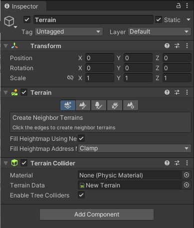

## Terrain

The Unity Editor includes a built-in set of Terrain features that allow you to add landscapes to your game. In the Editor, you can create multiple Terrain tiles, adjust the height or appearance of your landscape, and add trees or grass to it
 
To add a Terrain GameObject to your Scene, **select GameObject** > **3D Object** > **Terrain from the menu**. 
 
This also adds a corresponding Terrain Asset to the Project view. When you do this, the landscape is initially a large, flat plane. The Terrain’s Inspector window provides a number of tools to create detailed landscape features.
 
 
### Creating and editing Terrains

To add a Terrain GameObject to your Scene, select **GameObject > 3D Object > Terrain** from the menu. This also adds a corresponding Terrain Asset to the Project view. When you do this, the landscape is initially a large, flat plane. The Terrain’s Inspector window provides a number of tools to create detailed landscape features.

The **toolbar** provides five options to adjust your Terrain:

-   Create adjacent Terrain tiles.
-   Sculpt and paint your Terrain.
-   Add trees.
-   Add details such as grass, flowers, and rocks.
-   Change general settings for the selected Terrain.

### Keyboard shortcuts
The Terrain Inspector has the following keyboard shortcuts enabled by default.
 
 
| Keys | Function |
| --- | --- |
| Comma ( , ) and Period ( . ) | Cycle through the available Brushes |
| Shift-Comma ( < ) and Shift-Period ( > ) | Cycle through the available objects for trees, textures, and details |
| Open Bracket ( [ ) and Close Bracket ( ] ) | Decrease and increase the Brush Size |
| Minus ( - ) and Equal ( = ) | Decrease and increase Brush Opacity |

To set your own custom shortcuts, use the **Shortcuts Manager**.

- On Windows and Linux, select **Edit > Shortcuts**.
- On macOS, select **Unity > Shortcuts**.

### Terrain tools
To access the **Terrain painting tools**, click on a Terrain object in the **Hierarchy** window and open an Inspector window. In the Inspector, click the **Paint Terrain (paintbrush)** icon to reveal the list of Terrain tools.

### ref
https://docs.unity3d.com/Manual/terrain-UsingTerrains.html
