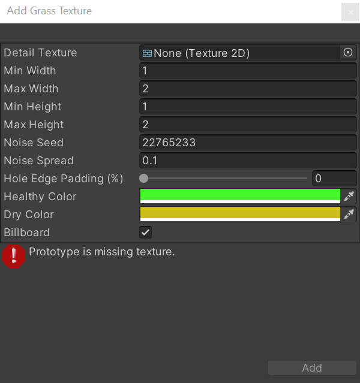

## Grass
A Terrain might have **grass clumps** and other small objects (such as **rocks**) covering its surface. Unity renders these objects using **textured quads** or **full meshes**, 
depending on the **level of detail** and performance you require.

> Terrain details are available in **several modes**, where each mode has a different use during game development.

| Mode | Description |
| --- | --- |
| Instanced mesh | Unity recommends you use this mode because it’s best suited for most scenarios that require the placement of any number of arbitrary meshes on Terrain.To add an instanced mesh, select Add Detail Mesh and enable the Use GPU Instancing option. |
| Vertex Lit mesh | Doesn’t use GPU instancing for rendering. Instead, it combines all detail instances into one mesh, which results in simple shading and limitations to the number of instances you can achieve.To add a Vertex Lit mesh, select Add Detail Mesh and set the Render Mode to Vertex Lit. |
| Grass mesh | Works similar to the vertex list mesh, but Unity treats these meshes as grass so they always have up-facing normals and move in the wind.To add a grass mesh, select Add Detail Mesh and set the Render Mode to Grass. |
| Grass Texture | Lets you create grass quad meshes directly from Texture, which move in the wind. You don’t need to specify any custom meshes, and there’s also an option you can enable to make grass quads always face the camera for a billboard effect.Select Add Grass Texture for this option. |

### Paint details
To enable grass and detail painting, select the Paint Details button on the Terrain Inspector
 toolbar.
 

Paint Details in the Terrain Inspector
Initially, a Terrain has no grass or details available. In the Inspector, click the **Edit Details** button to display a menu with the **Add Detail Mesh** and **Add Grass Texture** options. Click either option to bring up a window that lets you choose **Assets** to add to the Terrain for painting.
 

### Add Detail Mesh

Use the **Detail Prefab** field to select a Prefab from your Project. To create an authentic look, each mesh is affected by a random factor to determine the size and color. Unity uses the Perlin noise algorithm to generate such random factors.

The **Min Width**, **Max Width**, **Min Height**, and **Max Height** values specify the upper and lower scalings along the X and Y axes with which the meshes are randomly generated.

The **Noise Seed** setting sets the random number generator seed. Each seed value represents a unique generation. If you set the same seed for two types of details, the generated instances become identical. The **Noise Spread** value refers to the scaling of the noise pattern over the X-Z plane, with higher values indicating more variations within a given area.

The **Hole Edge Padding (%)** setting controls how far away detail objects are from the edge of the hole area. 

**Healthy Color** and **Dry Color** settings control the color variation. Unity performs linear interpolation between the healthy and dry colors, and selects a color based on the size of the mesh. For example, the system considers bigger-sized meshes to be healthier, thus the linear interpolation results for such meshes lean more towards the **Healthy** Color tint. These color settings disappear when you select **Use GPU Instancing** because they have no effect on instanced meshes.

You can set the **Render Mode** to **Vertex Lit** or **Grass**.

| Render Mode | Description |
| --- | --- |
| Vertex Lit | Renders detail meshes as solid, vertex lit GameObjects in the scene, which don’t move in the wind. |
| Grass | Renders detail meshes in the scene with simplified lighting similar to Grass Textures, and do move in the wind. |

> **Note**: To apply a texture on a detail using Vertex Lit or Grass render mode, their material should have a texture assigned to the **MainTex** material property (default property name for Base Color Map in built-in/URP). No other material properties are considered for non-instanced details._

### Add Grass Texture

**Detail Texture** is the Texture that represents the grass. You can download Textures from the **Asset Store**, or create your own Textures. A Texture is a small image with alpha set to zero for the empty areas. 

> **Note**: **"Grass"** is a generic term; it is possible for a Texture to represent **flowers or man-made objects** such as barbed wire coils.

The **Min Width**, **Max Width**, **Min Height**, **Max Height**, **Noise Seed**, **Noise Spread**, **Hole Edge Padding (%)**, **Healthy Color**, and **Dry Color** settings work the same as they do for meshes, and are described in the Add Detail Mesh section above.

Finally, when you enable the **Billboard** option, the grass images rotate so that they always face the **Camera**. This is useful when you want to show a dense field of grass because clumps are two-dimensional, and not visible from the side. However, with sparse grass, the rotations of individual clumps might become apparent to the viewer, creating a strange effect.

### ref 
https://docs.unity3d.com/Manual/terrain-Grass.html

