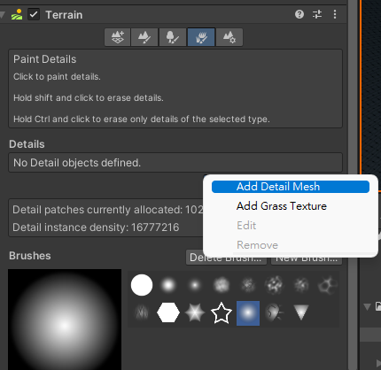
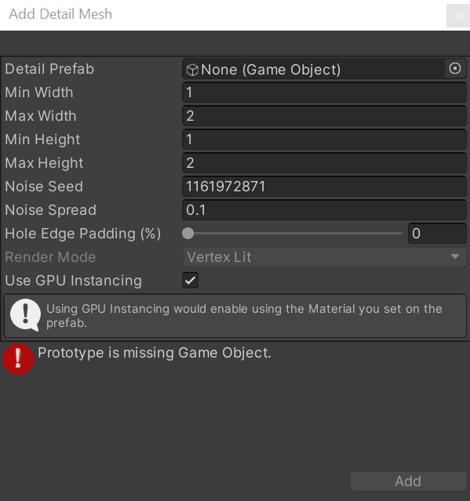

## Grass
A Terrain might have **grass clumps** and other small objects (such as **rocks**) covering its surface. Unity renders these objects using **textured quads** or **full meshes**, 
depending on the **level of detail** and performance you require.

> Terrain details are available in **several modes**, where each mode has a different use during game development.

| Mode | Description |
| --- | --- |
| Instanced mesh | Unity recommends you use this mode because it’s best suited for most scenarios that require the placement of any number of arbitrary meshes on Terrain.To add an instanced mesh, select Add Detail Mesh and enable the Use GPU Instancing option. |
| Vertex Lit mesh | Doesn’t use GPU instancing for rendering. Instead, it combines all detail instances into one mesh, which results in simple shading and limitations to the number of instances you can achieve.To add a Vertex Lit mesh, select Add Detail Mesh and set the Render Mode to Vertex Lit. |
| Grass mesh | Works similar to the vertex list mesh, but Unity treats these meshes as grass so they always have up-facing normals and move in the wind.To add a grass mesh, select Add Detail Mesh and set the Render Mode to Grass. |
| Grass Texture | Lets you create grass quad meshes directly from Texture, which move in the wind. You don’t need to specify any custom meshes, and there’s also an option you can enable to make grass quads always face the camera for a billboard effect.Select Add Grass Texture for this option. |

### Paint details
To enable grass and detail painting, select the Paint Details button on the Terrain Inspector
 toolbar.
 

Paint Details in the Terrain Inspector
Initially, a Terrain has no grass or details available. In the Inspector, click the **Edit Details** button to display a menu with the **Add Detail Mesh** and **Add Grass Texture** options. Click either option to bring up a window that lets you choose **Assets** to add to the Terrain for painting.
 

### 

### ref 
https://docs.unity3d.com/Manual/terrain-Grass.html

