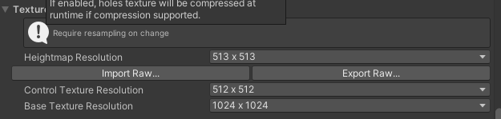

## Heightmaps
Terrain tools that affect height, such as **Raise or Lower Terrain** and **Set Height**, use a grayscale texture called a **heightmap**. 

Unity represents the **height of each point on the Terrain as a value in a rectangular array**. It represents this array using a **grayscale heightmap**. 

**Heightmaps** are **built into the Terrain**, and the **values stored in a heightmap** **define the height of each point** or **vertex on the Terrain**.

### Importing and exporting heightmaps

You can **import** and **export** heightmaps into the Unity Editor. 
This is useful when you want to use real world height data to replicate a landmark such as Mount Everest, or work on a heightmap image in an external editor like Photoshop. 

You can also use 3D modelling applications, such as **Houdini** and **World Machine**, to **generate Terrain**, then import your Terrain into Unity as a **heightmap**.

It’s good practice to store heightmaps as **RAW files**. A **RAW file** uses a 16-bit grayscale format that is compatible with most image and landscape editors. The Unity Editor enables you to import and export RAW heightmap files for a Terrain.

To access the import and export settings into the Editor, select the **Terrain component** in the Inspector
, and click the **Terrain Settings** button (gear icon in the toolbar). Select **"Import Raw"** or **"Export Raw"**.

### ref 
https://docs.unity3d.com/Manual/terrain-Heightmaps.html

