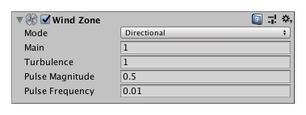

## Wind Zones
To create the **effect of wind** on your **Terrain** and **Particle Systems**, you can add one or more GameObjects with Wind Zone components. Trees within a wind zone bend in a realistic animated fashion, and the wind itself moves in pulses to create natural patterns of movement among the trees.

### Using Wind Zones
To create a Wind Zone GameObject directly, go to Unity’s top menu and then go to **GameObject > 3D Object > Wind Zone**. You can add the Wind Zone component to any suitable GameObject already in the Scene(menu: **Component > Miscellaneous > Wind Zone**). The Inspector for the Wind Zone has a number of settings to control its behavior.

You can set the Mode to **Directional** or **Spherical**.

- In **Directional mode**, the wind affects the whole Terrain at once. This is useful for creating effects like the natural movement of the trees.
- In **Spherical mode**, the wind blows outwards within a sphere defined by the **Radius** property. This is useful for creating special effects like **explosions**.

The **Main** property determines the overall strength of the wind, and you can use **Turbulence** to give these some random variation.

The wind blows over the trees in pulses to create a more natural effect. You can control the strength of the pulses with **Pulse Magnitude**, and the time interval between them with **Pulse Frequency**.

### ref
https://docs.unity3d.com/Manual/class-WindZone.html

