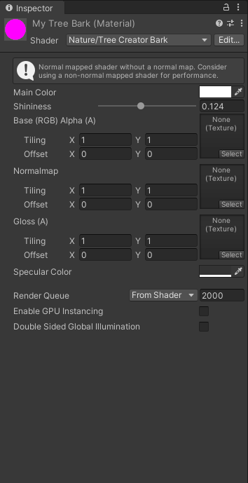
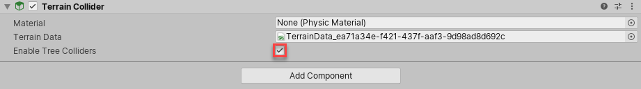

## Tree
There are two ways to create new Tree models. Use the **SpeedTree Modeler** from IDV, Inc. to create Trees with advanced visual effects, such as smooth LOD transition, fast billboarding, and natural wind animation. 

Alternatively, use the **Tree Editor** to create Tree Models.

### Tree Editor
Unity provides a tool called Tree Editor that lets you design trees directly within the editor.

### SpeedTree
You can use **SpeedTree Modeler** from IDV, Inc. to create trees with advanced visual effects such as smooth LOD
transition, fast billboarding and natural wind animation,
 
 
### Building a tree

#### Adding a new Tree
To create a new Tree asset, select **GameObject > 3D Object > Tree**. You’ll see a new Tree asset is created in your Project View, and instantiated in the currently open Scene. This new tree is very basic with only a single branch, so let’s add some character to it.

Select the tree to view the **Tree** window in the **Inspector**A Unity window that displays information about the currently selected GameObject, asset or project settings, allowing you to inspect and edit the values. [More info](https://docs.unity3d.com/Manual/tree-FirstTree.htmlUsingTheInspector.html)  
See in [Glossary](https://docs.unity3d.com/Manual/tree-FirstTree.htmlGlossary.html#Inspector). This interface provides all the tools for shaping and sculpting your trees. You will see the **Tree Hierarchy** window with two nodes present: the **Tree Root** node and a single **Branch Group** node, which we’ll call the trunk of the tree.

In the **Tree Hierarchy**, select the **Branch Group**, which acts as the trunk of the tree. Click on the **Add Branch Group** button and you’ll see a new **Branch Group** appear connected to the Main Branch. Now you can play with the settings in the **Branch** **Group Properties** to see alterations of the branches attached to the tree trunk.

Select a branch you can either add a new **branch group** or **leaf group** to that branch. 

View the tree hierarchy in the **Tree Hierarchy window**.

- Select a leave in the **Tree Hierarchy window**, you can choose to **move or rotate** the leaf
- Select a branch in the **Tree Hierarchy window**, you can choose to **move or rotate** the branch, or even draw and reshape the branch.

Trees you create using Tree Editor must use the **Nature/Soft Occlusion Leaves** and **Nature/Soft Occlusion Bark** shader. To use those shaders, you have to place Trees in a specific folder named _Ambient-Occlusion_, otherwise the Trees don’t render correctly. When you place a model in this folder and re-import it Unity calculates soft ambient occlusion in a way that is specifically designed for Trees.

If you change an imported Tree Asset in a separate 3D modelling application, you need to click the Refresh button in the Editor to see the updated Trees on your Terrain.

> **Note**: When you import and alter a SpeedTree model in a 3D modeling program, then re-export it (as an .fbx or .obj), you might lose the natural wind animation functionality that comes with SpeedTree models.

### Adding mateials

To add material on tree, just create a new Material in your project using **Assets > Create > Material**. Rename it to **"My Tree Bark"**, and choose **Nature > Tree Creator Bark** from the **Shader** drop-down. From here you can assign the Textures
 provided in the Tree Creator Package to the Base, Normalmap, and Gloss properties of the Bark Material. We recommend using the texture **"BigTree_bark_diffuse"** for the **Base** and **Gloss** properties, and **"BigTree_bark_normal"** or the **Normalmap** property.

Now we’ll follow the same steps for creating a Leaf Material. Create a new Material and assign the shader as Nature > Tree Creator Leaves. Assign the texture slots with the leaf textures from the Tree Creator Package.

After create the material, assign them to the different Group Nodes of the Tree. Select your Tree and click any Branch or Leaf node, then expand the **Geometry** section of the **Branch Group Properties**. You will see a Material assignment slot for the type of node you’ve selected. Assign the relevant Material you created and view the results.

### Using Colliders with Trees

You can add a **Capsule Collider** to a **Tree Asset**. First, **click > next** to the Tree Asset to open the Prefab.

Then, select **Add Component > Physics > Capsule Collider** to add the collider. To return to the Scene, **click < next** to the Prefab name.

> You **must** also check **Enable Tree Colliders** in the Terrain Collidercomponent.

### Make Trees bend in the wind

**Wind Zones** can bend Trees to simulate the **direct effect of wind**.

This feature is only available for Trees that you place through the Terrain menu.

To do this, select the Terrain, click the Paint Trees button in the Inspector, then select Edit Trees > Add Tree and select your Tree Prefab. If you did not create the Tree in Unity, set the Bend Factor to 1. Click on the Terrain to place the selected Tree.

Terrain-based Trees that have a **Bend Factor** react to Wind Zones by bending and swaying, according to the values of the Wind Zone’s **Turbulence** and **Main** properties. The **Turbulence** setting controls the fluttering of leaves. Reducing this value smooths the fluttering effect. The **Main** value controls the main force of the wind. To create a Wind Zone, select **GameObject > 3D Object > Wind Zone**.

If the Wind Zone’s **Mode** is **Directional**, then its position relative to the Tree does not matter. The Trees will sway in the direction of the Wind Zone. However, if your Wind Zone’s **Mode** is **Spherical**, then its **Radius** has to overlap the Tree’s radius. This results in multi-directional gusts of wind, with a falloff from the center towards the edge.

With the default settings, Trees such as the Broadleaf Prefab (which is provided in the Standard Assets Environment pack) sway in a smooth and realistic way. However, if you’re using your own Tree Prefab, you might need to adjust the Wind Zone property values. If your Tree Prefab trunk is bent all the way to one side, try reducing the Main value. Alternatively, if the branches of your Tree Prefab bend or stretch excessively, reduce the Turbulence value.

### Tree Level of Detail (LOD) transition zone

For Tree Editor Trees, Unity’s LOD system uses a 2D to 3D transition zone to seamlessly blend 2D billboards with 3D Tree models. This prevents any sudden popping of 2D and 3D Trees, which is vital in VR. Note that billboard
 Trees don’t receive local lighting such as Point Lights and Spot Lights. They work with directional lights, but lighting on the billboards only updates when you rotate the Camera
.

### ref 
https://docs.unity3d.com/Manual/class-Tree.html

https://docs.unity3d.com/Manual/tree-Structure.html

**Branch Group Properties:** \
https://docs.unity3d.com/Manual/tree-Branches.html

**Leaf Group Properties:** \
https://docs.unity3d.com/Manual/tree-Leaves.html

https://docs.unity3d.com/Manual/terrain-Trees.html
