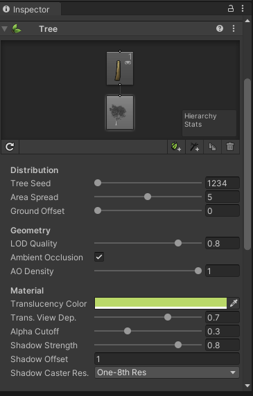

## Tree Editor

Unity provides a tool called Tree Editor that lets you design trees directly within the editor.

### SpeedTree

You can use **SpeedTree Modeler** from IDV, Inc. to create trees with advanced visual effects such as smooth LOD
transition, fast billboarding and natural wind animation,
 
 
### Building a tree

#### Adding a new Tree
To create a new Tree asset, select **GameObject > 3D Object > Tree**. You’ll see a new Tree asset is created in your Project View, and instantiated in the currently open Scene. This new tree is very basic with only a single branch, so let’s add some character to it.

### ref 
https://docs.unity3d.com/Manual/class-Tree.html

