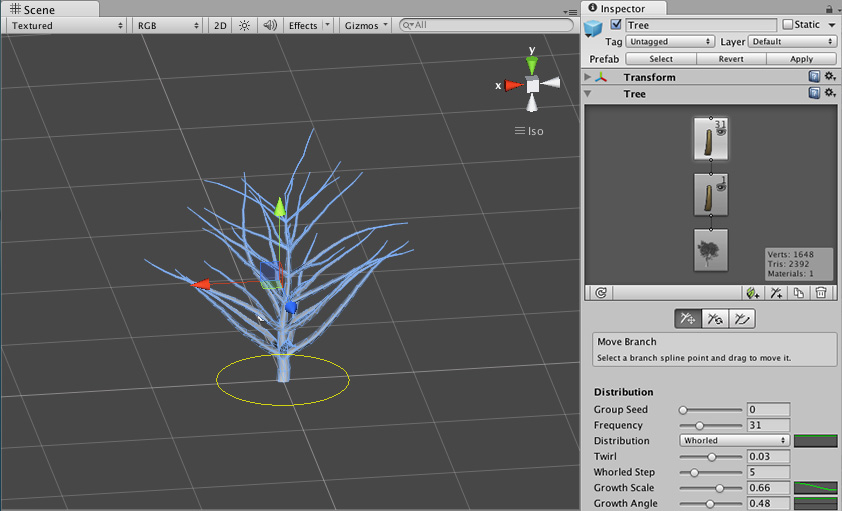

## Tree Editor

Unity provides a tool called Tree Editor that lets you design trees directly within the editor.

### SpeedTree

You can use **SpeedTree Modeler** from IDV, Inc. to create trees with advanced visual effects such as smooth LOD
transition, fast billboarding and natural wind animation,
 
 
### Building a tree

#### Adding a new Tree
To create a new Tree asset, select **GameObject > 3D Object > Tree**. You’ll see a new Tree asset is created in your Project View, and instantiated in the currently open Scene. This new tree is very basic with only a single branch, so let’s add some character to it.

Select the tree to view the **Tree** window in the **Inspector**A Unity window that displays information about the currently selected GameObject, asset or project settings, allowing you to inspect and edit the values. [More info](https://docs.unity3d.com/Manual/tree-FirstTree.htmlUsingTheInspector.html)  
See in [Glossary](https://docs.unity3d.com/Manual/tree-FirstTree.htmlGlossary.html#Inspector). This interface provides all the tools for shaping and sculpting your trees. You will see the **Tree Hierarchy** window with two nodes present: the **Tree Root** node and a single **Branch Group** node, which we’ll call the trunk of the tree.

In the **Tree Hierarchy**, select the **Branch Group**, which acts as the trunk of the tree. Click on the **Add Branch Group** button and you’ll see a new **Branch Group** appear connected to the Main Branch. Now you can play with the settings in the **Branch** **Group Properties** to see alterations of the branches attached to the tree trunk.

Select a branch you can either add a new **branch group** or **leaf group** to that branch. 

View the tree hierarchy in the **Tree Hierarchy window**.

- Select a leave in the **Tree Hierarchy window**, you can choose to **move or rotate** the leaf
- Select a branch in the **Tree Hierarchy window**, you can choose to **move or rotate** the branch, or even draw and reshape the branch.

### Adding mateials

To add material on tree, just create a new Material in your project using **Assets > Create > Material**. Rename it to **"My Tree Bark"**, and choose **Nature > Tree Creator Bark** from the **Shader** drop-down. From here you can assign the Textures
 provided in the Tree Creator Package to the Base, Normalmap, and Gloss properties of the Bark Material. We recommend using the texture **"BigTree_bark_diffuse"** for the **Base** and **Gloss** properties, and **"BigTree_bark_normal"** or the **Normalmap** property.

Now we’ll follow the same steps for creating a Leaf Material. Create a new Material and assign the shader as Nature > Tree Creator Leaves. Assign the texture slots with the leaf textures from the Tree Creator Package.

After create the material, assign them to the different Group Nodes of the Tree. Select your Tree and click any Branch or Leaf node, then expand the **Geometry** section of the **Branch Group Properties**. You will see a Material assignment slot for the type of node you’ve selected. Assign the relevant Material you created and view the results.

### ref 
https://docs.unity3d.com/Manual/class-Tree.html

