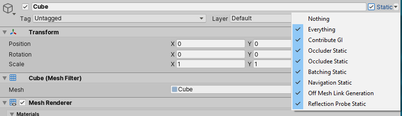

## GameObject

If a GameObject does not move at runtime, it is known as a static GameObject. If a GameObject moves at runtime, it is known as a dynamic GameObject.
 
Many systems in Unity can precompute information about static GameObjects in the Editor. Because the GameObjects do not move, the results of these calculations are still valid at runtime. This means that Unity can save on runtime calculations, and potentially improve performance. So check the **static** box to indicate the GameObject is static.

### Static GameObjects
If a GameObject does not move at runtime, it is known as a static GameObject. If a GameObject moves at runtime, it is known as a dynamic GameObject.

Many systems in Unity can precompute information about static GameObjects in the Editor. Because the GameObjects do not move, the results of these calculations are still valid at runtime. This means that Unity can save on runtime calculations, and potentially improve performance.

The Static Editor Flags checkbox and drop-down menu, as seen when viewing a GameObject in the Inspector

