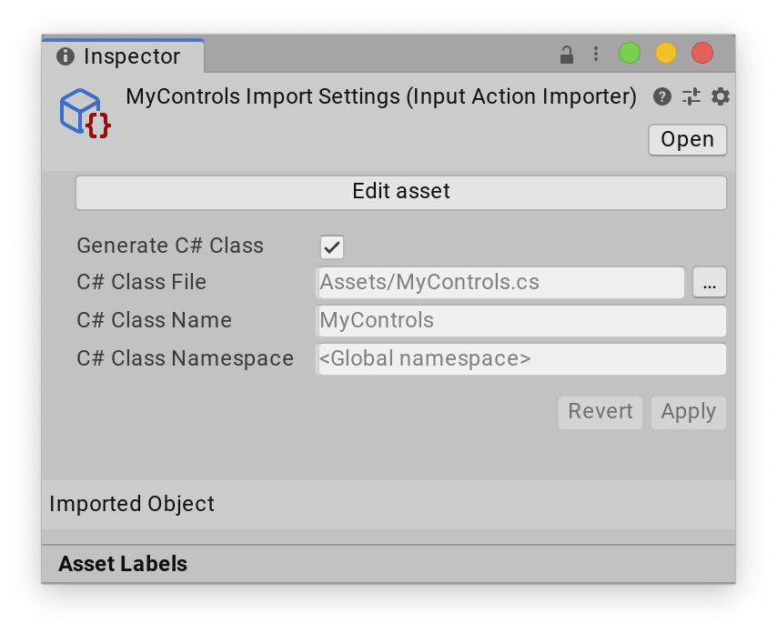

## Input Action Assets

An Input Action Asset is an Asset which **contains Input Actions and their associated Bindings and Control Schemes**. These Assets have the **`.inputactions` file extension** and are stored in a plain **JSON format**.

To create an Asset that contains Input Actions in Unity, right-click in the Project window or go to **Assets > Create > Input Actions** from Unity's main menu.

By default, Unity doesn't save edits you make in the Action Asset window when you save the Project. To save your changes, select **Save Asset** in the window's toolbar. To discard your changes, close the window and choose **Don't Save** when prompted. Alternatively, you can toggle auto-saving on by enabling the **Auto-Save** checkbox in the toolbar. This saves any changes to that Asset.

The Action editor window is divided into three panes:

1.  The left pane lists the Action Maps in the Asset. Each Action Map is a collection of Actions that you can enable or disable in bulk.
2.  The middle pane contains the Actions in the currently selected Action Map, and the bindings associated with each Action.
3.  The right pane contains the properties of the currently selected Action or Binding.

If you select an Action, you can edit it's properties in the right-hand pane of the window

#### Action Type

While all actions essentially function the same way, there are differences in how an action will react to changes in values on the controls it is bound to.

The most straightforward type of behavior is **PassThrough** which does not expect any kind of value change pattern but simply triggers the action on every single value change. A **pass-through** action will not use started or canceled except on bindings that have an interaction added to them. **Pass-through** actions are most useful for sourcing input from arbitrary many controls and simply piping all input through without much processing on the side of the action.

| Name | Description |
|-|-|
| Value | An action that reads a single value from its connected sources. |
| Button | An action that acts as a trigger. A button action has a defined trigger point that corresponds to Performed. After being performed, the action goes back to waiting state to await the next triggering. |
| PassThrough | An action that has no specific type of behavior and instead acts as a simple pass-through for any value change on any bound control. |

https://docs.unity3d.com/Packages/com.unity.inputsystem@1.7/api/UnityEngine.InputSystem.InputActionType.html?q=pass%20through

### Editing Bindings

-   To add a new Binding, select the Add **(+)** icon on the action you want to add it to, and select the binding type from the menu that appears.
-   To delete an existing Binding, either right-click it and select **Delete** from the context menu, or use the **Delete** key (Windows) / **⌘⌫ (Mac)**.
-   To duplicate an existing Binding, either right-click it and select **Duplicate** from the context menu, or use **Ctrl-D** (Windows) / **⌘D (Mac)**.

If you select a Binding, you can edit its properties in the right-hand pane of the window:

### Picking Controls

The most important property of any Binding is the **control path**. To edit it, open the **Path** drop-down list. This displays a Control picker window.

### Editing Composite Bindings
Composite Bindings are Bindings consisting of multiple parts, which form a Control together. For instance, a 2D Vector Composite uses four buttons (left, right, up, down) to simulate a 2D stick input. 

### Composite Bindings

Sometimes, you might want to have several Controls act in unison to mimic a different type of Control. The most common example of this is using the W, A, S, and D keys on the keyboard to form a 2D vector Control equivalent to mouse deltas or gamepad sticks. Another example is to use two keys to form a 1D axis equivalent to a mouse scroll axis.

This is difficult to implement with normal Bindings. You can bind a ButtonControl to an action expecting a Vector2, but doing so results in an exception at runtime when the Input System tries to read a Vector2 from a Control that can deliver only a float.

#### 1D axis
A Composite made of two buttons: one that pulls a 1D axis in its negative direction, and another that pulls it in its positive direction. Implemented in the `AxisComposite class`. The result is a `float`.

The axis Composite has two part bindings.

| Part | Type |
| --- | --- |
| positive | Button |
| negative | Button |

| Parameter | Description |
| --- | --- |
| whichSideWins | What happens if both positive and negative are actuated. See table below. |
| minValue | The value returned if the negative side is actuated. Default is -1. |
| maxValue | The value returned if the positive side is actuated. Default is 1. |

| WhichSideWins | Description |
| --- | --- |
| (0) Neither | Neither side has precedence. The Composite returns the midpoint between minValue and maxValue as a result. At their default settings, this is 0.This is the default value for this setting. |
| (1) Positive | The positive side has precedence and the Composite returns maxValue. |
| (2) Negative | The negative side has precedence and the Composite returns minValue. |

#### 2D vector
A Composite that represents a **4-way button setup** like the **D-pad on gamepads**. Each button represents a cardinal direction. Implemented in the `Vector2Composite` class. The result is a `Vector2`.

This Composite is most useful for representing up-down-left-right controls, such as **WASD keyboard input**.

The 2D vector Composite has four part Bindings.

| Part | Type | Description |
| --- | --- | --- |
| up | Button | Controls representing (0,1) (+Y). |
| down | Button | Controls representing (0,-1) (-Y). |
| left | Button | Controls representing (-1,0) (-X). |
| right | Button | Controls representing (1,0) (+X). |

| Parameter | Description |
| --- | --- |
| mode | Whether to treat the inputs as digital or as analog controls.If this is set to Mode.DigitalNormalized, inputs are treated as buttons (off if below defaultButtonPressPoint and on if equal to or greater). Each input is 0 or 1 depending on whether the button is pressed or not. The vector resulting from the up/down/left/right parts is normalized. The result is a diamond-shaped 2D input range.If this is set to Mode.Digital, the behavior is essentially the same as Mode.DigitalNormalized except that the resulting vector is not normalized.Finally, if this is set to Mode.Analog, inputs are treated as analog (i.e. full floating-point values) and, other than down and left being inverted, values will be passed through as is.The default is Mode.DigitalNormalized. |

#### 3D vector

A Composite that represents a **6-way button** where two combinations each control one axis of a 3D vector. Implemented in the `Vector3Composite` class. The result is a `Vector3`.

The 3D vector Composite has four part Bindings.

| Part | Type | Description |
| --- | --- | --- |
| up | Button | Controls representing (0,1,0) (+Y). |
| down | Button | Controls representing (0,-1,0) (-Y). |
| left | Button | Controls representing (-1,0,0) (-X). |
| right | Button | Controls representing (1,0,0) (+X). |
| forward | Button | Controls representing (0,0,1) (+Z). |
| backward | Button | Controls representing (0,0,-1) (-Z). |

| Parameter | Description |
| --- | --- |
| mode | Whether to treat the inputs as digital or as analog controls.If this is set to Mode.DigitalNormalized, inputs are treated as buttons (off if below defaultButtonPressPoint and on if equal to or greater). Each input is 0 or 1 depending on whether the button is pressed or not. The vector resulting from the up/down/left/right/forward/backward parts is normalized.If this is set to Mode.Digital, the behavior is essentially the same as Mode.DigitalNormalized except that the resulting vector is not normalized.Finally, if this is set to Mode.Analog, inputs are treated as analog (that is, full floating-point values) and, other than down, left, and backward being inverted, values will be passed through as they are.The default is Analog. |

#### One Modifier

A Composite that requires the user to **hold down** a **"modifier"** **button** **in addition to another control** from which the **actual value** of the Binding is determined.

The button with one modifier Composite has two part Bindings.

| Part | Type | Description |
| --- | --- | --- |
| modifier | Button | Modifier that has to be held for binding to come through. If the user holds any of the buttons bound to the modifier at the same time as the button that triggers the action, the Composite assumes the value of the modifier Binding. If the user does not press any button bound to the modifier, the Composite remains at default value. |
| binding | Any | The control(s) whose value the Composite assumes while the user holds down the modifier button. |

#### Two Modifiers

A Composite that requires the user to hold down **two "modifier" buttons** **in addition to another control** from which the **actual value** of the Binding is determined.

This can be used, for example, for Bindings such as **"SHIFT+CTRL+1"**.

The button with two modifiers Composite has three part Bindings.

| Part | Type | Description |
| --- | --- | --- |
| modifier1 | Button | The first modifier the user must hold alongside modifier2, for binding to come through. If the user does not press any button bound to the modifier1, the Composite remains at default value. |
| modifier2 | Button | The second modifier the user must hold alongside modifier1, for binding to come through. If the user does not press any button bound to the modifier2, the Composite remains at default value. |
| binding | Any | The control(s) whose value the Composite assumes while the user presses both modifier1 and modifier2 at the same time. |

### Control Schemes

A Binding can belong to any number of **Binding groups**. Unity stores these on the `InputBinding` class as a semicolon-separated string in the `InputBinding.groups` property, and you can use them for any arbitrary grouping of bindings. To enable different sets of binding groups for an `InputActionMap` or `InputActionAsset`, you can use the `InputActionMap.bindingMask`/`InputActionAsset.bindingMask` property. The Input System uses this to implement the concept of grouping Bindings into different `InputControlSchemes`.

Control Schemes use Binding groups to map Bindings in an `InputActionMap` or `InputActionAsset` to different types of Devices. The `PlayerInput` class uses these to enable a matching Control Scheme for a new user joining the game, based on the Device they are playing on.

#### Editing Control Schemes
Input Action Assets can have **multiple Control Schemes**, which let you enable or disable different sets of Bindings for your Actions for different types of Devices.

To see the Control Schemes in the Input Action Asset editor window, open the Control Scheme drop-down list in the top left of the window. This menu lets you add or remove Control Schemes to your Asset. If the Asset contains any Control Schemes, you can select a Control Scheme, and then the window only shows bindings that belong to that Scheme. If you select a binding, you can now pick the Control Schemes for which this binding should be active in the **Properties** view to the left of the window. When you add a new Control Scheme, or select an existing Control Scheme, and then select **Edit Control Scheme…**, you can edit the name of the Control Scheme and which devices the Scheme should be active for.

### Using Input Action Assets

#### Auto-generating script code for Actions

One of the most convenient ways to work with **`.inputactions` Assets** in scripts is to **automatically generate a C# wrapper class** for them. 

This removes the need to manually look up Actions and Action Maps using their names, and also provides an **easier way to set up callbacks**.

To enable this option, tick the **Generate C#** Class checkbox in the importer properties in the Inspector of the **`.inputactions` Asset**, then select **Apply**.

### ref
https://docs.unity3d.com/Packages/com.unity.inputsystem@1.7/manual/ActionAssets.html

**Input Bindings** \
https://docs.unity3d.com/Packages/com.unity.inputsystem@1.7/manual/ActionBindings.html

**Interactions** \
https://docs.unity3d.com/Packages/com.unity.inputsystem@1.7/manual/Interactions.html
