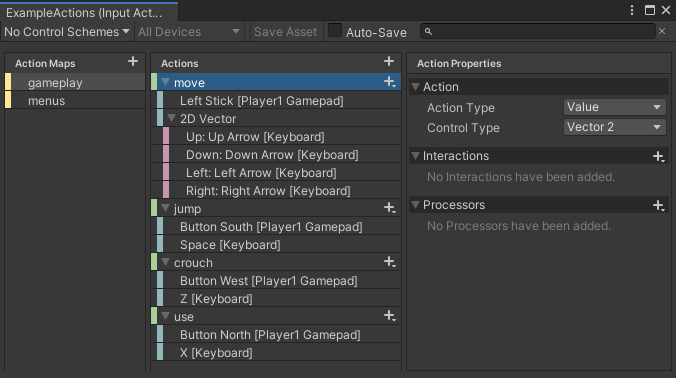

## Input Action Assets

To create an Asset that contains Input Actions in Unity, right-click in the Project window or go to **Assets > Create > Input Actions** from Unity's main menu.

By default, Unity doesn't save edits you make in the Action Asset window when you save the Project. To save your changes, select **Save Asset** in the window's toolbar. To discard your changes, close the window and choose **Don't Save** when prompted. Alternatively, you can toggle auto-saving on by enabling the **Auto-Save** checkbox in the toolbar. This saves any changes to that Asset.

The Action editor window is divided into three panes:

1.  The left pane lists the Action Maps in the Asset. Each Action Map is a collection of Actions that you can enable or disable in bulk.
2.  The middle pane contains the Actions in the currently selected Action Map, and the bindings associated with each Action.
3.  The right pane contains the properties of the currently selected Action or Binding.

If you select an Action, you can edit it's properties in the right-hand pane of the window

#### Editing Bindings

-   To add a new Binding, select the Add **(+)** icon on the action you want to add it to, and select the binding type from the menu that appears.
-   To delete an existing Binding, either right-click it and select **Delete** from the context menu, or use the **Delete** key (Windows) / **⌘⌫ (Mac)**.
-   To duplicate an existing Binding, either right-click it and select **Duplicate** from the context menu, or use **Ctrl-D** (Windows) / **⌘D (Mac)**.

If you select a Binding, you can edit its properties in the right-hand pane of the window:

#### Picking Controls

The most important property of any Binding is the control path. To edit it, open the **Path** drop-down list. This displays a Control picker window.

#### Editing Composite Bindings
Composite Bindings are Bindings consisting of multiple parts, which form a Control together. For instance, a 2D Vector Composite uses four buttons (left, right, up, down) to simulate a 2D stick input. 

### Composite Bindings

Sometimes, you might want to have several Controls act in unison to mimic a different type of Control. The most common example of this is using the W, A, S, and D keys on the keyboard to form a 2D vector Control equivalent to mouse deltas or gamepad sticks. Another example is to use two keys to form a 1D axis equivalent to a mouse scroll axis.

This is difficult to implement with normal Bindings. You can bind a ButtonControl to an action expecting a Vector2, but doing so results in an exception at runtime when the Input System tries to read a Vector2 from a Control that can deliver only a float.

#### 1D axis
A Composite made of two buttons: one that pulls a 1D axis in its negative direction, and another that pulls it in its positive direction. Implemented in the `AxisComposite class`. The result is a `float`.

#### 2D vector
A Composite that represents a **4-way button setup** like the **D-pad on gamepads**. Each button represents a cardinal direction. Implemented in the `Vector2Composite` class. The result is a `Vector2`.

This Composite is most useful for representing up-down-left-right controls, such as WASD keyboard input.

#### 3D vector

A Composite that represents a **6-way button** where two combinations each control one axis of a 3D vector. Implemented in the `Vector3Composite` class. The result is a `Vector3`.

#### One Modifier

A Composite that requires the user to **hold down** a **"modifier"** **button** **in addition to another control** from which the **actual value** of the Binding is determined.

#### Two Modifiers

A Composite that requires the user to hold down **two "modifier" buttons** **in addition to another control** from which the **actual value** of the Binding is determined.

This can be used, for example, for Bindings such as **"SHIFT+CTRL+1"**.

### ref
https://docs.unity3d.com/Packages/com.unity.inputsystem@1.7/manual/ActionAssets.html

**Input Bindings** \
https://docs.unity3d.com/Packages/com.unity.inputsystem@1.7/manual/ActionBindings.html

**Interactions** \
https://docs.unity3d.com/Packages/com.unity.inputsystem@1.7/manual/Interactions.html
