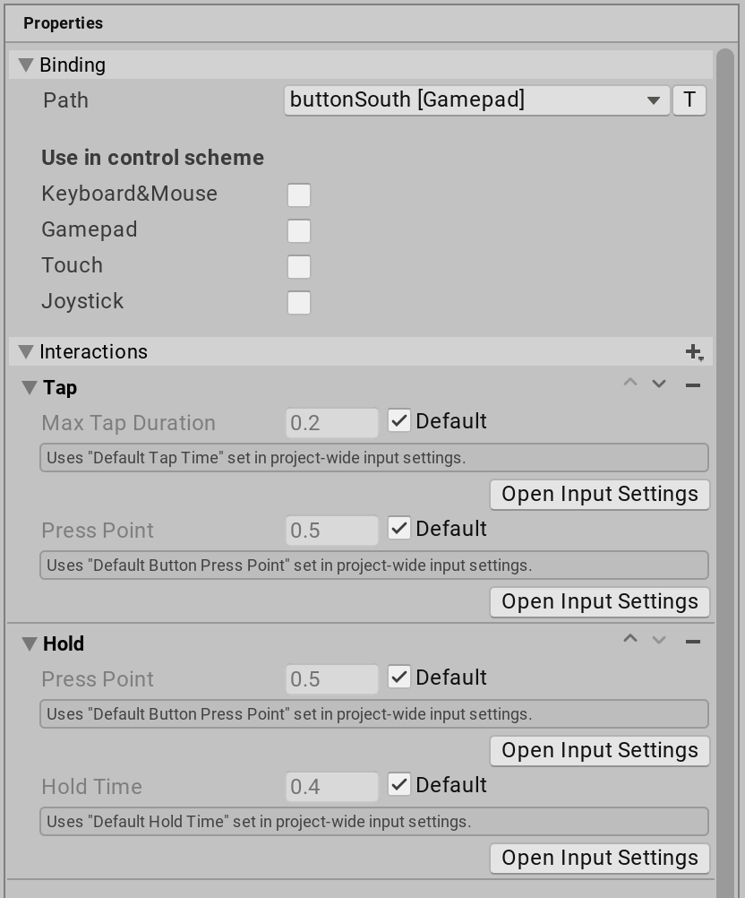
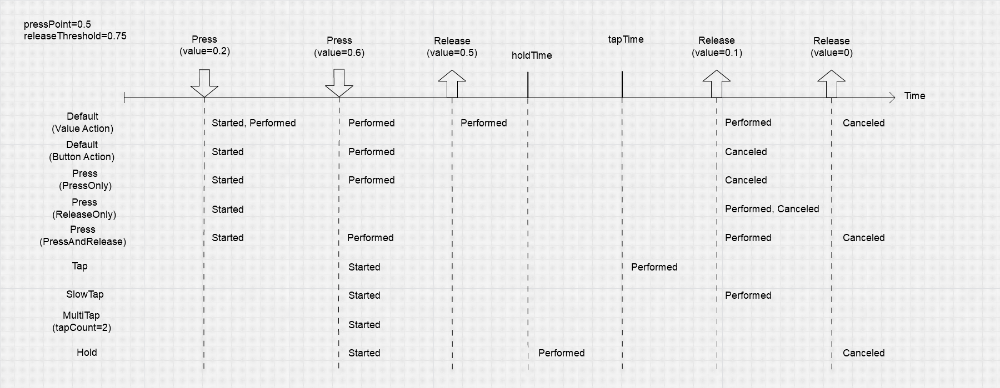

## Interactions

An Interaction represents a **specific input pattern**. \
For example, a hold is an Interaction that **requires a Control to be held for at least a minimum amount of time**.

Interactions drive responses on Actions. You can place them on **individual Bindings** or an **Action as a whole**, in which case they **apply to every Binding on the Action**. 
**At runtime**, when a **particular interaction completes**, this **triggers the Actio**n.

An Interaction has **a set of distinct phases** it can go through in response to receiving input.

| Phase | Description |
| --- | --- |
| Waiting | The Interaction is waiting for input. |
| Started | The Interaction has been started (that is, it received some of its expected input), but is not complete yet. |
| Performed | The Interaction is complete. |
| Canceled | The Interaction was interrupted and aborted. For example, the user pressed and then released a button before the minimum time required for a hold Interaction to complete. |

> **Mot**e: **Not every Interaction triggers every phase**, and the pattern in which specific Interactions trigger phases **depends on the Interaction type**.

While `Performed` is typically the phase that triggers the actual response to an Interaction, `Started` and `Canceled` can be useful for providing UI feedback while the **Interaction is in progress**. 

For example, when a hold is `Started`, the app can display a progress bar that fills up until the hold time has been reached. If, however, the hold is `Canceled` before it completes, the app can reset the progress bar to the beginning.

#### Multiple Controls on an Action
If you have multiple Controls bound to a Binding or an Action which has an Interaction, then the Input System first applies the Control conflict resolution logic to get a single value for the Action, which it then feeds to the Interaction logic. Any of the bound Controls can perform the Interaction.

#### Multiple Interactions on a Binding

If multiple Interactions are present on a single Binding or Action, then the Input System **checks the Interactions in the order** they are present on the Binding.

#### Timeouts
Interactions **might need to wait a certain time for a specific input to occur or to not occur**. An example of this is the **Hold interaction** which, after a button is pressed, has to wait for a set duration until the **"hold" is complete**. To do this, an interaction installs a timeout using `SetTimeout`.

It can be useful to know how much of a timeout is left for an interaction to complete. For example, you might want to display a bar in the UI that is charging up while the interaction is waiting to complete. To query the percentage to which a timeout has completed, use **`GetTimeoutCompletionPercentage`**.

> Note that each Interaction can **have its own separate timeout** (but only a single one at any one time). If multiple interactions are in effect, then **`GetTimeoutCompletionPercentage`** will only **use the timeout of the one interaction that is currently driving the action**.

### reference for interaction

Action Type Button
Interaction None
started, performed on button down | canceled on release

Interaction Press And Release
started, performed on button down | started, performed again on button up

Interaction Press Only
started, performed on button down

Interaction Release Only
started on button down | performed on button up

Interaction Hold
started on button down | performed once the button is held long enough | canceled when the button is released too early

Interaction Multi Tap
started on button down | canceled if button not pressed fast enough soon enough | performed if button pressed enough times fast enough
note: multitap doesn't work

Interaction Slow Tap
started on button down | canceled if you release before min tap duration | performed as soon as you release if the alotted min tap duration has elapsed (happens when you release the button not when the time has elapsed)

Interaction Tap
started on button down | performed if you release before the Max Tap Duration | canceled if you hold down past the Max Tap Duration as soon as the duration passes(no event on button up)

Action Type Value with a button
Control Type Any, Analog, Axis, Bone, Digital, Double, Dpad, Eyes, Integer, Quaternion, Stick, Touch, Vector2, Vector3
Interactions None
started, performed on button down | canceled on button up

Control Type Vector2 with a joystick
Interactions None
started on any joystick movement, performed while joystick is not centered over and over, canceled when release joystick

ControlType Any, Analog (didn't test the rest but assume it is the same)
Interactions Press And Release
started, performed on button down | performed, canceled on button up

Interactions Press Only
started, performed on button down | performed, canceled on button up

Interactions Release Only
started on button down | performed, canceled on button up

Interactions Hold
started on button down | performed after hold time | canceled when stopping game
note: this seems broken can't get any more actions, it's like it never releases

Interactions Multi Tap
started on button down | performed if button is pressed enough times fast enough | canceled if button is not pressed fast enough soon enough
note: doesn't work it's broken, only get started and canceled no matter what

Interactions Slow Tap
started on button down | performed on release if button was held long enough | cancelled on release if button was not held long enough

Interactions Tap
started on button down | canceled as soon as Max Tap Duration elapsed | performed if released before Max Tap Duration elapsed

Action Type Pass Through
Interactions None
performed on button down | performed on button up

Interactions Press and Release
started, performed on button down | canceled on button up

Interactions Press Only
started, performed on button down | canceled on button up

Interactions Release Only
started on button down | performed, canceled on button up

Interactions Hold
started on button down | performed as soon as hold time elapses | canceled on button up

Interactions Multi Tap
started on button down | performed if button pressed enough times fast enough | canceled if button is not pressed enough times fast enough
note: This seems to be the only multi tap that is actually working

Interactions Slow Tap
started on button down | performed on button up if Min Tap Duration elapsed | canceled on button up if Min Tap Duration not elapsed

Interactions Tap
started on button down | performed on button up if release before Max Tap Duration | canceled as soon as Max Tap Duration elapsed (no event on button up after Max Tap Duration elapsed)

### ref 
https://docs.unity3d.com/Packages/com.unity.inputsystem@1.7/manual/Interactions.html?q=Interactions

https://forum.unity.com/threads/input-getkeydown-but-in-the-new-input-system.1000077/
