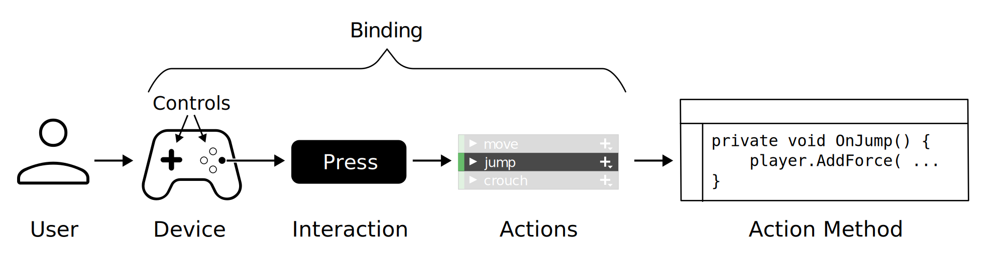

## Input System
The Input System package allows your users to control your game or app using a device, touch, or gestures.


> Unity supports input through **two separate systems**, **one older**, and **one newer**.

> The older system, which is built-in to the editor, is called the **Input Manager**. The Input Manager is part of the core Unity platform and is the **default**, if you do not install this Input System Package.

> This **Input System package** is a newer, **more flexible system**, which allows you to use **any kind of Input Device** to control your Unity content. It's intended to be a replacement for Unity's classic Input Manager. It iss referred to as **"The Input System Package"**, or just **"The Input System"**. 

To use **Input System package**, you **must install it into your project** using the **Package Manager**.

### Installing the package
To install the new Input System, open Unity's package manager (menu: **Window > Package Manager**). Select the **Input System** package from the list, then click **Install**.

https://docs.unity3d.com/Packages/com.unity.inputsystem@1.7/manual/Installation.html


### Basic concepts




| Concept | Description |
| --- | --- |
| User | The person playing your game or using your app, by holding or touching the input device and providing input. |
| Input Device | Often referred to just as a "device" within the context of input. A physical piece of hardware, such as a keyboard, gamepad, mouse, or touchscreen which allows the user to send input into Unity.|
| Controls | The separate individual parts of an input device which each send input values into Unity. For example, a gamepad’s controls comprise multiple buttons, sticks and triggers, and a mouse’s controls include the two X and Y sensors on the underside, and the various buttons and scroll wheels on the top side. |
| Interactions | These describe different ways of using the controls on a device. For example, pressing a button down, releasing a button, a long press, or a double tap. Interactions can be thought of as "patterns of input". The Input System provides ways of identifying and responding to different types of interaction. |
| Actions | These are things a user can do in your game or app as a result of input, regardless of what device or control they use to perform it. Actions generally have conceptual names that you choose to suit your project, and should usually be verbs. For example "Run", "Jump" "Crouch", "Use", "Start", "Quit". The Input System can help you manage and edit your actions, or you can implement them yourself. |
| Action Asset | An **asset type which allows you to define and configure groups of actions as a set**. The Action Asset UI allows you to bind controls, group related actions into Action Maps, and specify which controls belong to different Control Schemes. |
| Embedded Actions | Actions defined directly as fields in your scripts (as opposed to in an Action Asset). These types of action are the same as those defined in an Action Asset, and their inspector UI allows you to bind controls. However, because they’re defined as individual fields in your script, you do not benefit from the Action Asset’s ability to group Actions together into Action Maps and Control Schemes. |
| Binding | A connection defined between an Action and one or more Controls. For example, in a car racing game, pressing the right shoulder button on a controller might be bound to the action "Change Gear Up". The Action Asset and Embedded Actions both provide a similar UI to create and edit bindings. |
| Processor | An operation that the Input System applies to an input value. For example, an "invert" Processor inverts a floating-point value. |
| Phase | The current state of an Interaction, for example, "Started", "Performed", or "Canceled". |
| Control Scheme | Allows you to define mappings of Bindings to different Control Schemes, and to switch your Action Maps between different Control Schemes to enable different subsets of Bindings for your Actions. Control Schemes can have associated Device types, so that the game can automatically enable them for users when using that type of Device. |
| Action Map | A **named collection of Actions**. You can simultaneously enable or disable all Actions in an action map, so it is useful to **group Actions in Action Maps by the context in which they are relevant** (for example: "gameplay"). |

### Input System Workflows
There are multiple ways to use the Input System, and the workflow that’s right for you depends on how quickly you want to get up and running, how flexible you want your input code to be, and whether you prefer to set things up in the Unity Editor, or in code.

- **Directly Reading Device States**:  Your script explicitly refers to device controls and reads the values directly.Can be the fastest way to set up input for one device, but it is the least flexible workflow
- **Using Embedded Actions**: Your script uses the InputAction class directly. The actions display in your script’s inspector, and allow you to configure them in the editor.
- **Using an Actions Asset**: Your script does not define actions directly. Instead your script references an Input Actions asset which defines your actions. The Input Actions window provides a UI to define, configure, and organize all your Actions into useful groupings.
- **Using an Actions Asset and a PlayerInput component**: In addition to using an Actions Asset, the PlayerInput component provides a UI in the inspector to connect actions to event handlers in your script, removing the need for any intermediary code between the Input System and your Action Methods.

### Actions

There are three key classes for Actions in the API:

| Class | Description |
| --- | --- |
| `InputActionAsset` | An Asset that contains one or more Action Maps and, optionally, a sequence of Control Schemes. For more information on how to create, edit, and work with these Assets|
| `InputActionMap` | A named collection of Actions. |
| `InputAction` | A named Action that triggers callbacks in response to input. |


### Creating Actions

You can create Actions in any of the following ways:

- Use the dedicated editor for Input Action Assets.
- Embed them in MonoBehaviour components, then set up bindings in the Inspector.
- Manually load them from JSON.
- Create them entirely in code, including setting up the bindings.

#### Creating Actions using the Action editor
For information on how to create and edit Input Action Assets in the dedicated editor, see Action Assets. This is the recommended workflow if you want to organise all your input actions and bindings together into a single Asset, which is often the case for many types of game or app.


#### Creating Actions by embedding them in MonoBehaviours

As an alternative to using an **Action Asset**, You can embed individual **Input Action** and **Input Action Maps** as fields directly inside `MonoBehaviour` components, like this:

```cs
sing UnityEngine;
using UnityEngine.InputSystem;

public class ExampleScript : MonoBehaviour
{
    public InputAction move;
    public InputAction jump;
}

```

The result is similar to using an Action Asset, except the Actions are defined in the GameObject's properties and saved as Scene or Prefab data, instead of in a dedicated Asset.

When you embed actions in a MonoBehaviour and assign that MonoBehaviour to a GameObject, the GameObject's Inspector window displays an interface similar to the Actions Asset window, which allows you to set up the bindings for those actions. For example:


The visual editors work similarly to the Action Asset editor.

  -   To add or remove Actions or Bindings, click the Add (+) or Remove (-) icon in the header.
  -   To edit Bindings, double-click them.

      

  - To edit Actions, double-click them in an Action Map, or click the gear icon on individual Action properties.

    

  - You can also right-click entries to bring up a context menu, and you can drag them. Hold the Alt key and drag an entry to duplicate it.

You must manually enable and disable Actions and Action Maps that are embedded in MonoBehaviour components.

```cs
public class MyBehavior : MonoBehaviour
{
    // ...

    void Awake()
    {
        fireAction.performed += OnFire;
        lookAction.performed += OnLook;

        gameplayActions["fire"].performed += OnFire;
    }

    void OnEnable()
    {
        fireAction.Enable();
        lookAction.Enable();

        gameplayActions.Enable();
    }

    void OnDisable()
    {
        fireAction.Disable();
        lookAction.Disable();

        gameplayActions.Disable();
    }
}

```


#### Loading Actions from JSON
You can load Actions as JSON in the form of a set of Action Maps or as a full InputActionAsset. This also works at runtime in the Player.

```cs
// Load a set of action maps from JSON.
var maps = InputActionMap.FromJson(json);

// Load an entire InputActionAsset from JSON.
var asset = InputActionAsset.FromJson(json);

```


### Creating Input Action Assets
To create an Asset that contains Input Actions in Unity, right-click in the Project window or go to **Assets > Create > Input Actions** from Unity's main menu.

#### Editing Input Action Assets
To bring up the Action editor, double-click an `.inputactions` Asset in the Project Browser, or select the **Edit Asset** button in the Inspector for that Asset. You can have more than one editor window open at the same time, but not for the same Asset.

> By default, Unity doesn't save edits you make in the Action Asset window when you save the Project. To save your changes, select **Save Asset** in the window's toolbar. To discard your changes, close the window and choose **Don't Save** when prompted. Alternatively, you can toggle auto-saving on by enabling the **Auto-Save** checkbox in the toolbar. This saves any changes to that Asset.


The Action editor window is divided into three panes:

1.  The left pane lists the Action Maps in the Asset. Each Action Map is a collection of Actions that you can enable or disable in bulk.
2.  The middle pane contains the Actions in the currently selected Action Map, and the bindings associated with each Action.
3.  The right pane contains the properties of the currently selected Action or Binding.

https://docs.unity3d.com/Packages/com.unity.inputsystem@1.7/manual/ActionAssets.html


### Input settings

To configure the Input System individually for each project, go to **Edit > Project Settings… > Input System Package** from Unity's main menu.

The **Input System stores** input settings in Assets. If your Project doesn't contain an input settings Asset, click **Create settings asset** in the Settings window to create one. If your Project contains multiple settings Assets, use the gear menu in the top-right corner of the window to choose which one to use. You can also use this menu to create additional settings Assets.

> **Note**: Unity saves changes to these settings when you save the Project.

https://docs.unity3d.com/Packages/com.unity.inputsystem@1.7/manual/Settings.html

### Migrating from the old input system(Input Manager)

https://docs.unity3d.com/Packages/com.unity.inputsystem@1.7/manual/Migration.html

### ref
https://docs.unity3d.com/Packages/com.unity.inputsystem@1.7/manual/index.html 

**Supported Input Devices** \
https://docs.unity3d.com/Packages/com.unity.inputsystem@1.7/manual/SupportedDevices.html

**Scripting API** \
https://docs.unity3d.com/Packages/com.unity.inputsystem@1.7/api/index.html

**`UnityEngine.InputSystem`** \
https://docs.unity3d.com/Packages/com.unity.inputsystem@1.7/api/UnityEngine.InputSystem.html

**`Unity​Engine.​Input​System.Input​Action`** \
https://docs.unity3d.com/Packages/com.unity.inputsystem@1.7/api/UnityEngine.InputSystem.InputAction.html

**`Unity​Engine.​Input​System.Input​Action.​Callback​Context`** \
https://docs.unity3d.com/Packages/com.unity.inputsystem@1.7/api/UnityEngine.InputSystem.InputAction.CallbackContext.html

**`Unity​Engine.​Input​System.InputControl<TValue>`** \
https://docs.unity3d.com/Packages/com.unity.inputsystem@1.7/api/UnityEngine.InputSystem.InputControl-1.html#UnityEngine_InputSystem_InputControl_1_ReadValue

**`UnityEngine.InputSystem.Controls`** \
https://docs.unity3d.com/Packages/com.unity.inputsystem@1.7/api/UnityEngine.InputSystem.Controls.html

**`UnityEngine.InputSystem.Composites`** \
https://docs.unity3d.com/Packages/com.unity.inputsystem@1.7/api/UnityEngine.InputSystem.Composites.html

**`Unity​Engine.​Input​System.Input​Action​Asset`** \
https://docs.unity3d.com/Packages/com.unity.inputsystem@1.7/api/UnityEngine.InputSystem.InputActionAsset.html

**`Unity​Engine.​Input​System.Input​Action​Map`** \
https://docs.unity3d.com/Packages/com.unity.inputsystem@1.7/api/UnityEngine.InputSystem.InputActionMap.html

**PlayerInput** \
https://docs.unity3d.com/Packages/com.unity.inputsystem@1.7/api/UnityEngine.InputSystem.PlayerInput.html?q=playerinput#methods


https://gamedevbeginner.com/input-in-unity-made-easy-complete-guide-to-the-new-system/ \
https://blog.yarsalabs.com/player-movement-with-new-input-system-in-unity/ \
https://medium.com/nerd-for-tech/moving-with-the-new-input-system-unity-a6c9cb100808

https://www.youtube.com/watch?v=HmXU4dZbaMw \
https://www.youtube.com/watch?v=Yjee_e4fICc \
https://www.youtube.com/watch?v=UyUogO2DvwY \
https://youtu.be/m5WsmlEOFiA \
https://www.youtube.com/watch?v=q-VfsQQlji0 \
https://www.youtube.com/watch?v=ONlMEZs9Rgw
