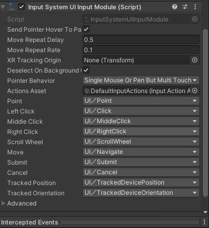
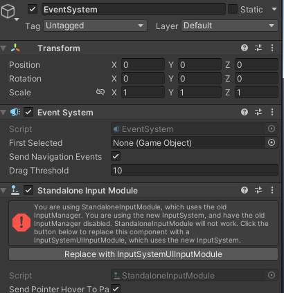
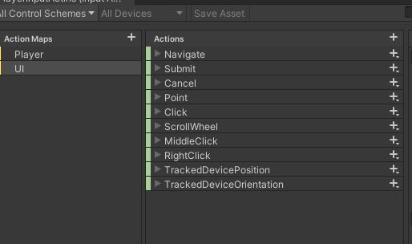
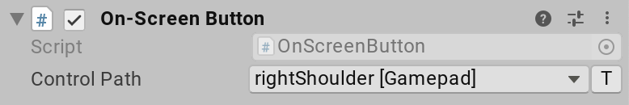
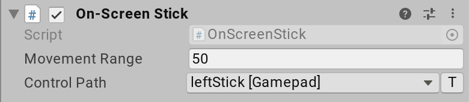

## UI with Input System


### Setting up UI input
The **InputSystemUIInputModule** component acts as a **drop-in replacement** for the **StandaloneInputModule** component that the Unity UI package. **InputSystemUIInputModule** provides the same **functionality as StandaloneInputModule**, but it **uses the Input System instead of the legacy Input Manager to drive UI input**.



If you have a **StandaloneInputModule** component on a GameObject, and the Input System is installed, Unity shows a button in the Inspector offering to **automatically replace** it with a InputSystemUIInputModule for you.



> The **InputSystemUIInputModule** is **pre-configured to use default Input Actions** to drive the UI, but you can **override that configuration** to suit your needs.


Input support for both **Unity UI** and **UI Toolkit** is based on the same **`EventSystem`** and **`BaseInputModule` subsystem**. In other words, the same input setup based on **`InputSystemUIInputModule`** supports input in **either UI solution** and **nothing extra needs to be done**.

Internally, **UI Toolkit installs an event listener in the form of the `PanelEventHandler` component** which intercepts events that **`InputSystemUIInputModule`** sends and translates them into UI Toolkit-specific events that are then routed into the visual tree. If you employ **`EventSystem.SetUITookitEventSystemOverride`**, this default mechanism is bypassed.

To use UI Toolkit with the new Input System, for now you need to have a **GameObject in your scene with an `EventSystem`** and **`InputSystemUIInputModule` components** on it, exactly like you would if you were using **`UnityEngine.UI` objects** in your scene. We will eventually support the new Input System with nothing else added, but for now we need some additional configurations from the Input System action maps, hence the need for some sort of presence in a component from your scene.

- UI Toolkit **handles raycasting internally**. **No separate raycaster component is needed** like for **uGUI**. This means that **`TrackedDeviceRaycaster` does not work together with UI Toolkit**.
- A pointer click and a gamepad submit action are distinct at the event level in UI Toolkit. This means that if you, for example, do
  ```cs
    button.RegisterCallback<ClickEvent>(_ => ButtonWasClicked());
  ```
  the handler is not invoked when the button is "clicked" with the gamepad (a `NavigationSubmitEvent` and not a `ClickEvent`). If, however, you do
  ```cs
     button.clicked += () => ButtonWasClicked();
  ```


### Default UI Action Map




### On-screen Controls
You can use **on-screen Controls** to **simulate Input Devices with UI widgets** that the user interacts with on the screen. The most prominent example is the use of **stick** and **button widgets** on **touchscreens to emulate a joystick or gamepad**.

> There are currently two Control types implemented out of the box: **buttons** and **sticks**.

> You can implement custom Controls by extending the base **`OnScreenControl`** class (see documentation on **writing custom on screen Controls** to learn more).


> **Note**: **On-screen Controls** don't have a predefined visual representation. It's up to you to set up the visual aspect of a Control (for example, by adding a sprite or UI component to the GameObject). On-screen Controls take care of the interaction logic and of setting up and generating input from interactions.


To **query the Control** (and, implicitly, the Device) that an on-screen Control feeds into, you can use the **`OnScreenControl.control`** property.

> Note: This design allows you to use on-screen Controls to create input for arbitrary Input Devices, in addition to joysticks and gamepads.

#### On-screen buttons



To create an on-screen button:

1. Add a **UI Button** object.
2. Add the **`OnScreenButton` component** to it
3. Set the **Control Path** to refer to a **ButtonControl** type. The type of device referenced by the control path determines the type of virtual device created by the component.

> The `OnScreenButton` component requires the **target Control to be a Button Control**. `OnScreenButton` sets the **target Control value to 1** when it **receives a pointer-down**(**`IPointerDownHandler.OnPointerDown`**) event, or **0** when it **receives a pointer-up** (**`IPointerUpHandler.OnPointerUp`**) event.


#### On-screen sticks



To create an on-screen stick:

1. Create a **UI Image** object.
2. Add the **`OnScreenStick` component** to it.
3. Set the **Control Path** to refer to a **`Vector2Control`**. The type of device referenced by the control path determines the type of virtual device created by the component.

> The `OnScreenStick` component requires the **target Control to be a Vector2 Control**. `OnScreenStick` starts the movement of the stick Control when it **receives a pointer-down** (**`IPointerDownHandler.OnPointerDown`**) event, and stops it when it **receives a pointer-up** (**`IPointerUpHandler.OnPointerUp`**) event.

In-between, the stick moves according to the pointer being dragged (`IDragHandler.OnDrag`) within a box centered on the pointer-down screen point, and with an edge length defined in the component's Movement Range property. A movement range of 50, for example, means that the stick's on-screen area is 25 pixels up, down, left, and right of the pointer-down point on screen.

#### Writing custom on-screen Controls
You can add support for new types of Input Controls by **extending `OnScreenControl`**. An easy example to follow is **`OnScreenButton`**.

Eg:
```cs
 [AddComponentMenu("Input/On-Screen Button")]
    public class OnScreenButton : OnScreenControl, IPointerDownHandler, IPointerUpHandler
    {
        public void OnPointerUp(PointerEventData data)
        {
            SendValueToControl(0.0f);
        }

        public void OnPointerDown(PointerEventData data)
        {
            SendValueToControl(1.0f);
        }

        [InputControl(layout = "Button")]
        [SerializeField]
        private string m_ControlPath;

        protected override string controlPathInternal
        {
            get => m_ControlPath;
            set => m_ControlPath = value;
        }
    }
```

### ref 
UI Support \
https://docs.unity3d.com/Packages/com.unity.inputsystem@1.8/manual/UISupport.html

Working with UI and New Input System in Unity \
https://www.youtube.com/watch?v=KH0KrAFNR_M

**`UnityEngine.InputSystem.OnScreen`** \
https://docs.unity3d.com/Packages/com.unity.inputsystem@1.7/api/UnityEngine.InputSystem.OnScreen.html

**`UnityEngine.InputSystem.UI`** \
https://docs.unity3d.com/Packages/com.unity.inputsystem@1.7/api/UnityEngine.InputSystem.UI.html

**`UnityEngine.InputSystem.UI.InputSystemUIInputModule`** \
https://docs.unity3d.com/Packages/com.unity.inputsystem@1.7/api/UnityEngine.InputSystem.UI.InputSystemUIInputModule.html


