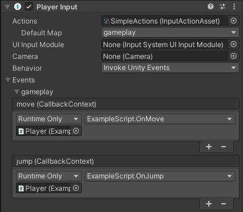

## Using an Actions Asset and Player Input Component

The highest level of abstraction provided by the Input System is when you use the **Actions Asset** and 
the **Player Input component** together.

The **Player Input component** takes a **reference to an Actions Asset**, and 
**provides a way to make connections between the Actions defined in that asset**, and **C# methods in your own MonoBehaviour scripts**, 
so that your desired C# methods are called when the user performs an input action.




In the above example image, you can see the PlayerInput component set up to map the "move", "jump" actions to OnMove and OnJump methods in a script, via Unity Events.

This is an example of the script which would provide an implementation of these methods

```cs
using UnityEngine;
using UnityEngine.InputSystem;

// This script is designed to have the OnMove and
// OnJump methods called by a PlayerInput component

public class ExampleScript : MonoBehaviour
{
    Vector2 moveAmount;

    public void OnMove(InputAction.CallbackContext context)
    {
        // read the value for the "move" action each event call
        moveAmount = context.ReadValue<Vector2>();
    }

    public void OnJump(InputAction.CallbackContext context)
    {
        // your jump code goes here.
    }

    public void Update()
    {
        // to use the Vector2 value from the "move" action each
        // frame, use the "moveAmount" variable here.
    }

}

```

### The Player Input component

The Input System provides two related components that simplify how you set up and work with input: the **Player Input component** and the **Player Input Manager component**.

The **Player Input component** represents a **single player**, and that player's associated **Input Actions**, whereas the **Player Input Manager component** handles setups that allow for** several concurrent users (for example, player lobbies and split-screen gameplay in a game)**.


#### Getting started

To get started using the Player Input component, use the following steps:

1. **Add** a **Player Input** component to a GameObject. This would usually be the GameObject that represents the player in your game.

2. **Create an Input Actions asset**. You can do this by clicking the "Create Actions..." button which is visible in the Player Input component inspector if you have not yet assigned actions to it (shown below).

    

3. When creating the actions asset, Unity asks you where to create the new Asset. Choose a name and folder inside the **Assets** folder of your Project (or just accept the defaults) and select Okay. This creates a new **`.inputactions`** Asset in your Project, connects it to the Player Input component, and brings up the editor window for the Input Action asset.

4. **Configure the Actions Asset** so that it contains the actions you want your users to be able to perform, bound to the controls they should use to perform them.

    

5. Set up Action responses, by selecting a **Behaviour** type from the Behaviour menu. The Behaviour type you select affects how you should implement the methods that handle your Action responses. See the **notification behaviors** section further down for details.

    


### ref
https://docs.unity3d.com/Packages/com.unity.inputsystem@1.7/manual/Workflow-PlayerInput.html \
https://docs.unity3d.com/Packages/com.unity.inputsystem@1.7/manual/PlayerInput.html


