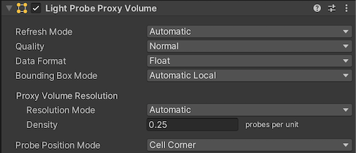

## Light Probe Proxy Volume component

The **Light Probe Proxy Volume (LPPV)** component allows you to use more lighting information **for large dynamic GameObjects** that cannot use baked lightmaps (for example, **large Particle Systems** or **skinned Meshes**).

By default, **a probe-lit Renderer receives lighting from a single Light Probe that is interpolated between the surrounding Light Probes in the Scene**.

Because of this, GameObjects have constant ambient lighting across the surface. This lighting has a rotational gradient because it is using spherical harmonics, but it lacks a spatial gradient. This is more noticeable on larger GameObjects or Particle Systems. The lighting across the GameObject matches the lighting at the anchor point, and if the GameObject straddles a lighting gradient, parts of the GameObject may look incorrect.

The **Light Probe Proxy Volume** component generates a **3D grid of interpolated Light Probes** inside a **Bounding Volume**. 

You can specify the resolution of this grid in the UI of the component. The **spherical harmonics (SH) coefficients** of the interpolated Light Probes are uploaded into **3D textures**. The 3D textures containing **SH coefficients** are then sampled at render time to **compute the contribution to the diffuse ambient lighting**. This adds a **spatial gradient** to probe-lit GameObjects.

The **Standard Shader** supports this feature. To add this to a custom shader, use the **`ShadeSHPerPixel`** function.

 > When you set the **Light Probes** property in the Mesh Renderer component to **Use Proxy Volume**, the GameObject must have a **Light Probe Proxy Volume (LPPV)** component attached.

You can add a **LPPV component** on the same GameObject, or you can use (borrow) a **LPPV component** from another GameObject using the **Proxy Volume Override** property. If Unity cannot find a **LPPV component** in the current GameObject or in the Proxy Volume Override GameObject, a warning message is displayed at the bottom of the Renderer.

### Properties:
#### Bounding Box Mode 
| Bounding Box Mode: | Function: |
| --- | --- |
| Automatic Local (default value) | A local-space bounding box is computed. The interpolated Light Probe positions are generated inside this bounding box. If a Renderer component isn’t attached to the GameObject, then a default bounding box is generated. The bounding box computation encloses the current Renderer, and sets all the Renderers down the hierarchy that have the Light Probes property to Use Proxy Volume. |
| Automatic World | A bounding box is computed which encloses the current Renderer and all the Renderers down the hierarchy that have the Light Probes property set to Use Proxy Volume. The bounding box is world-aligned. |
| Custom | A custom bounding box is used. The bounding box is specified in the local-space of the GameObject. The bounding box editing tools are available. You can edit the bounding volume manually by modifying the Size and Origin values in the UI. |

The main difference between Automatic Local and Automatic World is that in Automatic Local, the bounding box is more resource-intensive to compute when a large hierarchy of GameObjects uses the same LPPV component from a parent GameObject. However, the resulting bounding box may be smaller in size, meaning the lighting data is more compact.

#### Proxy Volume Resolution
#### Probe Position Mode 
**Probe Position Mode** specifies the **relative position** of an interpolated Light Probe to a cell center. This option may be useful in situations when some of the interpolated Light Probes pass through walls or other geometries and cause light leaking. The example below shows the difference between Cell Corner and Cell Center in a 2D view, using a 4x4 grid resolution:

The number of interpolated Light Probes from within the bounding volume is affected by the Proxy Volume Resolution property.
- **Automatic (default value)**: \
  The resolution on each axis is computed using the number of interpolated Light Probes per unit area that you specify (**Density**, maximum is 1), and the size of the bounding box. 
- **Custom**: \
  Allows you to specify a different resolution on each axis.
  
> **Note**: The final resolution on each axis must be a **power of two**, and the maximum value of the resolution is **32**.

### ref 
https://docs.unity3d.com/Manual/class-LightProbeProxyVolume.html

