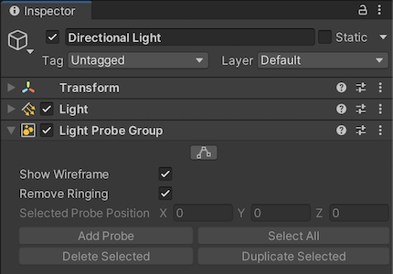
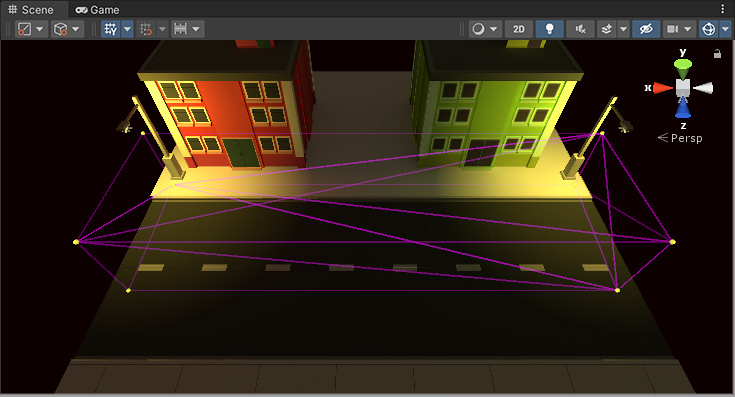

## Light Probe Groups

To place Light Probes in your Scene, you must use a GameObject with a Light Probe Group component attached. You can add a Light Probe Group component from the menu: **Component > Rendering > Light Probe Group**.

Adding the **Light Probe Group** component to any GameObject in the Scene. However, it’s good practice to **create a new empty GameObject** (menu: **GameObject > Create Empty**) and add it to that, to decrease the possibility of accidentally removing it from the Project.

### Troubleshooting Light Probe placement
Your choice of Light Probe positions must take into account that the lighting is **interpolated between sets of Light Probes**. Problems can arise if your Light Probes **don’t adequately cover the changes in lighting across your Scene**.

The example below shows a night-time Scene with two bright street lamps on either side, and a dark area in the middle. If Light Probes are only placed near the street lamps, and none in the dark area, the lighting from the lamps “bleeds” across the dark gap, on moving objects. This is because the lighting is being interpolated from one bright point to another, with no information about the dark area in-between.

> If you are using **Realtime or Mixed lights**, this problem may be **less noticeable**, because **only the indirect light bleeds across the gap**. **The problem is more noticable if you are using fully baked lights**, because in this situation the **direct light on moving objects is also interpolated from the Light Probes**. 

https://docs.unity3d.com/Manual/class-LightProbeGroup.html

