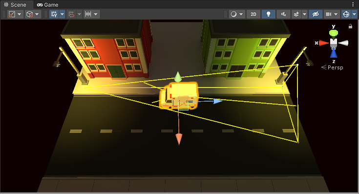
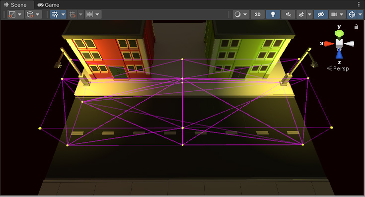
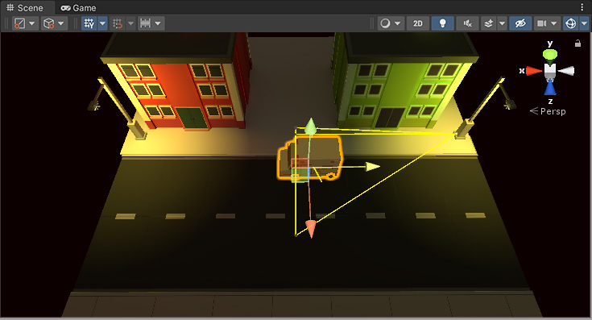

## Light Probe Groups

To place Light Probes in your Scene, you must use a GameObject with a Light Probe Group component attached. You can add a Light Probe Group component from the menu: **Component > Rendering > Light Probe Group**.

Adding the **Light Probe Group** component to any GameObject in the Scene. However, it’s good practice to **create a new empty GameObject** (menu: **GameObject > Create Empty**) and add it to that, to decrease the possibility of accidentally removing it from the Project.

| Property | Function |
| --- | --- |
| Edit Light Probes | To make changes to a Light Probe Group, click the Edit Light Probes button to enable editing. This changes Unity so that you can only move and edit Light Probes, so you must remember to disable it when you are finished. You cannot move or edit GameObjects or other element in Unity while Edit Light Probes is enabled. |
| Show Wireframe | When this property is enabled, Unity displays the wireframe of the Light Probe Group in the Scene view. When it is disabled, Unity only displays the Light Probe points, and not the wireframe connecting them. |
| Remove Ringing | When this property is enabled, Unity automatically removes Light Probe ringing from the Scene. For more information, see Ringing, later in this section. |
| Selected Probe Position | This gives the x, y and z coordinates of the selected Light Probes in the Scene. This property is read-only. |
| Add Probe | Click this to add a Light Probe to the Light Probe Group. |
| Select All | Click this to select all Light Probes in the Light Probe Group. |
| Delete Selected | Click this to delete the selected Light Probes from the Light Probe Group. |
| Duplicate Selected | Click this to duplicate the selected Light Probes. |

### Ringing 
Under certain circumstances, **Light Probes** exhibit an **unwanted behaviour called "ringing"**.

This often happens when there are significant differences in the light surrounding a Light Probe. For example, if you have bright light on one side of a Light Probe, and no light on the other side, the light intensity can “overshoot” on the back side. This overshoot causes a light spot on the back side.

There are several ways to deal with this:

- In the Light Probe Group component, enable Remove Ringing. Unity automatically removes the unintended light spots. However, this generally makes the Light Probes less accurate, and reduces light contrast, so you must check the visual results.
- Place in-game obstacles in such a way that players can’t get to a position where they can see the light spot.
- Avoid baking direct light into Light Probes. Direct light tends to have sharp discontinuities (such as shadow edges), which makes it unsuitable for Light Probes. To only bake indirect light, use Mixed lighting.

### Choosing Light Probe positions
Unlike lightmaps, which usually have a continuous resolution across the surface of an object, the resolution of the Light Probe information depends on how closely packed you choose to position the Light Probes.

You might place Light Probes in a more condensed pattern around areas that **have complex or highly contrasting light**, and you might place them in a much more spread out pattern over areas where the light **does not significantly change**.

> Light Probes individually do not store a large amount of information. From a technical perspective, each probe is a spherical, panoramic HDR image of the view from the sample point, encoded using Spherical Harmonics L2 which is stored as 27 floating point values. However, in large Scenes with hundreds of Light Probes they can add up, and having unnecessarily densely packed Light Probes can result in large amounts of wasted memory in your game.

### Troubleshooting Light Probe placement
Your choice of Light Probe positions must take into account that the lighting is **interpolated between sets of Light Probes**. Problems can arise if your Light Probes **don’t adequately cover the changes in lighting across your Scene**.

The example below shows a night-time Scene with two bright street lamps on either side, and a dark area in the middle. If Light Probes are only placed near the street lamps, and none in the dark area, the lighting from the lamps “bleeds” across the dark gap, on moving objects. This is because the lighting is being interpolated from one bright point to another, with no information about the dark area in-between.

> If you are using **Realtime or Mixed lights**, this problem may be **less noticeable**, because **only the indirect light bleeds across the gap**. **The problem is more noticable if you are using fully baked lights**, because in this situation the **direct light on moving objects is also interpolated from the Light Probes**. 

In this example Scene, the two lamps are baked, so moving objects get their direct light from Light Probes. Here you can see the result - a moving object (the ambulance) remains brightly lit while passing through the dark area, which is not the desired effect. The yellow wireframe tetrahedron shows that the interpolation is occurring between one brightly lit end of the street to the other.

https://docs.unity3d.com/Manual/class-LightProbeGroup.html

This is an undesired effect - the ambulance remains brightly lit while passing through a dark area, because no Light Probes were placed in the dark area.

To solve this, you should place more Light Probes in the dark area, as shown below:

Now the Scene has Light Probes in the dark area too. As a result, the moving ambulance takes on the darker lighting as it travels from one side of the Scene to the other.

