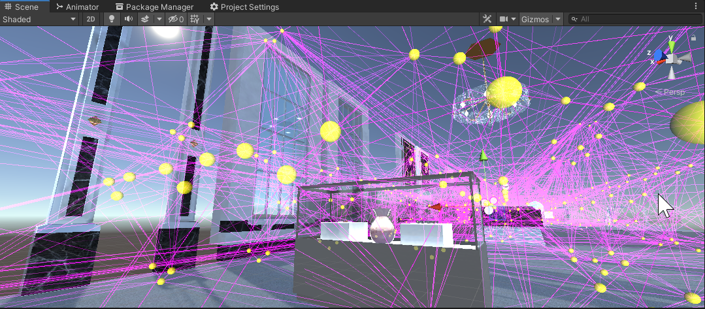

## Light Probes

**Light Probes** provide a way to **capture and use information about light that is passing through the empty space** in your scene.

Similar to lightmaps, **light probes** store **"baked" information about lighting** in your scene. The difference is that while **lightmaps store lighting information about light hitting the surfaces in your scene**, 

- **Light Probes store information about light passing through empty space in your scene**.

- Use **light probes** in a scene to **cast baked light** onto dynamic objects. 

- **Light probes** used if there need light variation on gameobject when moving one position to another position. For example moving from bright area to dark area.

- **Light probes** used if need to bake bounced light on game object.

- **Light Probes** add high-quality lighting effects to moving objects. They allow you to use Baked lighting — such as Emissive Materials and Area Lights — to **illuminate objects passing through your Scene**.

- **Light Probes** are **positions in the scene where the light is measured** (probed) during the bake. 

At runtime, the indirect light that hits dynamic GameObjects is approximated using the values from the nearest Light Probes to that object.

#### Light Probes have two main uses:
- The primary use of light probes is to **provide high quality lighting** (**including indirect bounced light**) **on moving objects** in your scene.

- The secondary use of light probes is to provide the lighting information for **static scenery** when that scenery is using **Unity’s LOD system**.

> When using light probes for either of these two distinct purposes, many of the techniques you need to use are the same. It’s important to understand how light probes work so that you can choose where to place your probes in the scene.

### Light Probes for moving objects (For bounced light)

Lightmapping adds greatly to the realism of a scene by capturing **realistic bounced light as textures** which are **"baked"** onto the **surface of static objects**. However, due to the **nature of lightmapping**, it can **only be applied to non-moving objects marked as Contribute GI**.

**Realtime and mixed mode lights** can cast **direct light** on moving objects, moving objects **do not receive bounced light** from your **static** environment unless you use **light probes**. 

> Light probes **store information about how light is bouncing around in your scene**. Gameobjects move through the spaces in your game environment, they can use the information stored in your light probes to show an approximation of the bounced light at their current position.

https://docs.unity3d.com/Manual/LightProbes-MovingObjects.html

### Light Probes and the Mesh Renderer

To use Light Probes on your moving GameObjects, the Mesh Renderer component on the moving GameObject must be set correctly. The **Mesh Renderer** component has a Light Probes setting which is set to **Blend Probes** by default. 
This means that by default, all GameObjects will use light probes and will **blend between the nearest probes** as it changes position in your scene.

You can change this setting to either “off” or “use proxy volume”. Switching the light probes setting to off will disable the light probe’s effect on this GameObject.

**Light Probe Proxy Volumes** are a special setting which you can use for situations where a large moving object might be too big to be sensibly lit by the results of a single tetrahedron from the light probe group
, and instead needs to be lit by multiple groups of light probes across the length of the model. See Light Probe Proxy Volumes for more information.

The other setting in the Mesh Renderer inspector
 which relates to light probes is the Anchor Override setting. As described previously, when a GameObject moves through your scene, Unity calculates which tetrahedron the GameObject falls within from the volume defined by the light probe groups. By default this is calculated from the centre point of the Mesh’s bounding box, however you can override the point that is used by assigning a different GameObject to the Anchor Override field.

If you assign a different GameObject to this field, it is up to you to move that GameObject in a way that suits the lighting you want on your mesh.

The anchor override may be useful when a GameObject contains two separate adjoining meshes; if both meshes are lit individually according to their bounding box positions then the lighting will be discontinuous at the place where they join. This can be prevented by using the same Transform (for example the parent or a child object) as the interpolation point for both Mesh Renderers or by using a Light Probe Proxy Volume.

Most of the Renderer components in Unity contain Light Probes. There are three options for Light Probes:

- **Off**: the Renderer doesn’t use any interpolated Light Probes.
- **Blend Probes (default value)**: the Renderer uses one interpolated Light Probe.
- **Use Proxy Volume**: the Renderer uses a **3D grid** of interpolated Light Probes.

### ref
https://docs.unity3d.com/Manual/LightProbes.html

https://medium.com/nerd-for-tech/using-light-probes-in-unity-56bcedd1aafd

https://www.youtube.com/watch?v=_E0JXOZDTKA

https://www.youtube.com/watch?v=DlxuvvYZO4Q

https://www.google.com/search?rlz=1C1RXMK_enCA1034CA1034&tbm=vid&sxsrf=AJOqlzW0_zOqDoP7476DkYiCrAFKNSBZ5w:1678419702782&q=unity+light+probe&sa=X&ved=2ahUKEwj0_qvRuND9AhUajIkEHTqzBx8Q8ccDegQICxAD&biw=1021&bih=909&dpr=1#fpstate=ive&vld=cid:bbada050,vid:pzbebc0Ryv8

https://fistfullofshrimp.com/unity-vr-optimization-light-probes/

