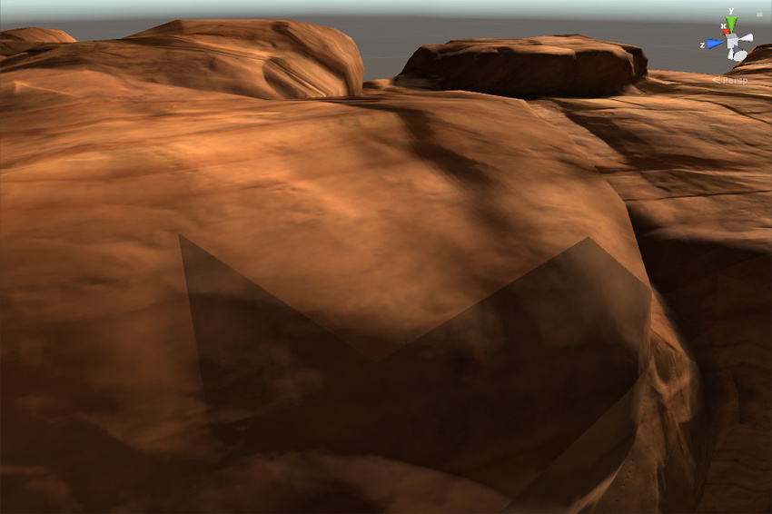

## Lightmap UVs

**Texture coordinates, commonly called UVs**, describe how to "**wrap**" **a texture around geometry**. **Lightmaps
 are textures**, so Unity needs UVs to correctly use them in your scene.

Both the Realtime Global Illumination
 system and the Baked Global Illumination system use lightmaps, and therefore need lightmap
 UVs.
 
 
Unity uses separate sets of lightmap UVs for the **Realtime Global Illumination system** and the **Baked Global Illumination system**. There are two reasons for this:

- There is no direct correspondence in the grouping of instances between real-time and baked lightmaps; instances that are in the same real-time lightmap may be in two different baked lightmaps, and vice versa.
- Meshes that appear at different scales share lightmap UVs in baked lightmaps, but do not share UVs in real-time lightmaps.

### Baked lightmap UVs
**Baked lightmap UVs** are **per-mesh**: all instances of the **same mesh share the same baked lightmap UVs**. **Unity can calculate the UVs for baked lightmaps when you import a model**, or you can provide your own data.

Unity stores baked lightmap UVs in its mesh in the **`Mesh.uv2`** channel. This channel maps to the **TEXCOORD1 shader semantic**, and is commonly called **"UV1"**.

If Baked Global Illumination is enabled and a given MeshRenderer receives its global illumination from lightmaps, Unity uses the data in the Mesh.uv2 channel to correctly map the baked lightmaps to the mesh.

> **Note**: If you want to use **`Mesh.uv2`** for another purpose in a given mesh, you must ensure that all MeshRenderer components that use the mesh receive global illumination from **Light Probes** rather than lightmaps. Change this with the Mesh Renderer component Inspector, or the **`MeshRenderer.receiveGI API`**.
 

### Real-time lightmap UVs
**Real-time lightmap UVs** are **per-Mesh Renderer**: 
All instances of the **same mesh share the same input data**, but different instances of **Mesh Renderers** can **use different real-time lightmap UVs at runtime**. 

Unity calculates the UVs for the **Realtime Global Illumination system** during the **precompute stage**. This calculation takes per-mesh UVs as its input, and uses that data to create per-Mesh Renderer UVs. Unity can generate the input per-mesh UVs when you import a model, or you can provide your own data.
 
- Unity can use data in the Mesh.uv3 channel as input for the real-time lightmap UV calculations. Mesh.uv3 maps to the TEXCOORD2 shader semantic, and is commonly called “UV2”.
- If there is no data in Mesh.uv3 but there is data in Mesh.uv2 , Unity falls back to using the data in Mesh.uv2 as input for the real-time lightmap UV calculations. Mesh.uv2 is used for baked lightmap UVs. It is common to use the baked lightmap UVs as input data for the real-time lightmap UVs.
- The results of the calculations are stored per-MeshRenderer, in **`MeshRenderer.enlightenVertexStream`**. If Realtime Global Illumination is enabled and a given MeshRenderer component contributes to global illumination and receives its global illumination from lightmaps, Unity automatically passes the data in **`MeshRenderer.enlightenVertexStream`** to **`TEXCOORD2`** in shaders, instead of the data in **`Mesh.uv3`**.

> **Note**: If you want to use Mesh.uv3 for another purpose in a mesh that uses Realtime Global Illumination, you must ensure that all MeshRenderer components that use the mesh receive global illumination from Light Probes rather than lightmaps. Change this with the Mesh Renderer component Inspector, or the MeshRenderer.receiveGI API.

https://docs.unity3d.com/Manual/LightingGiUvs.html

### Generating lightmap UVs

> Unity can calculate the UVs for baked lightmaps when you import a model, or you can provide your own data.

You can author your own lightmap UVs in the content creation software of your choice. Unity uses these UVs as input for its calculations.

Where you put this data depends on whether you are providing UVs for baked lightmaps, real-time lightmaps, or both:

- For baked lightmaps, you must place lightmap UVs in the **`Mesh.uv2`**. This channel is also called “UV1”.
- For real-time lightmaps:
  - If you already have baked lightmap UVs in the **`Mesh.uv2`** of your mesh
, and you want to use the same UVs as input for the real-time lightmaps, you do not need to do anything. Unity falls back to sharing the baked lightmap UVs.
  - If you already have baked lightmap UVs in **`Mesh.uv2`**, and you want to provide different UVs as input for your real-time lightmaps, place the real-time lightmap UVs in **`Mesh.uv3`**, also called **"UV2"**.
  - If you do not already have baked lightmap UVs in the second channel of your mesh, it’s your choice whether you use **`Mesh.uv2`** or **`Mesh.uv3`** for real-time lightmap UVs.

A good UV set for lightmaps should adhere to the following rules:

- It should be within the **`[0,1] x [0,1]`** UV space.
- It should have a wide enough margin between individual charts. For more information, see UV overlap feedback.
- It should not have any overlapping faces.
- There should be a low difference between the angles in the UV and the angles in the original geometry.
- There should be a low difference between the relative scale of triangles in the UV and the relative scale of the triangles in the original geometry), unless you want some areas to have a higher lightmap resolution.

### Automatically generate lightmap UVs
You can tell Unity to automatically generate lightmap UVs for a Model, using the Model Import Settings.

- Select the Model in your Project view. Unity opens the Model Import Settings in the Inspector.
- In the Model Import Settings, navigate to the Model tab, and then the Geometry section.
- Tick the **Generate Lightmap UVs** checkbox. The **Lightmap UVs settings** section appears below the Generate Lightmap UVs checkbox.
4. Optional: Configure the settings in the **Lightmap UVs settings** section. See Settings for more information.
5. Click the **Apply** button. Unity generates lightmap UVs into the **`Mesh.uv2`** channel.

These are the settings that appear in the **Model** tab of the **Model Import Settings**, when you enable Generate Lightmap UVs.

| Property: | Function: |
| --- | --- |
| Hard Angle | The angle between neighboring triangles (in degrees) after which Unity considers it a hard edge and creates a seam. You can set this to a value between 0 and 180. This is set to 88 degrees by default.If you set this to 180 degrees, Unity considers all edges smooth, which is realistic for organic models. The default value (88 degrees) is realistic for mechanical models. |
| Angle Error | The maximum possible deviation of UV angles from the angles in the source geometry (as a percentage from 0–100). This is set to 8% by default.This controls how different the triangles in UV space can be to the triangles in the original geometry. Usually this should be fairly low, to avoid artifacts when applying the lightmap. |
| Area Error | The maximum possible deviation of UV areas from the areas in the source geometry (as a percentage from 0–100). This is set to 15% by default.This controls how well Unity preserves the relative triangle areas. Increasing the value allows you to create fewer charts. However, increasing the value can change the resolution of the triangles, so make sure the resulting distortion does not deteriorate the lightmap quality. |
| Margin Method | Whether you specify the Pack Margin manually, or whether Unity automatically calculates it. |
|  | Manual |
|  | Calculate |
| Pack Margin | The margin between neighboring charts (in pixels), assuming the Mesh takes up the entire 1024x1024 lightmap. You can set this to a value between 1 and 64. A larger value increases the margin, but also increases the amount of space the chart needs. This is set to 4 pixels by default.For more information, see Pack Margin.This property is only visible when Margin Method is set to Manual. |
| Min Lightmap Resolution | The minimum lightmap resolution (in texels per unit) of the MeshRenderers that use this Mesh, across all Scenes. The lightmap resolution of a MeshRenderer is a combination of the MeshRenderer’s Scale in Lightmap property, and the Lightmap Resolution property of the Lighting Settings Asset of the Scene it appears in.For more information, see Min Lightmap Resolution and Min Object Scale.Unity uses this information to calculate pack margin. This property is only visible when Margin Method is set to Calculate. |
| Min Object Scale | The minimum transform scale that of the GameObjects that use this Mesh, across all Scenes.For more information, see Min Lightmap Resolution and Min Object Scale.Unity uses this information to calculate pack margin. This property is only visible when Margin Method is set to Calculate. |
 

### Visualizing lightmap UVs
To preview the UVs lightmaps, go to the **Window > Rendering > Lighting**, click **Baked Lightmaps** or **Realtime Lightmaps** and click the lightmaps UVs to open preview.

Or click the gameobject, under the mesh renderer component, in Lightmapping field, under the Baked Lightmap open the preview.

### Lightmap seam stitching

Seam stitching is a feature that smooths unwanted hard edges in GameObjects rendered with baked lightmaps generated by the **Progressive Lightmapper**.

When Unity bakes lightmaps, it identifies mesh faces that are close together but separate from each other as being separate in lightmap space; the edges of these meshes are called “seams”. Ideally, seams are invisible; however, they can sometimes appear to have hard edges. This is because the GPU cannot blend texel values between charts that are separated in the lightmap.

**Seam stitching** fixes this issue. When you enable seam stitching, Unity does **extra computations to amend the lightmap** to improve each seam’s appearance.

Stitching is not perfect, but it often improves the final result substantially. **Seam stitching takes extra time during baking due to extra calculations** Unity makes, so **Unity disables it by default**.

When you enable seam stitching, the lightmapper identifies the pair of edges that it should stitch together, and produces illumination which is as smooth as possible across the seam. This applies only to straight edges which run horizontally or vertically along chart boundaries in the atlas, and is designed to work with rectangles which are axis-aligned in UV space.

**Limitations of seam stiching:**
Seam stitching works with the Progressive Lightmapper. **Seam stitching only works on single GameObjects**; multiple GameObjects cannot be smoothly stitched together.

