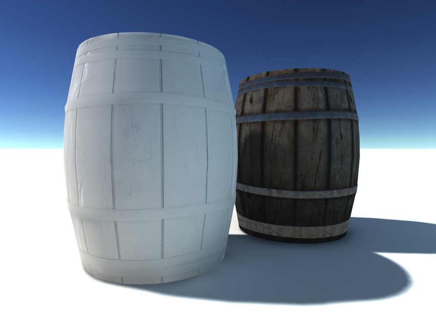
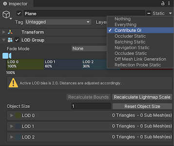

## Lightmapping

Lightmapping is the **process of pre-calculating the brightness of surfaces in a Scene** , and **storing the result in a Texture** called a **lightmap** for later use.

> The data baked into **lightmaps cannot change at runtime**. Real-time lights can be overlaid and used additively on top of a lightmapped scene, but cannot interactively change the lightmaps themselves.

**Unity provides the following lightmappers for generating lightmaps:**

- **Progressive Lightmapper**
- **Enlighten Baked Global Illumination**

### Preparing the Scene and baking the lightmaps

Select **Window > Rendering > Lighting** from the Unity Editor menu to open the Lighting window. Make sure any Mesh you want to apply a lightmap to has proper UVs for lightmapping. The easiest way to do this is to open the Mesh import settings and enable the **Generate Lightmap UVs setting**.

Next, to control the resolution of the **lightmaps**, go to the **Lightmapping Settings** section and adjust the **Lightmap Resolution** value.

To be included in your lightmap, Renderers must meet the following criteria:

- Have a **Mesh Renderer** or **Terrain component**
- Be marked as **Contribute GI**
- Use a built-in Unity Material, the **Standard Shader**, or a Shader with a **Meta Pass**

You can adjust settings for Lights in the **Light Explorer**. To open the Light Explorer, go to **Window > Rendering > Light Explorer**.

To **generate lightmaps** for your Scene:

- Open the Lighting window (menu: **Window > Rendering > Lighting**)
- At the bottom of the **Scene** tab on the Lighting window, select **Generate Lighting** (or ensure that Auto Generate is enabled).
- A progress bar appears in Unity Editor’s status bar, in the bottom-right corner.

When lightmapping is complete, Unity’s Scene and Game views update automatically and you can view the resulting lightmaps by going to the **Baked Lightmaps** tab in the Lighting Window.

> When you manually generate lighting, Unity adds Lighting Data Assets, baked lightmaps and Reflection Probes
 to the Assets folder.

To create a new Lightmap Parameters Asset, right-click in the Project window and go to Create > New Parameters Asset. Unity stores this in your Project folder.

### Lightmap Parameters Asset

A LightmapParameters Asset contains a set of values for the parameters that control Unity’s lighting features. These Assets allow you to define and save different sets of values for lighting, for use in different situations.

Lightmap Parameters Assets allow you to quickly create presets optimized for different types of GameObjects
, or for different platforms and different Scene types (for example, indoor or outdoor Scenes).

To create a new Lightmap Parameters Asset, right-click in the **Project window** and go to** Create > Lightmap Parameters**. Unity stores this in your Project folder. Or **Assets > Create > Lightmap Parameters**.

### Assigning Lightmap Parameters Assets

#### Scenes
To assign a **Lightmap Parameters Asset** **to the whole Scene**:

- Open the Lighting window (**Window > Rendering > Lighting**)
- Click the **Scene** tab
- Navigate to the **Lightingmapping Settings**.
- Use the **Lightmap Parameters** drop-down to assign a default Lightmap Parameters Asset. This drop-down lists all available Lightmap Parameters Assets.

#### GameObjects
To assign a **Lightmap Parameters Asset** to a single **GameObject**, ensure the GameObject has a **Mesh Renderer** or **Terrain component** attached.

To assign a Lightmap Parameters Asset to a **Mesh Renderer** component:

- In the Inspector, go to **Mesh Renderer > Lighting**
- Enable **Contribute Global Illumination**
- In the mesh Renderer component, go to **Lightmapping > Lightmap Parameters**.
- Select an option from the menu. Select **Scene Default Parameter** to use the same Lightmap Parameters Asset that’s assigned to the whole Scene.

To assign a Lightmap Parameters Asset to a **Terrain** component:

- In the Inspector, go to **Terrain > Terrain Settings > Lighting**
- Enable **Contribute Global Illumination**
- In **Terrain Settings**, go to **Lightmapping > Lightmap Parameters.**
- Select an option from the menu. Select **Scene Default Parameter** to use the same Lightmap Parameters Asset that’s assigned to the whole Scene.

### Directional Mode
There are two Directional Modes for lightmaps: 
- **Directional** 
- **Non-Directional**. 

 Both modes are compatible with real-time lightmaps from Unity’s **Enlighten Realtime Global Illumination
 system**, and **baked lightmaps from Unity’s Progressive Lightmapper**.

The barrels in this image have baked **Non-directional lightmaps**.

The barrels in this image have baked **Directional lightmaps**.

#### Setting your lightmap mode

Open the **Lighting window** (**Window > Lighting > Settings**), click **Scene**, navigate to the **Lightmapping Settings**, and select **Directional Mode**.

> The default mode is Directional

> You can set the lightmap mode for an instance of the Lighting Settings asset which can apply to one or more Scenes. You cannot set the lightmap mode for individual lightmaps.

https://docs.unity3d.com/Manual/LightmappingDirectional.html

### Lightmaps and LOD

Baking light into models that use **Unity’s LOD (level of detail) system**.

When you use the **Progressive Lightmapper**, there is no need to place **Light Probes** around an **LOD Group** to generate baked indirect lighting.

**Enlighten Baked Global Illumination** can **only compute direct lighting for lower LODs**, and the **LOD system** **must rely on Light Probes** to sample indirect lighting.

> If you do not place Light Probes, your lower LOD models may appear visually incorrect because they only receive direct light.

To set up LOD models correctly for baked lighting, mark the **LOD GameObjects** as **Contribute GI**. To do this, select the GameObject, and at the top of the Inspector window, select the drop-down menu next to the **Static checkbox**:

Use the Light Probes component to place Light Probes around the LOD GameObjects.

https://docs.unity3d.com/Manual/LODForBakedGI.html

### Ambient occlusion

**Ambient occlusion(AO)** is a feature that simulates the soft shadows that occur in creases, holes, and surfaces that are close to each another. These areas occlude (block out) ambient light, so they appear darker.

It works by approximating how much ambient light can hit a point on a surface. It then darkens creases, holes and surfaces that are close to each other.

You can use ambient occlusion to add realism to your lighting.

#### Baked Ambient Occlusion

If Baked Global Illuminationis enabled in your Scene, Unity can bake ambient occlusion into the lightmap. This is known as **Baked Ambient Occlusion**.

To enable baked ambient occlusion in your Scene:

- Open the Lighting window (menu: **Window > Rendering > Lighting**)
- Navigate to the **Mixed Lighting** section
- Enable **Baked Global Illumination**
- Navigate to the Lightmapping Settings section
- Enable **Ambient Occlusion**

#### Realtime ambient occlusion
If Global Illumination is not enabled in your Scene but you still want the effect of ambient occlusion, you can use a post-processing effect to apply real-time ambient occlusion to your Scene.

If Enlighten Realtime Global Illumination is enabled in your Scene, the resolution for indirect lighting does not capture fine details or dynamic objects. We recommend using a real-time ambient occlusion post-processing effect, which has much more detail and results in higher quality lighting.

https://docs.unity3d.com/Manual/LightingBakedAmbientOcclusion.html

### Lightmapping and shaders
#### The Meta Pass
A Meta Pass is a **Shader pass that provides albedo and emission values to the Global Illumination
 system**. These values are separate from those used in real-time rendering, meaning that you can use the Meta Pass to control how a GameObject
 looks from the point of view of the lighting baking system without affecting its appearance at runtime.
 
 All of Unity’s built-in Materials have a **Meta Pass**, and the Standard Shader contains a **Meta pass**. If you are using these, you do not need to do anything to enable the **Meta Pass**. If you are using a custom Shader, you can add your own **Meta Pass**.

https://docs.unity3d.com/Manual/MetaPass.html

### ref
https://www.youtube.com/watch?v=KJ4fl-KBDR8

https://www.youtube.com/watch?v=okYhs6kQ0xw

https://docs.unity3d.com/Manual/Lightmappers.html

