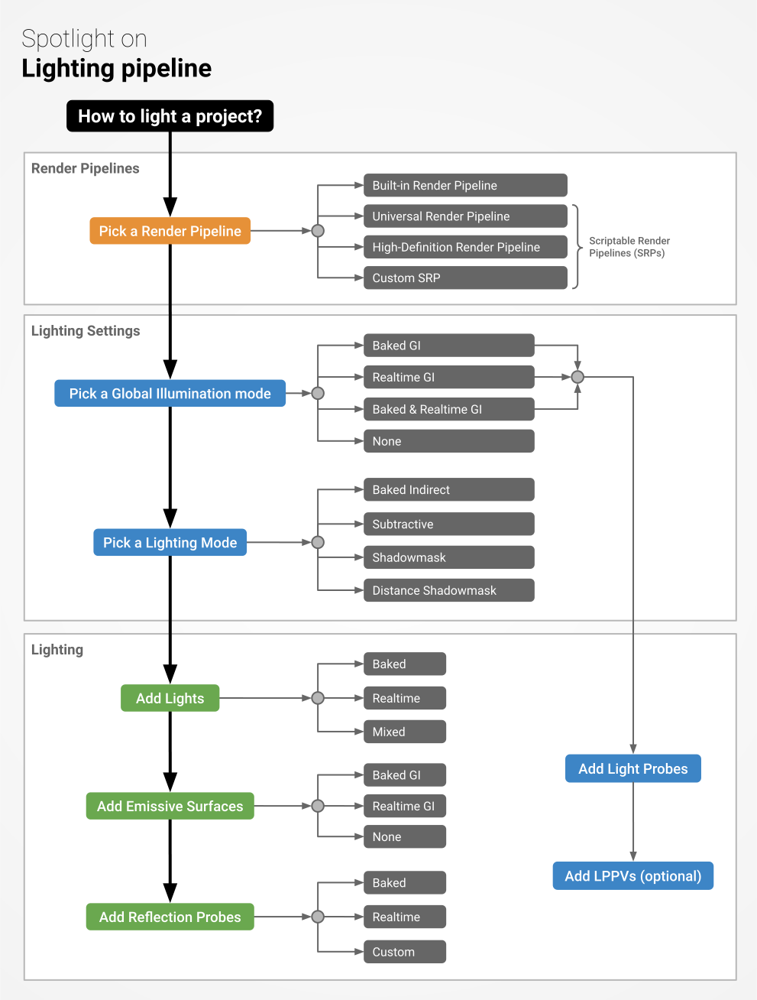
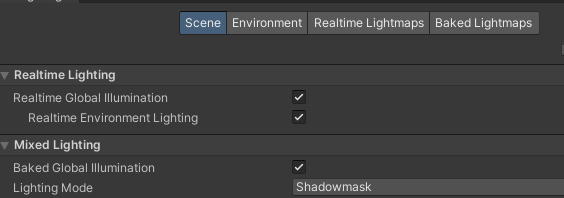
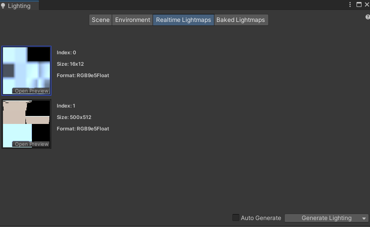
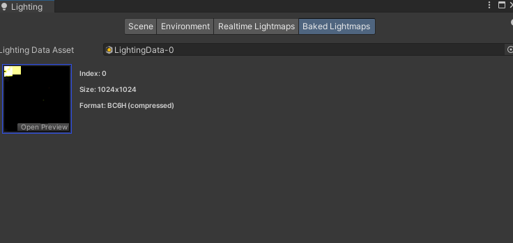
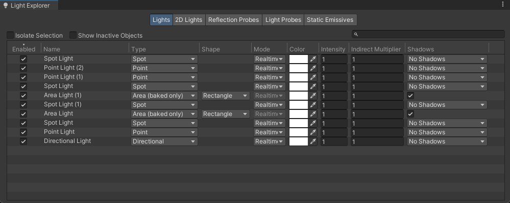

## Lighting

a **Light object** is created by attaching a **Light component** to a GameObject.

**Lights can be added to your scene** from the **GameObject > Light** menu. You will choose the light format that you want from the sub-menu that appears. Once a light has been added, you can manipulate it like any other GameObject. Additionally, you can **add a Light Component** to any **selected GameObject** by using **Component > Rendering > Light**.

Lighting in Unity works by approximating how light behaves in the real world.

- **Direct light**:
  It is light that is emitted, hits a surface once, and is then **reflected directly into a sensor** (for example, the eye’s retina or a camera).
  
- **Indirect light**:
  It is all other light that is **ultimately reflected into a sensor**, including light that hits surfaces several times, and sky light.  Such as bounced light.
  
> To achieve realistic lighting results, you need to simulate both direct and indirect light.

- **Real-time lighting**:
  It is when Unity calculates lighting at runtime.

- **Baked lighting**:
  It is when Unity performs lighting calculations in advance and saves the results as lighting data, which is then applied at runtime.
  
>  In Unity, your Project can use real-time lighting, baked lighting, or a mix of the two (called **mixed lighting**).
  
- **Global illumination**:
  Global illumination is **a group of techniques** that **model both direct and indirect lighting to provide realistic lighting results**. \
  **Unity has two global illumination systems**, which combine direct and indirect lighting.
  - **Baked Global Illumination system**:
    Consists of **lightmappers**, **Light Probes**, and **Reflection Probes**. \
    **There are three options for baking**: 
    - The **Progressive Lightmapper (CPU or GPU)**, and
    - **Enlighten Baked Global Illumination**.
  - **Real-time Global Illumination system**: 
    It is **Enlighten Realtime Global Illumination**. \
    https://www.siliconstudio.co.jp/middleware/enlighten/en/

### Set `Static` to objects for using baked/mixed lighting

#### 🔆 Unity Lighting: When to Use Static Settings (HDRP/URP)

In **Unity**, especially when using **Baked** or **Mixed Lighting** in **HDRP** or **URP**, objects that should receive baked lighting need to be marked as **Static**, specifically **Lightmap Static** / **Contribute GI**.

#### ✅ When & Why to Mark Objects as Static

1. If Using Baked or Mixed Lights
  - **Baked Lights** only affect objects marked as **Lightmap Static**/**Contribute GI**.
  - **Mixed Lights**:
    - Bake indirect lighting for static objects.
    - Provide real-time shadows for dynamic objects.

**What to do**:

1. Select the object in the **Scene**.
2. In the **Inspector**, check the `Static` checkbox (top right).
3. Or click the dropdown next to it and only check **Lightmap Static**/**Contribute GI**.

#### 🔸 2. If Using Realtime Lights Only

- You **don’t need** to mark the object as static.
- All objects can receive lighting dynamically from realtime lights.

#### 💡 Summary Table

| Object Type                    | Light Type         | Should Be Static?   |
|-------------------------------|--------------------|----------------------|
| Static walls/floors           | Baked or Mixed     | ✅ Yes (Lightmap Static) |
| Movable vehicles (e.g. forklift) | Mixed or Realtime | ❌ No |
| Props that never move         | Baked              | ✅ Yes |
| Player, enemies               | Realtime           | ❌ No  |

#### 💡 Unity Lighting & Lightmap Static: Bake to See Results

If you mark an object as **Lightmap Static**/**Contribute GI**, you must **bake the lighting** first to see the lighting effects in **Editor** or **Play Mode**.

#### 🔦 Breakdown

| Situation                  | Static Object Behavior                         |
|---------------------------|-------------------------------------------------|
| ✅ Marked as Lightmap Static | Receives light **only after baking**        |
| ❌ Not baked yet            | Will look **unlit** / **incorrect** in scene |
| ✅ Baked Lighting completed | Shows **correct** light/shadow               |
| 🔁 Real-time Light only     | Doesn’t need baking; **lights immediately**  |
| 🛠️ Using HDRP/URP           | Needs **Global Illumination settings** configured |

#### 🔧 What You Should Do

1. ✅ **Mark objects as Lightmap Static**/**Contribute GI** if they don’t move.
2. Go to:  
   `Window > Rendering > Lighting > Environment`
3. Under **Lightmapping Settings**, click:
   - ✅ `Generate Lighting` (manual)  
   - Or enable `Auto Generate` *(not recommended for large scenes)*

####  ✅ Once Baking is Done, You'll See:

- Proper **shadows**
- **Global illumination** bounce

### Lighting window
The Lighting window (menu: **Window > Rendering > Lighting**) is the main control point for Unity’s lighting features.

You can use the Lighting window to **adjust settings related to the lighting** in your Scene, and to **optimise your precomputed lighting data for quality, bake time, and storage space**.

> You can perform many of the functions available in the **Lighting window** in scripts, using the **`LightingSettings`** and **`Lightmapping`** APIs.

#### Scene tab
The Scene tab displays information about the **Lighting Settings Asset** that is assigned to the active Scene. If no Lighting Settings Asset is assigned to the active Scene, it displays information about the **default LightingSettings object**.

The Scene tab is divided into several sections:

- Lighting Settings Asset controls
- Lighting settings - Realtime Lighting, Mixed Lighting and Lightmapping settings
- Workflow Settings

#### Environment tab
The Environment tab contains settings related to **environmental lighting effects** for the current Scene. The contents depend on the render pipeline that your Project uses.

The Environment tab is divided into two sections:

- **Environment**: \
  The Environment section contains **lighting-related settings** and **controls** that apply to the **environmental lighting** in the current scene, such as the **Skybox, diffuse lighting and reflections**.
- **Other settings**: \
  The Other Settings section contains settings for **fog, Halos, Flares, and Cookies**.

#### Realtime Lightmaps tab
The **Realtime Lightmaps tab** shows a list of all **lightmaps** generated by the **`Enlighten Realtime Global Illumination system`** in the current Scene. 
> If **`Enlighten Realtime Global Illumination`** is **not enabled** in your Project, this tab will be empty.

#### Baked Lightmaps tab
This tab shows **a list of all lightmaps generated by lightmapper** for the current Scene, **along with the Lighting Data Asset**. 

> If **`Baked Global Illumination`** is not enabled in your Project, this tab will be empty.

https://docs.unity3d.com/Manual/lighting-window.html

### Light Explorer window
The **Light Explorer window** allows you to **select and edit light sources**. To open the Light Explorer window from the menu, navigate to **Window > Rendering > Light Explorer**.

Use the four tabs at the top of the panel to view settings for the **Lights, 2D Lights, Reflection Probes, Light Probes, and Static Emissives** in the current Scene. The **editable parameters** are the most commonly-used fields for each component type.

Use the search field to filter each table for names. You can also **select the lights** you want to work on, then **tick the Lock Selection checkbox**. Only the lights that were selected when the checkbox was ticked remain listed in the Light Explorer, even if you select a different Light in the Scene.

### 🌞 Lightmap vs Light Probe — What’s the Difference?

| **Feature**  | **Lightmap**  |**Light Probe**    |
|-|-|-|
| **Used For** | Static objects (non-moving) | Dynamic/moving objects (e.g., characters) |
| **Lighting Stored In**   | Textures (UV-mapped)  | 3D Spherical Harmonics at probe positions  |
| **Bakes**   | Direct + Indirect lighting  | Indirect lighting only |
| **Shadows**  | ✅ Yes (baked into the texture)  | ❌ No (only ambient GI, no baked shadowing)  |
| **Performance**  | Moderate texture memory usage | Lightweight, great for dynamic characters  |
| **Realtime Compatible**  | ❌ (static only)  | ✅ Yes – responds to probe blending while moving  |

#### 🎯 When to Use Each

**✅ Use **Lightmaps** when:** 
- The object is **static** (walls, floors, terrain).
- You want **baked shadows** and **bounce light**.
- You want **maximum visual quality** for non-moving geometry.

**✅ Use **Light Probes** when:** 
- The object is **movable** (players, enemies, vehicles).
- You want it to **receive baked indirect lighting** as it moves.
- You want **better performance** than full real-time GI.

#### 🔁 Use Them Together (Recommended)
**Most games use both:** 
- **Lightmaps** for static geometry (buildings, props)
- **Light Probes** for dynamic objects (characters)

In **HDRP**, Light Probes (or **Adaptive Probe Volume**) will blend between probe points to give moving objects smooth **indirect lighting transitions**.

### ref
https://www.youtube.com/watch?v=DlxuvvYZO4Q

https://www.youtube.com/watch?v=VnG2gOKV9dw

https://www.youtube.com/watch?v=5rxMdiCkQGk
