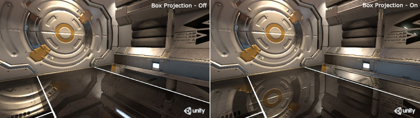

## Box projection

The Box Projection feature allows you to create a reflection cubemap at a finite distance from the probe, thus allowing objects to show different-sized reflections according to their distance from the cubemap’s walls.

Normally, the reflection cubemap is assumed to be at an infinite distance from any given object.
It is not possible for the object to move closer or farther away from the reflected surroundings. This behavior often works very well for outdoor scenes. Still, its limitations show in an indoor scene where the interior walls of a room are clearly not an infinite distance away, and the reflection of a wall should get larger the closer the object gets to it. 
For example, with a probe that reflects the interior of a room, you should set the size to match the dimensions of the room.

The Box Projection option allows you to create a reflection cubemap at **a finite distance from the probe**, thus allowing objects to show **different-sized reflections according to their distance from the cubemap’s walls**.

