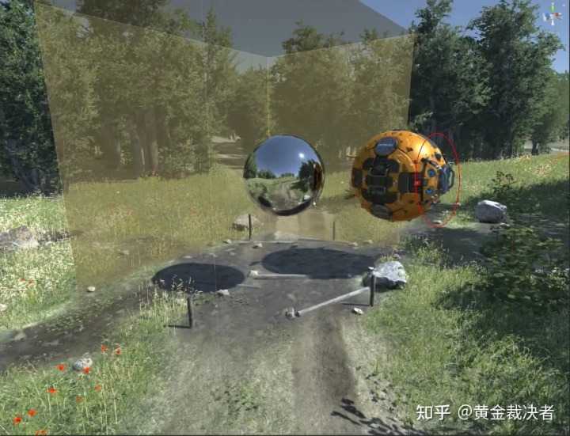
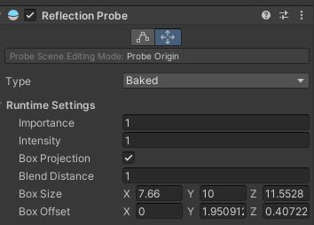

## Reflection Probes

Traditionally, games have used a technique called ***reflection mapping*** to simulate reflections from objects while keeping the processing overhead to an acceptable level. 

This technique assumes that all reflective objects in the scene can **see** (and therefore reflect) the exact same surroundings.

This works quite well for the game’s main character (a shiny car, say) if it is in open space but is unconvincing when the character passes into different surroundings; it looks strange if a car drives into a tunnel but the sky is still visibly reflected in its windows.

**Unity improves on basic reflection mapping** through the use of **Reflection Probes**, which **allow the visual environment to be sampled at strategic points** in the scene.

You should generally place them at every point where the appearance of a reflective object would change noticeably (**eg, tunnels, areas near buildings and places where the ground colour changes**). 

> When a **reflective object** passes near to a probe, the reflection sampled by the probe can be used for the object’s reflection map. Furthermore, when several probes are nearby, Unity can interpolate between them to allow for gradual changes in reflections. 

### How Reflection Probes Work

The visual environment for a point in the scene can be represented by a **cubemap**. This is conceptually like a box with flat images of the view from six directions (up, down, left, right, forward and backward) painted on its **interior surfaces**. Reflective object pass through this box will have those reflective images painted on its surface.

For an object to show the reflections, its **shader** **must have access to the images representing the cubemap**. Each point of the object’s surface can "see" a small area of cubemap in the direction the surface faces (ie, the direction of the surface normal vector).

The **cubemap** can be **painted by an artist** or it can be obtained by taking six **"snapshots"** from a point in the scene, with one shot for each cube face.

Reflection probes improve on this by allowing you to set up many **predefined points** in the scene where **cubemap** **snapshots can be taken**. You can therefore **record the surrounding view** at any point in the scene where the reflections differ noticeably.

A probe also has a zone of effect defined by an invisible box shape in the scene. A reflective object that passes within a probe’s zone has its reflection cubemap supplied temporarily by that probe. As the object moves from one zone to another, the cubemap changes accordingly.

### Types of Reflection Probe
- **Baked** \
  **Baked probes** store a reflection cubemap generated (**"baked"**) within the editor. You can trigger the baking by clicking either the Bake button at the bottom of the Reflection Probe inspector or the Generate Lighting button in the Lighting window. The reflection from a **baked probe** can only show objects marked as **Reflection Probe Static** in the inspector. This indicates to Unity that the objects will not move at runtime.
  A **Baked Reflection Probe** is one whose **reflection cubemaps** captured in the Unity editor and stored for subsequent usage in the player (see the Reflection Probes Introduction for further information). Once the capture process is complete, the reflections are “frozen” and so baked probes can’t react to runtime changes in the scene caused by moving objects.
  > You should set the probe’s Type property to **Baked** or **Custom** in order to make it behave as a baked probe 
- **Realtime** \
  **Realtime probes** create the **cubemap** at **runtime** in the player rather than the editor. This means that **the reflections are not limited to static objects** and can be **updated in real time** to show changes in the scene. However, it takes considerable processing time to refresh the view of a probe so it is wise to manage the updates carefully. Unity **allows you to trigger updates from a script so you can control exactly when they happen**. Also, there is an option to apply **timeslicing to probe updates** so that they can **take place gradually over a few frames**.
- **Custom** \
  **Custom probe** let you bake the view in the editor, as with Baked probes, but you can also supply a custom cubemap for the reflections. Custom probes cannot be updated at runtime.

### Using Baked probes
> Baked probes are useful for many purposes and have good runtime performance but they have the disadvantage of not updating live within the player. This means that objects can move around in the scene without their reflections moving along with them. In cases where this is too limiting, you can use Realtime probes, which update the reflection cubemap at runtime. This effect comes with a higher processing overhead but offers greater realism.

> The reflections captured by baked probes can **only** include scene objects marked as **Reflection Probe Static**(using the Static menu at the top left of the inspector panel for all objects). You can further refine the objects that get included in the **reflection cubemap** using the **Culling Mask** and **Clipping Planes** properties, which work the same way as for a Camera (the probe is essentially like a camera that is rotated to view each of the six cubemap faces).

> When the **Auto** option is switched on (from the Lighting window), the **baked reflections** will update automatically as you position objects in the scene. If you are not making use of auto baking then you will need to click the Bake button in the Reflection Probe inspector to update the probes. (The **Generate Lighting** button in the Lighting window will also trigger the probes to update.)

### Using Custom Probes
By default, Custom probes work the **same way as Baked probes** but they also have additional options that change this behaviour.

The **Dynamic Objects** property on a custom probe’s inspector allows objects that are not marked as **Reflection Probe Static** to be included in the **reflection cubemap**.

> **Note**: The positions of these objects are still “frozen” in the reflection at the time of baking.

The **Cubemap** property allows you to assign your **own cubemap** to the probe and therefore make it completely independent of what it can **"see"** from its view point. You could use this, say, to set a **skybox** or a **cubemap** generated from your 3D modelling app as the **source for reflection**s.

### Using Realtime Probes
To enable a probe to update at runtime, you should set its Type property to Realtime in the **Reflection Probe** Inspector. You don’t need to mark objects as **Reflection Probe Static** to capture their reflections (as you would with a baked probe). However, you can **selectively exclude objects from the reflection cubemap** using the **Culling Mask** and **Clipping Planes** properties, which work the same way as for a Camera (the probe is essentially like a camera that is rotated to view each of the six cubemap faces).

> **Note**: Currently, real-time probes will only update their reflections in the Scene view
 when Reflection Probe Static objects are moved or change their appearance. This means that moving dynamic objects won’t cause an update even though those objects appear in the reflection. You should choose the Bake Reflection Probes option from the Generate Lighting button dropdown in the Lighting window to update reflections when a dynamic object is changed.

### Dfault Reflection Probe
Unity includes a dedicated manager—the **SkyManager**—to ensure that environment lighting affects your scene
by default. The **SkyManager** automatically generates an ambient probe and default reflection probe to capture nvironment lighting.

Unity updates these probes each time environment lighting in your scene changes, until the moment you generate lighting. After you generate lighting, Unity bakes the current environment light values into the probes.

When you specifically use the Generate Lighting control to manually bake your lighting, Unity stops updating the probes from that point onward and only updates them again at the next bake. If you want Unity to continue to update the **probes** each time the environment lighting changes, enable the Auto Generate option.

If you remove the Lighting Data Asset from your project, Unity continues to update the probes each time the environment lighting changes.

### Adding Reflection Probes
- Create a new empty GameObject (menu: **GameObject > Create Empty**) and then add the **Reflection Probe** component to it (menu: **Component > Rendering > Reflection Probe**). Alternatively, if you already have a probe in the scene you will probably find it easier to duplicate that instead (menu: **Edit > Duplicate**).
- Place the new probe in the desired location and set its Offset point and the size of its zone of effect.
- Optionally set other properties on the probe to customise its behaviour.
- Continue adding probes until all required locations have been assigned.

To see the reflections, you will also need at least one reflective object in the scene. A simple test object can be created as follows:

- Add a **primitive object** such as a Sphere to the scene (menu: **GameObject > 3D Object > Sphere**).
- Create a new material (menu: **Assets > Create > Material**) and leave the **default Standard shader** in place.
- Make the **material reflecti**ve by setting both the **Metall**ic and **Smoothness** properties to **1.0**.
- Drag the newly-created material onto the sphere object to assign it.

The sphere can now show the reflections obtained from the probes. A simple arrangement with a single probe is enough to see the basic effect of the reflections.

The probes must be baked before the reflections become visible. If you have the Auto Generate option enabled in the Lighting window (this is the default setting) then the reflections will update as you position or change objects in the scene, although the response is not instantaneous.

### Properties
| Type | Choose whether the probe is for a Baked, Custom, or Realtime setup. If you select Baked, the Reflection Probe does not capture GameObjects at runtime that have their Reflection Probe Static flag disabled. If you want to capture dynamic GameObjects in a baked Reflection Probe, select Custom and enable Dynamic Objects. |
| --- | --- |
| Dynamic Objects | (Custom type only) Forces objects not marked as Static to be baked in to the reflection. |
| Cubemap | (Custom type only) Sets a custom cubemap for the probe. |
| Refresh Mode | (Realtime type only) Selects if and how the probe will refresh at runtime. The On Awake option renders the probe only once when it first becomes active. Every Frame renders the probe every frame update, optionally using Time Slicing (see below). The Via Scripting option refreshes the probe from a user script command rather than an automatic update. |
| Time Slicing | (Realtime type only) How should the probe distribute its updates over time? The options are All Faces At Once (spreads update over nine frames), Individual Faces (updates over fourteen frames) and No Time Slicing (the update happens entirely within one frame). See below for further details. |

**Runtime settings**
| Importance | The degree of “importance” of this probe compared to its neighbours. Higher values indicate greater importance; more important probes will have priority over less important one in cases where an object is within range of two or more probes. This setting also affects the Blending, explained here. |
| --- | --- |
| Intensity | The intensity modifier that is applied to the texture of this probe in its shader. |
| Box Projection | Check this box to enable projection for reflection UV mappings. |
| Box Size | The size of the probe’s bounding box in which the probe can contribute to reflections. The size is in world space. Also used by Box Projection. |
| Box Offset | The center of the probe’s bounding box in which the probe can contribute to reflections. The offset is relative to the position of the probe. Also used by Box Projection. |

**Cubemap capture settings**
| Resolution | The resolution of the captured reflection image. |
| --- | --- |
| HDR | Should High Dynamic Range rendering be enabled for the cubemap? This also determines whether probe data is saved in OpenEXR or PNG format. |
| Shadow Distance | Distance at which shadows are drawn when rendering the probe. |
| Clear Flags | Option to specify how empty background areas of the cubemap will be filled. The options are Skybox and Solid Color. |
| Background | Background colour to which the reflection cubemap is cleared before rendering. |
| Culling Mask | Allows objects on specified layers to be included or excluded in the reflection. See the section about the Camera’s culling mask on the Layers page. |
| Use Occlusion Culling | Should occlusion culling be used when baking the probe? |
| Clipping Planes | Near and far clipping planes of the probe’s "camera". |

### ref
https://www.youtube.com/watch?v=lhELeLnynI8

https://bootcamp.uxdesign.cc/reflection-probe-vs-screen-space-reflection-4b134c46ca16

https://docs.unity3d.com/Manual/ReflectionProbes.html

