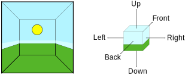

## Reflection Probes

Traditionally, games have used a technique called ***reflection mapping*** to simulate reflections from objects while keeping the processing overhead to an acceptable level. 

This technique assumes that all reflective objects in the scene can **see** (and therefore reflect) the exact same surroundings.

This works quite well for the game’s main character (a shiny car, say) if it is in open space but is unconvincing when the character passes into different surroundings; it looks strange if a car drives into a tunnel but the sky is still visibly reflected in its windows.

**Unity improves on basic reflection mapping** through the use of **Reflection Probes**, which **allow the visual environment to be sampled at strategic points** in the scene.

You should generally place them at every point where the appearance of a reflective object would change noticeably (**eg, tunnels, areas near buildings and places where the ground colour changes**). 

> When a **reflective object** passes near to a probe, the reflection sampled by the probe can be used for the object’s reflection map. Furthermore, when several probes are nearby, Unity can interpolate between them to allow for gradual changes in reflections. 

### How Reflection Probes Work

The visual environment for a point in the scene can be represented by a **cubemap**. This is conceptually like a box with flat images of the view from six directions (up, down, left, right, forward and backward) painted on its **interior surfaces**. Reflective object pass through this box will have those reflective images painted on its surface.

For an object to show the reflections, its **shader** **must have access to the images representing the cubemap**. Each point of the object’s surface can “see” a small area of cubemap in the direction the surface faces (ie, the direction of the surface normal vector).

The **cubemap** can be **painted by an artist** or it can be obtained by taking six **"snapshots"** from a point in the scene, with one shot for each cube face.

Reflection probes improve on this by allowing you to set up many **predefined points** in the scene where **cubemap** **snapshots can be taken**. You can therefore** record the surrounding view** at any point in the scene where the reflections differ noticeably.

A probe also has a zone of effect defined by an invisible box shape in the scene. A reflective object that passes within a probe’s zone has its reflection cubemap supplied temporarily by that probe. As the object moves from one zone to another, the cubemap changes accordingly.

### Types of Reflection Probe
- **Baked** \
  **Baked probes** store a reflection cubemap generated (**"baked"**) within the editor. You can trigger the baking by clicking either the Bake button at the bottom of the Reflection Probe inspector or the Generate Lighting button in the Lighting window. The reflection from a **baked probe** can only show objects marked as **Reflection Probe Static** in the inspector. This indicates to Unity that the objects will not move at runtime.
  A **Baked Reflection Probe** is one whose **reflection cubemaps** captured in the Unity editor and stored for subsequent usage in the player (see the Reflection Probes Introduction for further information). Once the capture process is complete, the reflections are “frozen” and so baked probes can’t react to runtime changes in the scene caused by moving objects.
  > You should set the probe’s Type property to **Baked** or **Custom** in order to make it behave as a baked probe 
- **Realtime** \
  **Realtime probes** create the **cubemap** at **runtime** in the player rather than the editor. This means that **the reflections are not limited to static objects** and can be **updated in real time** to show changes in the scene. However, it takes considerable processing time to refresh the view of a probe so it is wise to manage the updates carefully. Unity **allows you to trigger updates from a script so you can control exactly when they happen**. Also, there is an option to apply **timeslicing to probe updates** so that they can **take place gradually over a few frames**.
- **Custom**
  **Custom probe** let you bake the view in the editor, as with Baked probes, but you can also supply a custom cubemap for the reflections. Custom probes cannot be updated at runtime.

> Baked probes are useful for many purposes and have good runtime performance but they have the disadvantage of not updating live within the player. This means that objects can move around in the scene without their reflections moving along with them. In cases where this is too limiting, you can use Realtime probes, which update the reflection cubemap at runtime. This effect comes with a higher processing overhead but offers greater realism.

### ref
https://www.youtube.com/watch?v=lhELeLnynI8

https://bootcamp.uxdesign.cc/reflection-probe-vs-screen-space-reflection-4b134c46ca16

https://docs.unity3d.com/Manual/ReflectionProbes.html

