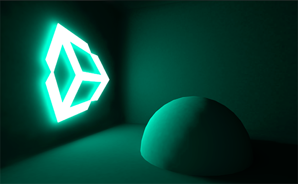

## Emissive materials
"**Emission**" is a property of the Standard Shader which allows static objects in our scene to **emit light**.
 
Like area lights, emissive materials emit light across their surface area.

Example:

> Note: Emission will only be received by objects marked as **Static** or **Lightmap Static** from the Inspector. Similarly, emissive materials applied to non-static, or dynamic geometry such as characters will not contribute to scene lighting.
