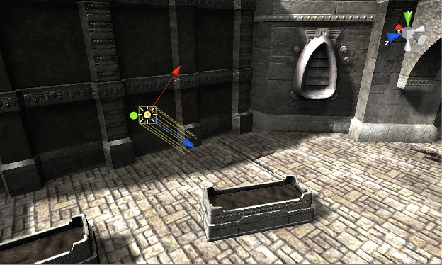

## Lights

**GameObject > Light**
 
Place the light object where you want it in the scene. If you enable scene view lighting (the "**lightbulb**" button on the toolbar) then you can see a preview of how the lighting will look as you move light objects and set their parameters.

### Types of light
- Point Light
- Spot Light
- Directional Light
- Area Light

### Light modes
The Modes are:

- **Baked**: \
  Unity **pre-calculates** the illumination from **Baked Lights before runtime**, and **does not include them in any runtime lighting calculations**.
  
- **Realtime**: \
  Unity **calculates and updates the lighting of Realtime Lights every frame at runtime**. Unity does not precompute any calculations for Realtime Lights. 
  
  Unity performs the lighting calculations for Realtime Lights at runtime, once per frame. For example  flickering light bulbs, or a torch being carried through a dark room.
  
  Realtime Lights are useful for lighting and casting shadows on characters or moveable geometry.
  
  **Realtime Light behavior:**
  - Realtime Lights cast shadows up to the Shadow Distance.
  - By default, Realtime Lights contribute only realtime direct lighting to a Scene. If you’re using the Built-in Render Pipeline
 and you enable Enlighten Realtime Global Illumination
 in your Project, Realtime Lights also contribute realtime indirect lighting to your Scene.

  **Limitations**:
  - Performing runtime calculations for Realtime Lights might be costly, especially in complex scenes or on low-end hardware.
  - Because Realtime Lights only contribute direct lighting to the Scene by default, shadows appear completely black and there aren’t any indirect lighting effects, such as color bounce. This might cause unrealistic lighting in the Scene.
  
- **Mixed**: \
  Unity **performs some calculations for Mixed Lights in advance, and some calculations at runtime**. Mixed Lights combine elements of both real-time and baked lighting. You can use Mixed Lights to combine dynamic shadows with baked lighting from the same light source, or when you want a light to contribute direct real-time lighting and baked indirect lighting.
  
  > **Note**:  if you disable Baked Global Illumination
 in your Scene, Unity forces Mixed Lights to behave as though you set their Mode to Realtime. When this happens, Unity displays a warning on the Light component Inspector
.

### ref
https://docs.unity3d.com/Manual/Lighting.html

