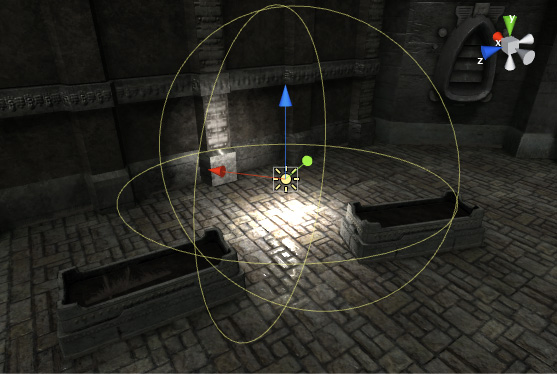

## Lights

**GameObject > Light**
 
Place the light object where you want it in the scene. If you enable scene view lighting (the "**lightbulb**" button on the toolbar) then you can see a preview of how the lighting will look as you move light objects and set their parameters.

### Types of light
- Point Light
- Spot Light
- Directional Light
- Area Light

### ref
https://docs.unity3d.com/Manual/Lighting.html

