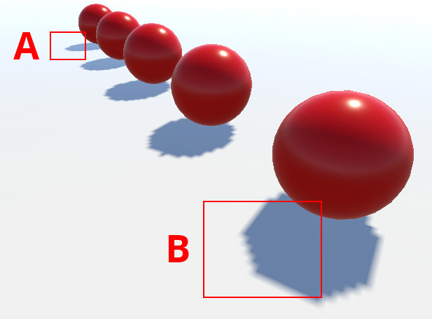

## Shadows
In Unity, Lights can cast shadows from a GameObject onto other parts of itself, or onto nearby GameObjects.

Unity uses a technique called **shadow mapping** to render real-time shadows.

### Shadow mapping
Shadow mapping or shadowing projection is a process by which shadows are added to 3D computer graphics.

**Shadow mapping** uses textures called **shadow maps**. **Shadow maps are similar to depth textures**. 

A Light **generates a shadow map** in a similar way to how a **Camera generates a depth texture**.

If you imagine a Camera at the same location as the Light, the areas of the Scene that the Camera cannot see are the same areas of the Scene that rays from the Light cannot reach; therefore, they are in shadow.
 

Unity **populates the shadow map with information about how far rays from the Light travel before they hit a surface**, and then **samples the shadow map to calculate real-time shadows for GameObjects that the Light hits**.

https://en.wikipedia.org/wiki/Shadow_mapping

https://www.youtube.com/watch?v=PTIC1oQzxno

### Shadow map resolution

To calculate the resolution of a shadow map, Unity:

1. Determines the area of the screen view that the Light can illuminate. For directional lights, the whole screen can be illuminated. For Spot Lights and Point Lights, the area is the onscreen projection of the shape of the light’s extent: a sphere for point lights, or a cone for Spot Lights. The projected shape has a width and height in pixels on the screen; the larger of those two values is then taken. This value is called the Light’s pixel
 size.

2. Determines the shadow quality multiplier. Unity uses the Shadow Resolution setting for this, which is set in the Quality Settings window). The quality settings correspond to the following values:

- Very High: 1.0
- High: 0.5
- Medium: 0.25
- Low: 0.125

### Configuring shadows
Tp configure the real-time and baked shadow settings for each Light component using the Inspector.

> Each** Mesh Renderer** in the Scene also has a **Cast Shadow**s and a **Receive Shadows** property, which **must be enabled** as required.

Enable Cast Shadows by selecting On from the drop-down menu to enable or disable shadow casting for the mesh
. Alternatively, select Two Sided to allow shadows to be cast by either side of the surface (so backface culling is ignored for shadow casting purposes), or Shadows Only to allow shadows to be cast by an invisible GameObject.

### Shadow distance

Use the Shadow Distance property to determine the distance from the Camera up to which Unity renders real-time shadows.

Shadows from GameObjects
 become less noticeable the farther the GameObjects are from the Camera. This is both because the shadows appear smaller on the screen, and because distant GameObjects are usually not the focus of attention. You can take advantage of this effect by disabling real-time shadow rendering for distant GameObjects.  
This saves on wasted rendering operations, and can improve runtime performance. Additionally, the Scene
 often looks better without distant shadows.
 
> To disguise missing shadows beyond the Shadow Distance, you can use visual effects such as **fog**.
 
 
- In the **Built-in Render Pipeline**, set the Shadow Distance property in your Project’s Quality Settings.

- In the **Universal Render Pipeline (URP)**, set the Shadow Distance property in the Universal Render Pipeline Asset.

- In the **High Definition Render Pipeline (HDRP)**, set the Shadow Distance property for each Volume.

If your Scene uses the Shadowmask Lighting Mode, Unity renders shadows from Mixed Lights
 beyond the Shadow Distance, using either Light Probes
 or a shadow mask Texture. You can configure how Unity renders shadows beyond the Shadow Distance.

### Shadow cascades
Shadow Cascades help solve a problem called perspective aliasing, where real-time shadows from Directional Lights appear pixelated when they are near the Camera.

**What are shadow cascades in unity?** \
Cascaded Shadow maps (CSM) is a know approach that helps to fix the aliasing problem by providing higher resolution of the depth texture near the viewer and lower resolution far away.

> **Shadow Cascades** only work with **Directional Lights**.

#### Perspective aliasing
Perspective aliasing means that shadow map pixels close to the Camera look enlarged and chunky compared to those farther away.

### ref
Realistic Shadows in Unity with HDRP \
https://www.youtube.com/watch?v=N_TeKoMC3hg

