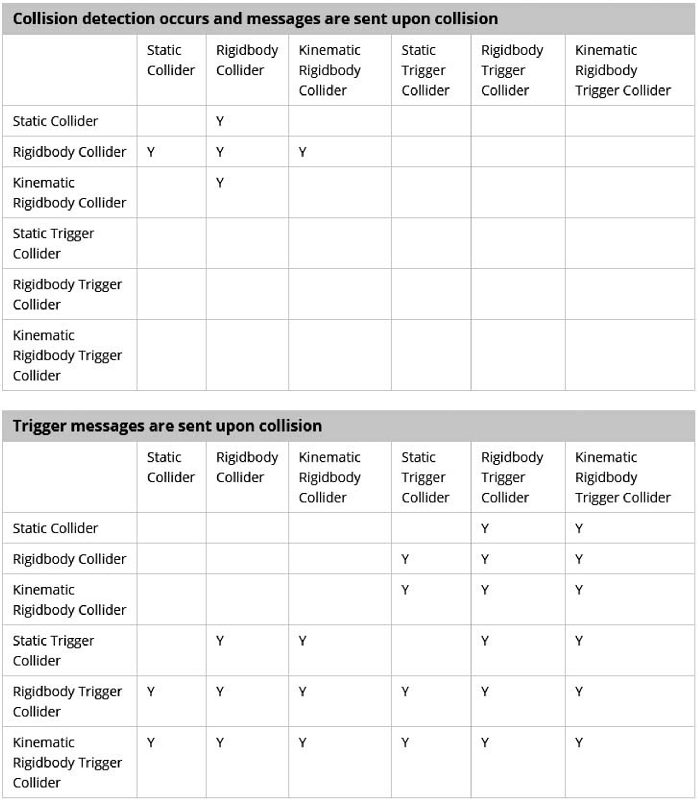

### Enter/Stay/Exit analysis

以Trigger為例，就是**OnTriggerEnter**、**OnTriggerStay**、**OnTriggerExit**

(Collision依此類推）。

> 📎 Enter函式是當兩個物件接觸的瞬間，會執行一次這個函式；

> 📎 Stay函式是當兩個物件持續接觸時，會不斷執行這個函式；

> 📎 Exit函式是當兩個物件分開的瞬間，會執行一次這個函式。


### unity collider & Trigger function
使用 Unity 開發遊戲時，往往需要檢測物件之間的碰撞。**`MonoBehaviour`** 提供了 **`OnCollisionXXX`** 和 **`OnTriggerXXX`** 系列函數用來反映 **rigidbody / collider / trigger** 的碰撞，若有偵測到符合對應表中的碰撞條件，就會呼叫函數並傳入相關參數.

**貞測 collider 和 rigidbody collider 的觸碰**: 
```cs
// 開始碰撞瞬間會呼叫一次
void OnCollisionEnter(Collision collision){ ... }　

// 碰撞期間會持續呼叫
void OnCollisionStay(Collision collisionInfo){ ... }

// 停止碰撞瞬間會呼叫一次
void OnCollisionExit(Collision other){ ... }
```

**貞測 trigger 和 rigidbody collider 的觸碰**: 
```cs
// 開始接觸瞬間會呼叫一次
void OnTriggerEnter(Collider other){ ... }

// 接觸期間會持續呼叫
void OnTriggerStay(Collider other){ ... }

// 停止接觸瞬間會呼叫一次
void OnTriggerExit(Collider other){ ... }
```

> Game object **must** have **trigger**

> **`OnTriggerEnter`** happens on the **FixedUpdate** function when two GameObjects collide. The Colliders involved are not always at the point of initial contact.

> **Note**: Both GameObjects must contain a **Collider component**. One must have **`Collider.isTrigger`** enabled, and contain a **Rigidbody**. If both GameObjects have **`Collider.isTrigger`** enabled, no collision happens. The same applies when **both** GameObjects **do not have a Rigidbody component**.




### Temporarily ignore collision?

https://gamedev.stackexchange.com/questions/164544/temporarily-ignore-collision

