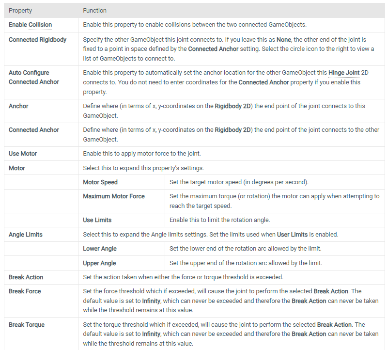
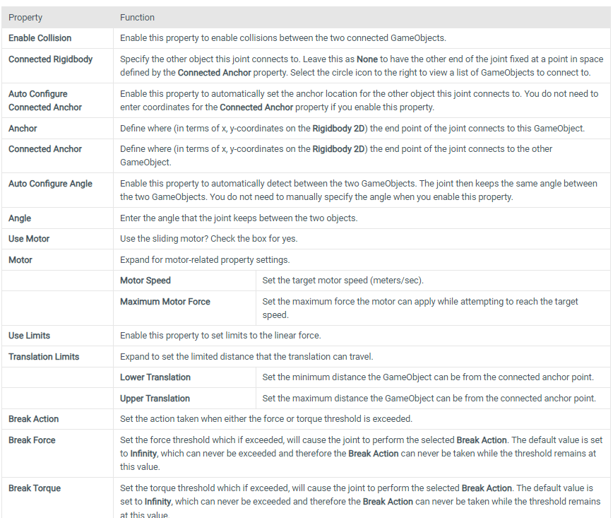

## 2D joints
1. **Distance Joint 2D** 
   - attaches two game objects **controlled by rigidbody physics together** and **keeps them a certain distance apart** (**No fixed position & angle required**, buy only keep certain distance).
  
      | Property | Function |
      | --- | --- |
      | **Enable Collision** |Enable this property to enable collisions between the two connected GameObjects|
      | **Connected Rigidbody** | Specify the other object this joint connects to. Leave this as **None** to have the other end of the joint fixed at a point in space defined by the **Connected Anchor** property. Select the circle icon to the right to view a list of GameObjects to connect to. |
      | **Auto Configure Connected Anchor** | Enable this property to automatically set the anchor location for the other object this joint connects to. You do not need to enter coordinates for the **Connected Anchor** property if you enable this property. |
      | **Anchor** | Define where (in terms of x, y-coordinates on the **Rigidbody 2D**) the end point of the joint connects to this GameObject. |
      | **Connected Anchor** | Define where (in terms of x, y-coordinates on the **Rigidbody 2D**) the end point of the joint connects to the other GameObject. |
      | **Auto Configure Distance** | Enable this to automatically detect the current distance between the two GameObjects, and set it as the distance that the Distance Joint 2D keeps between the two GameObjects. When enabled, you do not need to specify the distance between the GameObjects at **Distance**. |
      | **Distance** | Specify the distance that the Distance Joint 2D keeps between the two GameObjects. |
      | **Max Distance Only** | Enable this to only enforce a maximum distance. This allows connected GameObjects to move closer to each other, but not further than the distance set by **Distance**. Clear this to keep the distance between the GameObjects fixed. |
      | **Break Action** | Set the action taken when either a force or torque threshold is exceeded. |
      | **Break Force** | Set the force threshold which if exceeded, will cause the joint to perform the selected **Break Action**. The default value is set to **Infinity**, which can never be exceeded and therefore the **Break Action** can never be taken while the threshold remains at this value. |

   https://docs.unity3d.com/Manual/class-DistanceJoint2D.html

   https://www.youtube.com/watch?v=wpd2W3bIwx4
   
2. **Fixed Joint 2D**
   - **keeps two objects in a position relative to each other**, so the objects are **always offset at a given position and angle** (Keep **fixed point & angle**). 
   - It is a **spring-type 2D joint** for which you don’t need to set maximum forces. You can set the spring to be rigid or soft. \
     For example, objects that need to react as if they are rigidly connected: They can’t move away from each other, they **can’t move closer together**, and they can’t rotate with respect to each other. You can also use this joint to create a less rigid connection that flexes.

      | Property | Function |
      | --- | --- |
      | **Enable Collision** | Enable this property to enable collisions between the two connected GameObjects. |
      | **Connected Rigid Body** | Specify the other object this joint connects to. Leave this as **None** to have the other end of the joint fixed at a point in space defined by the **Connected Anchor** property. Select the circle icon to the right to view a list of GameObjects to connect to. |
      | **Auto Configure Connected Anchor** | Enable this property to automatically set the anchor location for the other object this joint connects to. You do not need to enter coordinates for the **Connected Anchor** property if you enable this property. |
      | **Anchor** | Define where (in terms of x, y-coordinates on the **Rigidbody 2D**) the end point of the joint connects to this GameObject. |
      | **Connected Anchor** | Define where (in terms of x, y-coordinates on the **Rigidbody 2D**) the end point of the joint connects to the other GameObject. |
      | ****Damping Ratio**** | Set the degree to suppress spring oscillation. In the range 0 to 1, the higher the value, the less movement. |
      | **Frequency** | Set the frequency at which the spring oscillates while the GameObjects are approaching the separation distance you want (measured in cycles per second). In the range 0 to 1,000,000 - the higher the value, the stiffer the spring. **Note:** Setting **Frequency** to zero will create the stiffest spring type joint possible. |
      | **Break Action** | Set the action taken when either the force or torque threshold is exceeded. |
      | **Break Force** | Set the force threshold which if exceeded, will cause the joint to perform the selected **Break Action**. The default value is set to **Infinity**, which can never be exceeded and therefore the **Break Action** can never be taken while the threshold remains at this value. |
      | **Break Torque** | Set the torque threshold which if exceeded, will cause the joint to perform the selected **Break Action**. The default value is set to **Infinity**, which can never be exceeded and therefore the **Break Action** can never be taken while the threshold remains at this value. |

   https://docs.unity3d.com/Manual/class-FixedJoint2D.html

   https://www.youtube.com/watch?v=AEoWuRn3YfY

3. **Friction Joint 2D** 
   - The Friction Joint 2D **connects GameObjects controlled by Rigidbody 2D physics, reduces both the linear and angular velocities between two game objects controlled by rigidbody physics to zero** (ie: it **slows them down and stops** them). For example; a platform that rotates but resists that movement.
  
     | Property | Function |
     | --- | --- |
     | **Enable Collision** | 	Enable this property to enable collisions between the two connected GameObjects. |
     | **Connected Rigid Body** | Specify the other object this joint connects to. Leave this as **None** to have the other end of the joint fixed at a point in space defined by the **Connected Anchor** property. Select the circle icon to the right to view a list of GameObjects to connect to. |
     | **Auto Configure Connected Anchor** | Enable this property to automatically set the anchor location for the other object this joint connects to. You do not need to enter coordinates for the **Connected Anchor** property if you enable this property. |
     | **Anchor** | Define where (in terms of x, y-coordinates on the **Rigidbody 2D**) the end point of the joint connects to this GameObject. |
     | **Connected Anchor** | Define where (in terms of x, y-coordinates on the **Rigidbody 2D**) the end point of the joint connects to the other GameObject. |
     | **Max Force** | Set the linear (or straight line) movement between joined GameObjects. A high value resists the linear movement between GameObjects. |
     | **Max Torque** | Set the angular (or rotation) movement between joined GameObjects. A high value resists the rotation movement between GameObjects. |
     | **Break Action** | Set the action taken when either the force or torque threshold is exceeded. |
     | **Break Force** | Set the force threshold which if exceeded, will cause the joint to perform the selected **Break Action**. The default value is set to **Infinity**, which can never be exceeded and therefore the **Break Action** can never be taken while the threshold remains at this value. |
     | **Break Torque** | Set the torque threshold which if exceeded, will cause the joint to perform the selected **Break Action**. The default value is set to **Infinity**, which can never be exceeded and therefore the **Break Action** can never be taken while the threshold remains at this value. |
  
   https://docs.unity3d.com/Manual/class-FrictionJoint2D.html

   https://www.youtube.com/watch?v=1-h43fzNB7U

4. **Hinge Joint 2D** 
   - allows a game object controlled by rigidbody physics to be **attached to a point in space** around which it **can rotate**. \
     The rotation can be left to happen passively (for example, in response to a collision) or can be actively powered by a motor torque provided by the Joint 2D itself. You can set limits to prevent the hinge from making a full rotation, or make more than a single rotation. \
     For example; the pivot on a pair of scissors.

     

   https://docs.unity3d.com/Manual/class-HingeJoint2D.html

   https://www.youtube.com/watch?v=l6awvCT29yU

5. **Relative Joint 2D**
   - The Relative Joint 2D allows two game objects controlled by rigidbody physics to **maintain a position based on each other’s location**. Use this joint to **keep two objects offset from each other**. \
     For example; a space-shooter game where the player has extra gun batteries that follow them.

      
     | Property | Function |
     | --- | --- |
     | **Enable Collision** | Enable this property to enable collisions between the two connected GameObjects. |
     | **Connected Rigid Body** | Specify the other object this joint connects to. Leave this as **None** to have the other end of the joint fixed at a point in space defined by the **Connected Anchor** property. Select the circle icon to the right to view a list of GameObjects to connect to. |
     | **Max Force** | Set the linear (or straight line) movement between joined GameObjects. A high value (up to 1,000) uses high force to maintain the offset. |
     | **Max Torque** | Set the angular (or rotation) movement between joined GameObjects. A high value (up to 1000) uses high force to maintain the offset. |
     | **Correction Scale** | Tweak the joint to correct its behaviorif required. Increasing the **Max Force** or **Max Torque** may affect the joint’s behavior such that the joint doesn’t reach its target, requiring you to correct it by adjusting this setting. The default setting is 0.3. |
     | **Auto Configure Offset** | Enable this property to automatically set and maintain the distance and angle between the connected objects. You do not need to manually enter the **Linear Offset** and **Angular Offset** when you enable this property. |
     | **Linear Offset** | Enter local space coordinates to specify and maintain the distance between the connected objects. |
     | **Angular Offset** | Enter local space coordinates to specify and maintain the angle between the connected objects. |
     | **Break Action** | Set the action taken when either the force or torque threshold is exceeded. |
     | **Break Force** | Set the force threshold which if exceeded, will cause the joint to perform the selected **Break Action**. The default value is set to **Infinity**, which can never be exceeded and therefore the **Break Action** can never be taken while the threshold remains at this value. |
     | **Break Torque** | Set the torque threshold which if exceeded, will cause the joint to perform the selected **Break Action**. The default value is set to **Infinity**, which can never be exceeded and therefore the **Break Action** can never be taken while the threshold remains at this value. |

     https://docs.unity3d.com/Manual/class-RelativeJoint2D.html

     https://www.youtube.com/watch?v=V6eGtas_EaY

#### Comparing Fixed and Relative joints 2D

It is important to know the major differences between **Fixed Joint 2D** and Relative Joint 2D:

-   **Fixed Joint 2D** is a **spring-type** joint(Spring Joint). **Relative Joint 2D** is a **motor-type** joint(Hinge Joint) with a maximum force and/or torque.
-   **Fixed Joint 2D** uses a **spring** to maintain the relative linear and angular offsets. **Relative Joint 2D** uses a **motor**. You can configure a joint’s spring or motor.
-   **Fixed Joint 2D** works with anchor points (it’s derived from script **Anchored Joint 2D**); it maintains the relative linear and angular offset between the anchors. **Relative Joint 2D** doesn’t have anchor points (it’s derived directly from script **Joint 2D**).
-   **Fixed Joint 2D** cannot modify the relative linear and angular offsets in real time. **Relative Joint 2D** can.
  

 
6. **Slider Joint 2D** 
    - allows a game object controlled by rigidbody physics to **slide along a line in space**. \
      The object can **freely move anywhere along the line** in response to **collisions**  
or forces. Alternatively, it can be also be **moved along by a motor force**, with **limits applied to keep its position** within a certain section of the line. \
      Like **sliding doors**, for example.

      

   https://docs.unity3d.com/Manual/class-SliderJoint2D.html

   https://www.youtube.com/watch?v=Micpv8SOXcg

6. **Spring Joint 2D** 
    - allows two game objects controlled by rigidbody physics to be attached together as if by a spring. \
      Spring Joint 2D **works in a similar way to distance joints**. However, while distance joints enforce a **fixed distance**, spring joints **apply tension to a connection**, causing objects to **bounce**.

      | Property | Function |
      | --- | --- |
      | **Enable Collision** | Enable this property to enable collisions between the two connected GameObjects. |
      | **Connected Rigidbody** | Specify the other object this joint connects to. Leave this as **None** to have the other end of the joint fixed at a point in space defined by the **Connected Anchor** property. Select the circle icon to the right to view a list of GameObjects to connect to. |
      | **Auto Configure Connected Anchor** | Enable this property to automatically set the anchor location for the other object this joint connects to. You do not need to enter coordinates for the **Connected Anchor** property if you enable this property. |
      | **Anchor** | Define where (in terms of x, y-coordinates on the **Rigidbody 2D**) the end point of the joint connects to the GameObject. |
      | **Connected Anchor** | Define where (in terms of x, y-coordinates on the **Rigidbody 2D**) the end point of the joint connects to the other GameObject. |
      | **Auto Configure Distance** | Enable this property to automatically detect the distance between the two GameObjects and set it as the distance that the joint keeps between the two GameObjects. |
      | **Distance** | Set the distance that the spring should attempt to maintain between the two objects. (Can be set manually.) |
      | **Damping Ratio** | Set the degree to suppress spring oscillation. In the range 0 to 1, the higher the value, the less movement. |
      | **Frequency** | Set the frequency at which the spring oscillates while the GameObjects are approaching the separation distance you want (measured in cycles per second). In the range 0 to 1,000,000 - the higher the value, the stiffer the spring. **Note:** Setting **Frequency** to zero will create the stiffest spring type joint possible. |
      | **Break Action** | Set the action taken when either the force or torque threshold is exceeded. |
      | **Break Force** | Set the force threshold which if exceeded, will cause the joint to perform the selected **Break Action**. The default value is set to **Infinity**, which can never be exceeded and therefore the **Break Action** can never be taken while the threshold remains at this value. |

   https://docs.unity3d.com/Manual/class-SpringJoint2D.html

   https://www.youtube.com/watch?v=zvHB1fsRadQ
   
6. **Target Joint 2D** 
    - connects to a **specified target**, **rather than another rigid body object**, as **other joints do**. \
      It is a **spring type** joint(Sprint Joint), which you could use for picking up and moving an object acting under gravity, \
      for example. The Target Joint 2D **does not connect to another object with a rigid body**; instead, it **connects to a specific target**. This is a spring type joint and can be used for **picking up and moving objects** acting under gravity, like our **moving platform**.

      | Property | Function |
      | --- | --- |
      | **Anchor** | Define where (in terms of x, y-coordinates on the **Rigidbody 2D**) the end point of the joint connects to this **GameObject**. |
      | **Target** | Define where (in terms of x, y-coordinates in world space) the other end of the joint attempts to move. |
      | **Auto Configure Target** | Enable this property to automatically set the other end of the joint to the current position of the GameObject. **Note:** When this option is enabled, the target changes as you move the GameObject but the target will not change if the option is not enabled. |
      | **Max Force** | Set the force that the joint can apply when attempting to move the object to the **target position**. The higher the value, the higher the maximum force. |
      | ****Damping Ratio**** | Set the degree to suppress spring oscillation. In the range 0 to 1, the higher the value, the less movement. |
      | **Frequency** | Set the frequency at which the spring oscillates while the GameObjects are approaching the separation distance you want (measured in cycles per second). In the range 0 to 1,000,000 - the higher the value, the stiffer the spring. **Note:** Setting **Frequency** to zero will create the stiffest spring type joint possible. |
      | **Break Action** | Set the action taken when either the force or torque threshold is exceeded. |
      | **Break Force** | Set the force threshold which if exceeded, will cause the joint to perform the selected **Break Action**. The default value is set to **Infinity**, which can never be exceeded and therefore the **Break Action** can never be taken while the threshold remains at this value. |
  
    https://docs.unity3d.com/Manual/class-TargetJoint2D.html

    https://www.youtube.com/watch?v=NyhWNWqFEVw

7. **Wheel Joint 2D** 
    - simulates wheels and suspension. You can apply motor power to the joint. The wheel uses a suspension spring to maintain its distance from the main body of the vehicle.

      

    https://docs.unity3d.com/Manual/class-WheelJoint2D.html

    https://www.youtube.com/watch?v=Fcjxe_KhgI4

    
### ref

https://docs.unity3d.com/Manual/Joints2D.html

https://gamedevelopment.tutsplus.com/tutorials/unity-2d-joints-distance-hinge-target-and-fixed-joint--cms-27452

https://www.kodeco.com/1766-physics-joints-in-unity-2d

https://www.youtube.com/watch?v=MElbAwhMvTc&t=71s

https://www.youtube.com/watch?v=KFzg8DLgxic

https://www.youtube.com/watch?v=Z6hXMqXZKFc
