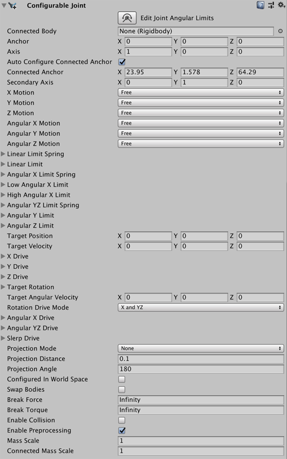
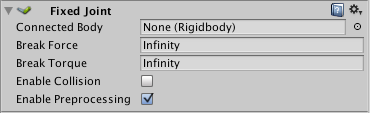

## 3D Joints

A joint **connects a Rigidbody to another Rigidbody** or **a fixed point in space**. Joints apply forces that move rigid bodies, and joint **limits restrict that movement**.

 
| Property: | Function: |
| --- | --- |
| Character Joint | Character Joints are mainly used for **Ragdoll effects**. **Emulates a ball and socket joint, like a hip or shoulder**. Constrains rigid body movement along all linear degrees of freedom, and enables all angular freedoms. Rigidbodies attached to a Character Joint orient around each axis and pivot from a shared origin. |
| Configurable Joint | **Emulates any skeletal joint**, like those in a ragdoll. You can configure this joint to force and **restrict rigid body movement in any degree of freedom**. https://medium.com/luna-labs-ltd/luna-tech-series-a-deep-dive-into-unity-configurable-joints-96c49138b9b7|
| Fixed Joint | Restricts the movement of a rigid body to follow the movement of the rigid body it is attached to. This is useful when you **need rigid bodies that easily break apart from each other**, or you want to **connect the movement of two rigid bodies without parenting** in a Transform hierarchy. |
| Hinge Joint | Attaches a **rigid body to another rigid body** or a **point in space** at a shared origin and allows the **rigid bodies to rotate around a specific axis from that origin**. Useful for emulating **doors** and **finger joints**. |
| Spring Joint | **Keeps rigid bodies apart from each other** but lets the distance between them **stretch slightly**. The spring acts like **a piece of elastic** that tries to pull the two anchor points together to the exact same position. |

### Character Joint component
Character Joints are mainly used for Ragdoll effects. They are an extended ball-socket joint
 which allows you to limit the joint on each axis.

If you just want to set up a ragdoll read about Ragdoll Wizard.

 
| **_Property:_** | **_Function:_** |
| --- | --- |
| **Connected Body** | Optional reference to the **Rigidbody** that the joint is dependent upon. If not set, the joint connects to the world. |
| **Anchor**A UI layout tool that fixes a UI element to a parent element. Anchors are shown as four small triangular handles in the Scene View and anchor information is also shown in the Inspector.  | The point in the **GameObject’s** local space where the joint rotates around. |
| **Axis** | The twist axes. Visualized with the orange **gizmo** cone. |
| **Auto Configure Connected Anchor** | If this is enabled, then the Connected Anchor position will be calculated automatically to match the global position of the anchor property. This is the default behavior. If this is disabled, you can configure the position of the connected anchor manually. |
| **Connected Anchor** | Manual configuration of the connected anchor position. |
| **Swing Axis** | The swing axis. Visualized with the green gizmo cone. |
| **Low Twist Limit** | The lower limit of the joint. See below. |
| **High Twist Limit** | The higher limit of the joint. See below. |
| **Swing 1 Limit** | Limits the rotation around one element of the defined **Swing Axis** (visualized with the green axis on the gizmo). See below. |
| **Swing 2 Limit** | Limits movement around one element of the defined **Swing Axis**. See below. |
| **Break Force** | The force that needs to be applied for this joint to break. |
| **Break Torque** | The torque that needs to be applied for this joint to break. |
| **Enable Collision** | When checked, this enables **collisions** between bodies connected with a joint. |
| **Enable Preprocessing** | Disabling preprocessing helps to stabilize impossible-to-fulfil configurations. |

https://docs.unity3d.com/Manual/class-CharacterJoint.html

### Configurable Joint component
Configurable Joints incorporate all the functionality of the other joint types and provide **greater control of character movement**. They are particularly useful when you want to **customize the movement of a ragdoll and enforce certain poses on your characters**. You can also use them to adapt joints into highly specialized joints of your own design.

https://docs.unity3d.com/Manual/class-ConfigurableJoint.html

### Fixed Joint component
Fixed Joints restricts an object’s movement to be dependent upon another object. This is somewhat similar to Parenting but is implemented through physics rather than Transform hierarchy. The best scenarios for using them are when you have objects that you want to easily break apart from each other, or connect two object’s movement without parenting.

| **_Property:_** | **_Function:_** |
| --- | --- |
| **Connected Body** | Optional reference to the Rigidbody that the **joint** is dependent upon. If not set, the joint connects to the world. |
| **Break Force** | The force that needs to be applied for this joint to break. |
| **Break Torque** | The torque that needs to be applied for this joint to break. |
| **Enable Collision** | When checked, this enables **collisions** between bodies connected with a joint. |
| **Enable Preprocessing** | Disabling preprocessing helps to stabilize impossible-to-fulfil configurations. |

### Hinge Joint component

The Hinge Joint groups together two Rigidbodies
, constraining them to move like they are connected by a hinge. It is perfect for doors, but can also be used to model chains, pendulums, etc.

| **_Property:_** | **_Function:_** |
| --- | --- |
| **Connected Body** | Optional reference to the Rigidbody that the **joint** is dependent upon. If not set, the joint connects to the world. |
| **Anchor** | The position of the axis around which the body swings. The position is defined in local space. |
| **Axis** | The direction of the axis around which the body swings. The direction is defined in local space. |
| **Auto Configure Connected Anchor** | If this is enabled, then the Connected Anchor position will be calculated automatically to match the global position of the anchor property. This is the default behavior. If this is disabled, you can configure the position of the connected anchor manually. |
| **Connected Anchor** | Manual configuration of the connected anchor position. |
| **Use Spring** | Spring makes the Rigidbody reach for a specific angle compared to its connected body. |
| **Spring** | Properties of the Spring that are used if **Use Spring** is enabled. |
|         **Spring** | The force the object asserts to move into the position. |
|         **Damper** | The higher this value, the more the object will slow down. |
|         **Target Position** | Target angle of the spring. The spring pulls towards this angle measured in degrees. |
| **Use Motor** | The motor makes the object spin around. |
| **Motor** | Properties of the Motor that are used if **Use Motor** is enabled. |
|         **Target Velocity** | The speed the object tries to attain. |
|         **Force** | The force applied in order to attain the speed. |
|         **Free Spin** | If enabled, the motor is never used to brake the spinning, only accelerate it. |
| **Use Limits** | If enabled, the angle of the hinge will be restricted within the **Min** & **Max** values. |
| **Limits** | Properties of the Limits that are used if **Use Limits** is enabled. |
|         **Min** | The lowest angle the rotation can go. |
|         **Max** | The highest angle the rotation can go. |
|         **Bounciness** | How much the object bounces when it hits the minimum or maximum stop limit. |
|         **Contact Distance** | Within the contact distance from the limit contacts will persist in order to avoid jitter. |
| **Break Force** | The force that needs to be applied for this joint to break. |
| **Break Torque** | The torque that needs to be applied for this joint to break. |
| **Enable Collision** | When checked, this enables **collisions** between bodies connected with a joint. |
| **Enable Preprocessing** | Disabling preprocessing helps to stabilize impossible-to-fulfil configurations. |

https://docs.unity3d.com/Manual/class-HingeJoint.html

### Spring Joint component

The Spring Joint joins two Rigidbodies
 together but allows the distance between them to change as though they were connected by a spring.

 
| **_Property:_** | **_Function:_** |
| --- | --- |
| **Connected Body** | The Rigidbody object that the object with the spring **joint** is connected to. If no object is assigned then the spring will be connected to a fixed point in space. |
| **Anchor** | The point in the object’s local space at which the joint is attached. |
| **Auto Configure Connected Anchor** | Should Unity calculate the position of the connected anchor point automatically? |
| **Connected Anchor** | The point in the connected object’s local space at which the joint is attached. |
| **Spring** | Strength of the spring. |
| **Damper** | Amount that the spring is reduced when active. |
| **Min Distance** | Lower limit of the distance range over which the spring will not apply any force. |
| **Max Distance** | Upper limit of the distance range over which the spring will not apply any force. |
| **Tolerance** | Changes error tolerance. Allows the spring to have a different rest length. |
| **Break Force** | The force that needs to be applied for this joint to break. |
| **Break Torque** | The torque that needs to be applied for this joint to break. |
| **Enable Collision** | Should the two connected objects register **collisions** with each other? |
| **Enable Preprocessing** | Disabling preprocessing helps to stabilize impossible-to-fulfil configurations. |

https://docs.unity3d.com/Manual/class-SpringJoint.html

### ref
https://docs.unity3d.com/Manual/Joints.html

https://www.youtube.com/watch?v=MElbAwhMvTc
