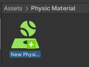
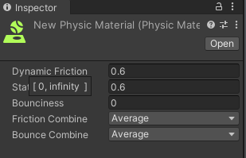

## Physic Material

When two colliders are in contact, the physics system uses the **surface properties of each collider 
to calculate the total friction and bounce** between the two surfaces.

In Unity, you use the **Physic Material** asset to control these parameters. 
The Physic Material asset is represented in the API by the **`PhysicMaterial`** class.

 
The Physic Material adjusts friction and bouncing effects of colliding GameObjectsThe fundamental object 
in Unity scenes, which can represent characters, props, scenery, cameras, waypoints, 
and more. A GameObject’s functionality is defined by the Components attached to it.

The Physic Material asset provides two properties: \
**Friction Combine** (**`PhysicMaterial.frictionCombine`**) and **Bounce Combine** (**`PhysicMaterial.bounceCombine`**). 
These properties each provide four options to control how the physics system calculates the total friction and bounce between two colliders:

### Create and apply a custom Physic Material

You can create as many **custom Physic Material assets** as you need, and **apply them to colliders** in your scene.

Several colliders can have the same Physic Material asset assigned to them, and you can set a project-wide default to apply new default settings to all colliders in the project.

#### Create a custom Physic Material asset

To create a Physic Material asset, go to **Assets** > **Create** > **Physic Material**. By default, Unity places new Physic Material assets in your `Assets` directory.

> You can create as many custom Physic Material assets as you need. **Physic Material** assets have the file extension **`.physicMaterial`**.

#### Apply a custom Physic Material asset to a collider

To apply a Physic Material asset to a collider:

1.  Navigate to the target **collider’s** **Material** property.
2.  In the **Material** property field, select the picker icon.
3.  Select the **Physic Material asset** you want to use.

> Alternatively, you can **click and drag the Physic Material asset file directly** from the Project window onto the target collider’s Material field.

> Each collider can only have **one assigned Physic Material asset at a time**. You can assign the **same Physic Material asset to multiple collider**s.

#### Set a custom Physic Material asset as the project default

You can use a custom Physic Material asset to replace the project-wide **default settings**. Unity applies the project-wide default settings to any collider that does not have an assigned Physic Material asset.

To **change the default Physic Material values**: 
1. Create a Physic Material asset and configure it to the default settings you want for the project. 2. Go to the Physics Settings (**Edit** > **Project Settings** > **Physics**).
3. In the **Default Material** property field, select the **picker** icon.
4. Select the **Physic Material** you want to use.

### ref 
https://docs.unity3d.com/Manual/collider-surfaces-combine.html \
https://docs.unity3d.com/Manual/create-apply-physics-material.html \
https://docs.unity3d.com/Manual/class-PhysicMaterial.html
