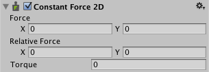

## Constant Force 2D

Constant Force 2D is a **quick utility** for **adding constant forces to a Rigidbody 2D**. 

This works well for one-shot objects like **rockets**, if you want them to accelerate over time rather than starting with a large velocity.

Constant Force 2D applies **both linear and torque (angular) forces continuously to the Rigidbody2D**, 
each time the physics engine **updates at runtime**.

 
| **_Property:_** | **_Function:_** |
| --- | --- |
| **Force** | The linear force applied to the Rigidbody 2D at each physics update. |
| **Relative Force** | The linear force, relative to the Rigidbody 2D coordinate system, applied each physics update. |
| **Torque** | The torque applied to the Rigidbody 2D at each physics update. |

### ref 
https://docs.unity3d.com/Manual/class-ConstantForce2D.html

