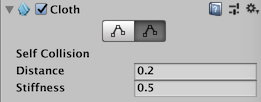

## Cloth physics
The **Cloth component** works with the **Skinned Mesh Renderer** to provide a physics-based solution for **simulating fabrics**. It is specifically designed for character clothing, and only works with the **Skinned Mesh Renderer**. 

> **Note**: If you add a **Cloth component** to a GameObject with a **regular Mesh Renderer**, Unity removes the Mesh Renderer and adds a **Skinned Mesh Renderer**.

 
| **_Property_** | **_Function_** |
| --- | --- |
| **Stretching Stiffness** | Stretching stiffness of the cloth. |
| **Bending Stiffness** | Bending stiffness of the cloth. |
| **Use Tethers** | Apply constraints that help to prevent the moving cloth particles from going too far away from the fixed ones. This helps to reduce excess stretchiness. |
| **Use Gravity** | Should gravitational acceleration be applied to the cloth? |
| **Damping** | Motion damping coefficient. |
| **External Acceleration** | A constant, external acceleration applied to the cloth. |
| **Random Acceleration** | A random, external acceleration applied to the cloth. |
| **World Velocity Scale** | How much world-space movement of the character will affect cloth vertices. |
| **World Acceleration Scale** | How much world-space acceleration of the character will affect cloth vertices. |
| **Friction** | The friction of the cloth when colliding with the character. |
| **Collision Mass Scale** | How much to increase mass of colliding particles. |
| **Use Continuous Collision** | Enable continuous **collision** to improve collision stability. |
| **Use Virtual Particles** | Add one virtual particle per triangle to improve collision stability. |
| **Solver Frequency** | Number of solver iterations per second. |
| **Sleep Threshold** | Cloth’s sleep threshold. |
| **Capsule Colliders** | An array of CapsuleColliders which this Cloth instance should collide with. |
| **Sphere Colliders** | An array of ClothSphereColliderPairs which this Cloth instance should collide with. |

Cloth does not react to all colliders in a scene, nor does it apply forces back to the world. When it has been added the Cloth component will not react to or influence any other bodies at all. Thus Cloth and the world do not recognise or see each other until you manually add colliders from the world to the Cloth component. Even after that, the simulation is still one-way: cloth reacts to those bodies but doesn’t apply forces back.

Additionally, you can only use three types of colliders with cloth: a sphere, a capsule, and conical capsule colliders, constructed using two sphere colliders. These restrictions all exist to help boost performance.

### Edit Constraints Tool
You can **apply constraints to specific vertices** of the cloth to give them **more or less freedom of movement**.

In the Inspector, **select Edit cloth constraints** (top-left button) in the Cloth component. When the tool is active, small spheres appear in the Scene view on all vertices of the mesh. They represent the cloth particles to which you can apply constraints. The Cloth Constraints tool window also appears at the bottom right of the Scene view.

#### Constraint types and colors

For each cloth particle, you can set and display two types of constraints: \* **Max Distance** – the maximum distance a cloth particle can travel from its vertex position. \* **Surface Penetration** – how deep the cloth particle can penetrate the mesh.

The color of a particle represents the **relative value of its constraint** within the cloth, according to the **type of constraint currently selected**.

#### Constraints visualization

  
| **_Property_** | **_Property value_** | **_Function_** |
| --- | --- | --- |
| **Visualization** |  | Allows you to select which constraint type and which particles to display. |
|  | _Max Distance_ | Displays only the Max Distance values of the cloth particles. |
|  | _Surface Penetration_ | Displays only the Surface Penetration values of the cloth particles. |
|  | _Manipulate Backfaces_ | Enable this option to visualize and manipulate particles that might be hidden behind the current facing part of the cloth. |
| \[ Color spectrum \] |  | Provides the correspondance between particle colors and constraint values for the above selected constraint type, according to the mimimum and maximum values currently applied within the whole cloth. Black always means that the particle has no constraint. |
| **Constraint Size** |  | The display size of the spheres that represent the cloth particles. Adjust this value at your convenience to ease your constraints edition. This property has no effect on the constraints themselves. |

#### Constraints edition modes

You can use **3 different modes** to edit the **cloth constraint values**.

 
| **_Mode_** | **_Description_** |
| --- | --- |
| **Select** | Allows you to apply a fixed constraint value to a pre-selected group of particles. |
| **Paint** | Allows you to apply a fixed constraint value by painting the cloth particles with a brush. |
| **Gradient** | Allows to apply a left-to-right linear gradient of constraint values to a pre-selected group of particles. |

The tool properties and the steps that you need to perform are different according to the mode you are using. In all cases, the last step corresponds to the action that applies the constraint values.

With the **Select** mode:

-   Use the mouse cursor to draw a selection box or click on particles one at a time.
-   Enable the constraint type that you want to apply to your selection: **Max Distance**, **Surface Penetration**, or both.
-   Set a value according to the constraint type you just enabled.

With the **Paint** mode:

-   Ensure to toggle on the **2D** view in the Scene view (the tool cannot apply a gradient when in 3D view).
-   Use the mouse cursor to draw a selection box or click on particles one at a time.
-   Set the limit values of the gradient you want to apply left-to-right within your selection: **Gradient Start** and **Gradient End**.
-   Enable the constraint type that you want to apply to your selection: **Max Distance**, **Surface Penetration**, or both.

### Self collision and intercollision

Cloth collision makes character clothing and other fabrics in your game move more realistically. In Unity, a cloth has several cloth particles that handle collision. You can set up cloth particles for:

-   Self-collision, which prevents cloth from penetrating itself.
-   Intercollision, which allows cloth particles to collide with each other.

To set up the collision particles for a cloth, select the **Self Collision and Intercollision** button in the Cloth inspector:

To enable the self collision behavior for a cloth, to go the Self Collision section of the Cloth Inspector window and set Distance and Stiffness to non-zero values:

 
| **_Property:_** | **_Function:_** |
| --- | --- |
| **Distance** | The diameter of a sphere around each particle. Unity ensures that these spheres do not overlap during simulations. **Distance** should be smaller than the smallest distance between two particles in the configuration. If the distance is larger, self collision may violate some distance constraints and result in jittering. |
| **Stiffness** | How strong the separating impulse between particles should be. The cloth solver calculates this and it should be enough to keep the particles separated. |

### Cloth intercollision

You specify particles for intercollision in the same way as you specify particles for self collision, as described above. As with self collision, you specify one set of particles for intercollision.

To enable intercollision behavior, open the **Physics** settings (from the main menu in Unity: **Edit** > **Project Settings**, then select the **Physics** category) and set **Distance** and **Stiffness** to non-zero values in the **Cloth InterCollision** section:

**Enable intercollision behavior in the Physics settings**

Cloth intercollision **Distance** and **Stiffness** properties have the same function as self collision Distance and Stiffness properties, which are described above.

### Collider collision

Cloth is **unable to simply collide with arbitrary world geometry**, and now will **only interact with the colliders** specified in either the **Capsule Colliders** or **Sphere Colliders arrays**.

The **sphere colliders array** can contain either a **single valid SphereCollider instance** (with the second one being null), or a **pair**. In the former cases the **ClothSphereColliderPair just represents a single sphere collider** for the cloth to collide against. In the latter case, it represents a **conic capsule shape** defined by the two spheres, and the cone connecting the two. **Conic capsule shapes** are useful for **modelling limbs of a character**.

### ref
https://docs.unity3d.com/Manual/class-Cloth.html

https://www.youtube.com/watch?v=FJZ0fOKCcfY&t=7s

https://www.youtube.com/watch?v=tKIzdLpawes

https://www.youtube.com/watch?v=Nc_ZMgEFj-A
