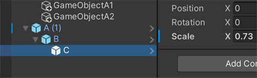
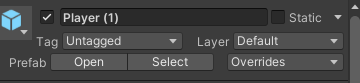
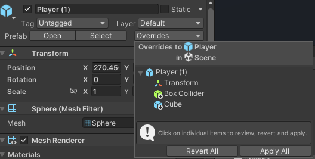
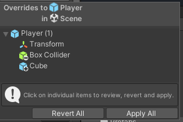
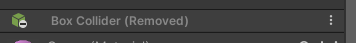
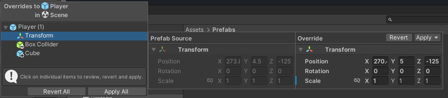
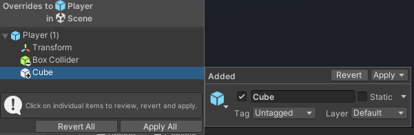

## Prefabs

### What are prefabs in Unity?

> **Prefabs** are a special type of component that allows fully configured GameObjects to be saved in the Project for **reuse**.

These assets can then be shared between scenes, or even other projects without having to be configured again. This is quite useful for objects that will be used many times, such as platforms.

**Prefabs is that they are essentially linked copies of the asset** that exist in the Project window. 

For Prefabs, you can
- Instantiate a Prefab using one line of code. Creating equivalent GameObjects from scratch requires many more lines of code.
- Set up, test, and modify the Prefab quickly and easily using the Scene
 view, **Hierarchy** and **Inspector**.

### How to create Prefabs?
Prefabs are created automatically when an object is **dragged from the Hierarchy into the Project window**.
Prefabs look quite similar to other objects that appear in the Project window. However, when selected, their file type will be a **`*.prefab`**. When the Prefab is selected, the Inspector displays all of the components that were configured on the original object.

### How to use Prefabs?
Just drag Prefabs from project window into Hierarchy if you want to **reuse**. When prefabs are present in the Hierarchy, they’re represented with **blue text** and a **blue cube**.

### Replacing existing prefabs

You can replace a Prefab by **dragging a new GameObject from the Hierarchy window** and **dropping it on top of an existing Prefab asset** in the Project window.

If you are **replacing an existing Prefab**, Unity tries to preserve references to the Prefab itself and the individual parts of the Prefab such as child GameObjects and Components. To do this, it matches the names of GameObjects between the new Prefab and the existing Prefab that you are replacing.

> **Note:** _Because this matching is done by name only, if there are multiple GameObjects with the same name in the Prefab’s hierarchy, it is not possible to predict which will be matched. Therefore if you need to ensure your references are preserved when saving over an existing prefab, you must ensure all GameObjects within the Prefab have unique names.

### Editing a Prefab in Prefab Mode

- In **isolation**: When you edit a Prefab in isolation, Unity **hides the rest of your current working Scene**, and you only see the GameObjects that relate to the Prefab itself.

- In **context**: When you edit a Prefab in context, the** rest of your current working Scene remains visible**, **but locked for editing**.

Editing in isolation

You can begin to edit a Prefab in Prefab Mode in several ways. To open a Prefab Asset and edit it in **isolation** you can do it in the following ways:

- Double-click the Prefab Asset in the Project window
- Select a Prefab Asset in the Project window and click the **Open Prefab button** in the Inspector window

Alternatively, you can open a Prefab Asset in **Context** via an instance of that Prefab. Ways of doing that include:

- Select a Prefab instance in the Hierarchy window and click the **Open** button in the Inspector window
- Select a Prefab instance in the Hierarchy window and press **P** on the **keyboard**. This is the default keyboard binding
- Use the arrow button next to the Prefab instance in the Hierarchy window

### Unpacking Prefab instances
To **return the contents of a Prefab instance** into a **regular GameObject**, you **unpack the Prefab instance**. This is exactly the **reverse operation of creating (packing) a Prefab**, except that **it doesn’t destroy the Prefab Asset** but **only affects the Prefab instance**.

You can unpack a Prefab instance by **right-clicking on it in the Hierarchy to select Prefab and selecting Unpack Prefab.** The resulting GameObject in the Scene **no longer has any link to its former Prefab Asset**. The **Prefab Asset itself is not affected by this operation** and there **may still be other instances of it in your Project**.

### Instance overrides
Instance overrides allow you to **create variations between Prefab instances**, while still linking those instances to the same Prefab Asset.

When you modify a Prefab Asset, the changes are reflected in all of its instances. However, you can also make modifications directly to an individual instance. Doing this **creates an instance override on that particular instance**.

An example would be if you had a Prefab Asset **"Robot"**, which you placed in multiple levels in your game. However, each instance of the **"Robot"** has a **different speed value**, and a **different** **audio clip** assigned.

There are four different types of **instance override**:
- **Overriding the value** of a property
- **Adding a component**
- **Removing a component**
- **Adding a child GameObject**

> **You can create different prefab instances with different type of overrides**

> **Note**: There are **some limitations** with Prefab instances: you **cannot reparent a GameObject that is part of a Prefab**, and you **cannot remove a GameObject that is part of the Prefab**. You can, however, **deactivate a GameObject**, which is a **good substitute for removing a GameObject** (this counts as a property override).

In the Hierarchy window, Prefab instances with overridden or non-default values have an override indicator to show that they have been edited, which Unity displays with a blue line in the left margin with the same appearance as the lines for instance overrides in the Inspector window.

When you edit a Prefab instance in a Scene, Unity displays a indicator next to the parent GameObject in the hierarchy. This indicator highlights any Prefab that has non-default override values in any of its child GameObjects. To open the Overrides dropdown directly from the Hierarchy window click on the override indicator. The override indicator appears as a blue line in the left side of the margin and is identical to the instance override in the Inspector window. For more information, see Instance overrides.

#### Overrides take precedence
An **overridden property value** on a Prefab instance **always takes precedence over the value from the Prefab Asset**. This means that if you **change a property on a Prefab Asset**, it **doesn’t have any effect on instances where that property is overridden**.

> If you make a change to a Prefab Asset, and it does not update all instances as expected, you should check whether that property is overridden on the instance. It is best to only use instance overrides when strictly necessary, because if you have a large number of instance overrides throughout your Project, it can be difficult to tell whether your changes to the Prefab Asset will or won’t have an effect on all of the instances.

https://docs.unity3d.com/Manual/PrefabInstanceOverrides.html \
https://docs.unity3d.com/Manual/Hierarchy.html#OverrideIndicator

### Editing a Prefab via its instances(Prefab instance)

The Inspector for the root of a Prefab instance has three more controls than a normal GameObject
: **Open**, **Select** and **Overrides**.

The three Prefab controls in the Inspector window for a Prefab instance.

The **Open** button **opens the Prefab Asset that the instance is from in Prefab Mode**, allowing you to edit the Prefab Asset and thereby change all of its instances. The **Select** button selects the Prefab Asset that this instance is from in the Project window. The **Overrides** button opens the overrides drop-down window.

#### Overrides dropdown

The **Overrides** drop-down window shows all the overrides on the Prefab instance. It also lets you apply overrides from the instance to the Prefab Asset, or revert overrides on the instance back to the values on the Prefab Asset. The **Overrides** drop-down button only appears for the root Prefab instance, not for Prefabs that are inside other Prefabs.

The **Overrides** drop-down window allows you to apply or revert prefab overrides individually, or apply or revert all the prefab overrides in one go.

-   **Applying** an override modifies the Prefab Asset. This puts the override (which is currently only on your Prefab instance) onto the Asset. This means the Prefab Asset now has that modification, and the Prefab instance no longer has that modification as an override.
    
-   **Reverting** an override modifies the Prefab instance. This essentially discards your override and reverts it back to the state of the Prefab Asset.
    

The drop-down window shows a list of changes on the instance in the form of modified, added and removed components, and added GameObjects (including other Prefabs).

The Overrides dropdown in the Inspector window when viewing a Prefab instance.

> For the Overrides dropdown, you can see all the override details on this dropdown. If **adding a new component or adding a new child GameObject** on prefab instance, you can see a **"+"** on the icon. If **Removing a component** from prefab instance, you can see a **"-"** on the icon.

#### Revert & Apply overrides
The Overrides drop-down window also has** Revert All** and **Apply All** buttons for reverting or applying all changes at once.

You can also choose to **revert and apply** some of the overrides, not all. You can do this by clicking the override part in the Overrides dropdown, you can see an extension menu next to the Overrides drop-down window. Then you can click **Revert or Apply button** on that override part.

For components with modified values, the view displays a side-by-side comparison of the component’s values on the Prefab Asset and the modified component on the Prefab instance. This allows you to compare the original Prefab Asset values with the current overrides, so that you can decide whether you would like to **revert or apply those values**.

### Unused Overrides
Instance override values are stored as data in the scene or prefab in which they are defined. However, an override becomes “unused” if its target object is either invalid or its Property Path is unknown. In this case, the data becomes unused. It is still stored in the scene file, but is redundant.
 
https://docs.unity3d.com/Manual/UnusedOverrides.html

### Nested Prefabs
You can include Prefab instances inside other Prefabs. This is called nesting Prefabs. Nested Prefabs retain their links to their own Prefab Assets, while also forming part of another Prefab Asset.
https://docs.unity3d.com/Manual/NestedPrefabs.html

### ref
https://docs.unity3d.com/Manual/Prefabs.html \
https://learn.unity.com/tutorial/prefabs-e# \
https://docs.unity3d.com/Manual/InstantiatingPrefabs.html \
https://docs.unity3d.com/Manual/UnpackingPrefabInstances.html

https://docs.unity3d.com/Manual/EditingPrefabViaInstance.html \
https://docs.unity3d.com/Manual/CreatingAndUsingScripts.html

