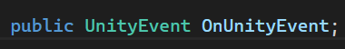
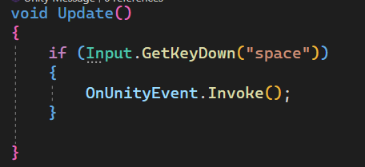
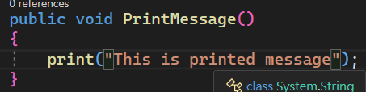
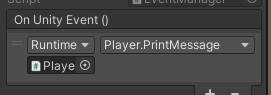
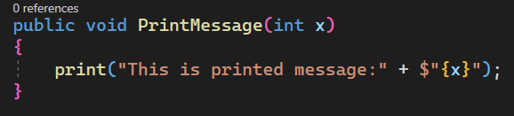
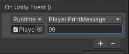
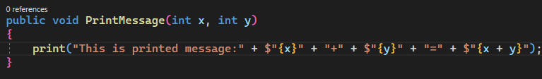
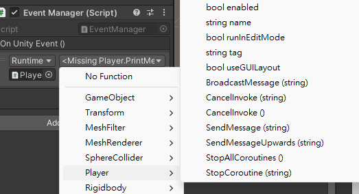

## UnityEvents
**UnityEvents** are a way of allowing user driven callback to be persisted from edit time to run time without the need for additional programming and script configuration.


不管是UnityEvent、Event，基本上都是基於Delegate所產生變體，而一旦使用了Event後，便可以極大幅的減少腳本之間的依賴，也不用在苦惱要在start還是update中**getComponet**了，因為幾乎都可以用註冊的方式直接完成這些操作。
而其中 **`UnityEvent`** 更是將其完全盡可能極簡化，特別是如果不需要有額外參數傳入的 **`UnityEvent`** 更是可以直接 **在Editor中進行操作**.

為什麼要用事件機制，主要是為了降低程式之間的耦合度(Coupling)，日後維護起來就方便許多。

UnityEvents are useful for a number of things:
-   Content driven callbacks
-   Decoupling systems
-   Persistent callbacks
-   Preconfigured call events

  
`UnityEvent`s can be added to any **`MonoBehaviour`** and are executed from code like a standard **`.NET`** delegate. When a **`UnityEvent`** is added to a **`MonoBehaviour`** it appears in the Inspector and persistent callbacks can be added.

`UnityEvent`s have similar limitations to standard delegates. That is, they hold references to the element that is the target and this stops the target being garbage collected. If you have a **`UnityEngine.Object`** as the target and the native representation disappears the callback will not be invoked.


### Using UnityEvents
To configure a callback in the editor there are a few steps to take:

- Create **`XXXManager`** and attach **`XXXManager.cs`**.
- Make sure your script **`imports/uses UnityEngine.Events`**.
- Declare UnityEvent variable: **`[SerializeField] private UnityEvent trigger_name`**.
- Inside trigger menthod, use **`invoke()`** method(eg: **`trigger_name.invoke()`**) to trigger callback.
- Select the **`+`** icon to add a slot for a callback
- Select the `UnityEngine.Object` you wish to receive the callback (You can use the object selector for this)
- Select the function(inside that object) you wish to be called, the function/method should be **`public`**, otherwise you can't search it in inspector.
- You can add **more than one callback** for the event.
- other game object, in its script subscribe and unscribe to the event listener.
- **`void OnEnable()`** or other **`OnEventName`** method to subcribe the event.
- **`void OnDisable()`** or other **`OnEventName`** method to unsubscribe the event.

When configuring a **`UnityEvent`** in the Inspector there are **two types of function calls** that are supported:

- **Static**: **Static calls** are **preconfigured** calls, with **preconfigured values** that are **set in the UI**. This means that when the callback is invoked, the target function is invoked with the **argument that has been entered into the UI**.
  
- **Dynamic**: **Dynamic calls** are invoked using an **argument** that is **sent from code**, and this is bound to the type of **`UnityEvent`** that is being invoked. The **UI filters the callbacks** and only shows the **dynamic calls** that are valid for the **`UnityEvent`**. **A method the argument(s) passed by the invoker would be passed down to the actual method**

> **Dynamic calls** vs **Static calls**: `dynamic` using the arguments sending from code, `static` using preconfigured values as argument entered into UI

> In inspector, the **dynamic calls** are the methods that the parameters are passed to invoke() from code, not **preconfigured values**/**static parameter** in inspector. Multiple parameters(**Up to 4 arguments**) can be **passed to the invoker**. 

> **Static calls** are the method with `static` parameters, the method **without any parameter** or **exactly one parameter** that argument is serialized in the inspector. 

> A `UnityEvent` only supports the following static types, since they need to be serialized inside the `UnityEvent` itself:
> - int
> - float
> - string
> - bool
> - `UnityEngine.Object` reference


https://forum.unity.com/threads/unityevent-passing-parameters-with-the-inspector.1249816/

### Steps for Using UnityEvents

To configure a callback in the editor there are a few steps to take:

1. Set up event manager script for using **`UnityEvent`** 

2. Inside the script make sure your script imports/uses **`UnityEngine.Events`**

3. Declare **`UnityEvent`** & **`Invoke()`** function to invoke the event

4. Create a **callback function/event handler** for this event some where. The callback function should be **`public`**, otherwise you can't search it in inspector.
    
5. In inspecter, the Event section you declared **`UnityEvent`** in the script, select the **"+"** icon to add a slot for a **callback**.
    
6. Select the **`UnityEngine.Object`** you wish to **receive the callback** (You can use the **object selector** for this)
    
7. Select the **function** you wish to be called (a method that subscribe to the event - event handler)
    
8. You can add more than one callback for the event

> Adding callback function through UI editor is for static calls only, with no parameters or exactly one parameter.

> You can select **"off"**, **"Editor and Runtime"** or **"Runtime only"**.



Dont pass any parameter in `Invoke()`, as parameter only be predefined and passed in UI editor. \


**With no parameter**: \
 \
If no parameter required, no predefined value can be set in UI editor. \


**With exactly one parameter**: \
 \
Then predefined value can be set in UI editor. \


**If having more than one parameter**: \

Callback function cannot be found in search, **Generic UnityEvents** should be used for more than one paramter \


> **Note**: The callback function should be **`public`**, otherwise you can't search it in inspector.


### Event vs UnityEvents
- In c#  declare an `event` **must** use script to **add event listener**.
- Using **`UnityEvent`**, you can use editor to **add event listener manually** in inspector.


### Declare UnityEvent & add callback manually in inspector

```cs
public class TestingEvents : MonoBehaviour {

    public UnityEvent OnUnityEvent;
    private void Update() {

        if (Input.GetKeyDown(KeyCode.Space)) {
            OnUnityEvent?.Invoke();
        }
    }
}
```
In inspector, the Event section you declared `UnityEvent` in the script, select the **"+"** icon to add a slot for a **callback**, select the **`UnityEngine.Object`** you wish to **receive the callback** (You can use the **object selector** for this), select the **function** you wish to be called (a method that subscribe to the event - event handler).

```cs
public class TestingEventSubscriber : MonoBehaviour {

    private void TestingUnityEvent() {
        Debug.Log("TestingUnityEvent");
    }

}
```

> This workflow only suitable for **no parameter or exactly only parameter be passed** to the callback function.

### Using Generic UnityEvents in script

> No need manually add callback in inspector, scripting only!

**Create your custom UnityEvents**:

**`UnityEvent`** has several generic overloadings which you can use to add parameters(event data) through scripting.

By default a **`UnityEvent`** in a **`Monobehaviour`** **binds dynamically to a void function**. This does not have to be the case as dynamic invocation of **`UnityEvents`** supports **binding** to functions with up to **4 arguments**. 

> To do this you need to define a **custom** **`UnityEvent`** class that **supports multiple arguments**. This is quite easy to do.

> **Generic UnityEvents** mainly used for dynamic binding, **a method the argument(s) passed by the invoker would be passed down to the actual method**.You can even us **UnityEvents** with **more than one argument** as the arguments are passed by the invoker.


**`UnityEngine.Events`** :
- **`UnityEvent`** (No argument)
- **`UnityEvent<T0>`**
- **`UnityEvent<T0,T1>`**
- **`UnityEvent<T0,T1,T2>`**
- **`UnityEvent<T0,T1,T2,T3>`**
- **`UnityEventBase`** (Abstract base class)

#### `UnityEventBase`

**Abstract base class** for UnityEvents. \
This class provides the base functionality for the UnityEvents.

|Public Methods|Descriptions|
|-|-|
| `GetPersistentEventCount` | Get the number of registered persistent listeners. |
| `GetPersistentListenerState` | Returns the execution state of a persistent listener. |
| `GetPersistentMethodName` | Get the target method name of the listener at index index. |
| `GetPersistentTarget` | Get the target component of the listener at index index. |
| `RemoveAllListeners` | Remove all non-persistent (ie created from script) listeners from the event. |
| `SetPersistentListenerState` | Modify the execution state of a persistent listener. |


|Static Method| Description|
| - | - |
| `GetValidMethodInfo` | Given an object, function name, and a list of argument types; find the method that matches. |


https://docs.unity3d.com/ScriptReference/Events.UnityEventBase.html

#### `UnityEvent`
zero argument 

```cs
//constructor
public UnityEvent();

//declaration
UnityEvent m_MyEvent;
m_MyEvent = new UnityEvent();
```

Eg:
```cs
using UnityEngine;
using UnityEngine.Events;
using System.Collections;

public class ExampleClass : MonoBehaviour
{
    UnityEvent m_MyEvent;

    void Start()
    {
        if (m_MyEvent == null)
            m_MyEvent = new UnityEvent();

        m_MyEvent.AddListener(Ping);
    }

    void Update()
    {
        if (Input.anyKeyDown && m_MyEvent != null)
        {
            m_MyEvent.Invoke();
        }
    }

    void Ping()
    {
        Debug.Log("Ping");
    }
}
```
https://docs.unity3d.com/ScriptReference/Events.UnityEvent.html

**`UnityEvent.AddListener`**:

Add listener in **`void Start()`**. Use this to add a runtime callback. Adding multiple identical listeners results in only a single call being made.
```cs
public void AddListener(Events.UnityAction call);
```

```cs
void Start()
{
   //Add a listener to the new Event. Calls MyAction method when invoked
   m_MyEvent.AddListener(MyAction);
}
```

```cs
//Attach this script to a GameObject
//This script creates a UnityEvent that calls a method when a key is pressed
//Note that 'q' exits this application.
using UnityEngine;
using UnityEngine.Events;

public class Example : MonoBehaviour
{
    UnityEvent m_MyEvent = new UnityEvent();

    void Start()
    {
        //Add a listener to the new Event. Calls MyAction method when invoked
        m_MyEvent.AddListener(MyAction);
    }

    void Update()
    {
        // Press Q to close the Listener
        if (Input.GetKeyDown("q") && m_MyEvent != null)
        {
            Debug.Log("Quitting");
            m_MyEvent.RemoveListener(MyAction);

            #if UNITY_EDITOR
            UnityEditor.EditorApplication.isPlaying = false;
            #endif

            Application.Quit();
        }

        //Press any other key to begin the action if the Event exists
        if (Input.anyKeyDown && m_MyEvent != null)
        {
            //Begin the action
            m_MyEvent.Invoke();
        }
    }

    void MyAction()
    {
        //Output message to the console
        Debug.Log("Do Stuff");
    }
}
```


**`UnityEvent.RemoveListener`**:

Remove a non persistent listener from the **`UnityEvent`**. If you have added the same listener multiple times, this method will remove all occurrences of it.

Use this to remove a runtime callback.

```cs
public void RemoveListener(Events.UnityAction call);
```

```cs
m_MyEvent.RemoveListener(MyAction);
```

**`UnityEvent.Invoke`**:

Invoke all registered callbacks (runtime and persistent).

```cs
public void Invoke();
```

```cs
m_MyEvent?.Invoke();
```


####  `UnityEvent<T0>`
One argument version of **`UnityEvent`**. If you wish to use a generic **`UnityEvent`** type you **must override** the class type.

```cs
public class MyEventName : UnityEvent<T0>
{
}
```

Eg:
```cs
[System.Serializable]
public class MyIntEvent : UnityEvent<int>
{
}

public class ExampleClass : MonoBehaviour
{
    public MyIntEvent m_MyEvent;

    void Start()
    {
        if (m_MyEvent == null)
            m_MyEvent = new MyIntEvent();

        m_MyEvent.AddListener(Ping);
    }

    void Update()
    {
        if (Input.anyKeyDown && m_MyEvent != null)
        {
            m_MyEvent.Invoke(5);
        }
    }

    void Ping(int i)
    {
        Debug.Log("Ping" + i);
    }
}
```

#### `UnityEvent<T0,T1>`
Two argument version of **`UnityEvent`**.
```cs
public class MyEventName : UnityEvent<T0,T1>
{
}
```

```cs
//EvenManager.cs
public class MyUnityEvent : UnityEvent<int, int>
{
}

public class EventManager : MonoBehaviour
{
    public MyUnityEvent OnUnityEvent;
    void Start()
    {
        OnUnityEvent = new MyUnityEvent();
        //OnUnityEvent.AddListener(player.GetComponent<Player>().PrintMessage);

    }
    // Update is called once per frame
    void Update()
    {
        if (Input.GetKeyDown("space"))
        {
            OnUnityEvent.Invoke(1, 2);
        }

    }
}

//Player.cs
public class Player : MonoBehaviour
{
    public void PrintMessage(int x, int y)
    {
        print("This is printed message:" + $"{x}" + "+" + $"{y}" + "=" + $"{x + y}");
    }
}

```


#### `UnityEvent<T0,T1,T2>`
Three argument version of UnityEvent
```cs
public class MyEventName : UnityEvent<T0,T1,T2>
{
}
```

#### `UnityEvent<T0,T1,T2,T3>`
Four argument version of UnityEvent
```cs
public class MyEventName : UnityEvent<T0,T1,T2,T3>
{
}
```

Eg:
```cs
using UnityEngine;
using UnityEngine.Events;


[System.Serializable]
public class MyIntEvent : UnityEvent<int, int, int, int>
{
}

public class ExampleClass : MonoBehaviour
{
    public MyIntEvent m_MyEvent;

    void Start()
    {
        if (m_MyEvent == null)
            m_MyEvent = new MyIntEvent();

        m_MyEvent.AddListener(Ping);
    }

    void Update()
    {
        if (Input.anyKeyDown && m_MyEvent != null)
        {
            m_MyEvent.Invoke(5, 6, 7, 8);
        }
    }

    void Ping(int i, int j, int k, int l)
    {
        Debug.Log("Ping" + i + j + k + l);
    }
}
```

By adding an instance of this to your class instead of the base **`UnityEvent`** it will allow the callback to bind dynamically to  functions.

This can then be invoked by calling the **`Invoke()`** function with a **`string`** as argument.

UnityEvents can be defined with up to **4 arguments** in their generic definition.


#### `UnityAction` delegate
Zero argument delegate used by UnityEvents.

Use this to create some dynamic functionality in your scripts. Unity Actions allow you to dynamically call multiple functions. Since Unity Actions have no arguments, functions they call must also have no arguments

```cs
public delegate void UnityAction();
```


https://docs.unity3d.com/ScriptReference/Events.UnityAction.html

### ref 
https://docs.unity3d.com/Manual/UnityEvents.html \
https://docs.unity3d.com/ScriptReference/Events.UnityEvent.html \
https://docs.unity3d.com/ScriptReference/Events.UnityEventBase.html \
https://docs.unity3d.com/ScriptReference/Events.UnityEvent_1.html \
https://docs.unity3d.com/ScriptReference/Events.UnityEvent_2.html \
https://docs.unity3d.com/ScriptReference/Events.UnityEvent_3.html \
https://docs.unity3d.com/ScriptReference/Events.UnityEvent_4.html \
https://medium.com/geekculture/how-to-use-events-to-implement-a-messaging-system-in-unity-c-342ab4806d53 \
https://forum.unity.com/threads/unityevent-passing-parameters-with-the-inspector.1249816/ \
https://www.youtube.com/watch?v=oc3sQamIh-Q \
https://www.youtube.com/watch?v=TWxXD-UpvSg \
https://www.youtube.com/watch?v=J01z1F-du-E \
https://www.youtube.com/watch?v=djW7g6Bnyrc \
https://www.youtube.com/watch?v=k_RMhQ19aQA
