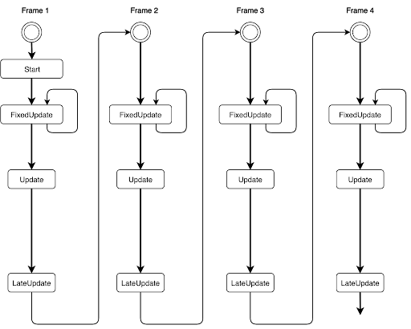

## MonoBehaviour
MonoBehaviour is the **base class from which every Unity script derives**. When you use C#, you **must explicitly derive from MonoBehaviour**.

`Start()`
`Update()`
`FixedUpdate()`
`LateUpdate()`
`OnGUI()`
`OnDisable()`
`OnEnable()`

### `Awake()`
`Awake` is **called when the script instance is being loaded**. `Awake` is used to **initialize any variables** or **game state** **before the game starts**. `Awake` is called **when the script object is initialised**, **regardless of whether or not the script is enabled**. 


> **Note**: **`Awake()`** only being called one time for the script


### `Start()`
`Start` is called on the frame when a **script is enabled** just before any of the Update methods **are called the first time**. Difference between `start()` and `awake()`:  However, `Awake` is called when the **script object is initialised**, **regardless of whether or not the script is enabled**. 

`Start` may not be called on the same frame as `Awake` if the script is not enabled at initialisation time.


> **Note**: **`Start()`** only being called one time for the script enable

### `Update()`
`Update` is **called every frame**, if the **MonoBehaviour is enabled**.

### `Fixedupdate()`
`FixedUpdate` **execute in fixed time** and **independent to frame**(**not affected by frame**), used especially in **calculating any physics** or **movemen**t.

- Physics
- movement
- anything applied to a rigidbody
- anything dependent on time

> **`FixedUpdate`**  is used for being in-step with the physics engine, so anything that needs to be applied to a **rigidbody** should happen in **`FixedUpdate`**.

### `OnEnable()`
This function is called when the **object** becomes **enabled and active**.

Because this function is **executed when the object is enabled**, it will be executed whenever entering the **Play Mode** (with the object enabled).


### `OnDisable()`
This function is called when the **behaviour becomes disabled**.

This is also called when the **object** is **destroyed** and can be **used for any cleanup code**. 

When scripts are reloaded **after compilation has finished**, **`OnDisable()` will be called**, followed by an **`OnEnable()`** after the script has been loaded.


### `OnGUI()`

**`OnGUI`** is called for **rendering** and **handling** **GUI events**.

**`OnGUI`** is the only function that can implement the **"Immediate Mode"** GUI (IMGUI) system for rendering and handling GUI events. Your **`OnGUI`** implementation might be called several times per frame (**one call per event**).

Eg:
```cs
using UnityEngine;
using System.Collections;

public class ExampleClass : MonoBehaviour
{
    void OnGUI()
    {
        if (GUI.Button(new Rect(10, 10, 150, 100), "I am a button"))
        {
            print("You clicked the button!");
        }
    }
}
```

### Update  vs  Fixedupdate

> fixedUpdate called **every physics step**

> fixeUpdate **intervals are consistent**

Update Order:  
When you’re keeping track of game logic and interactions, animations, camera positions, etc., there are a few different events you can use. The common pattern is to perform most tasks inside the Update function, but there are also other functions you can use.

- **FixedUpdate:** \
**`FixedUpdate`** is often called **more frequently** than **`Update`**. It can be called **multiple times per frame**, if the frame rate is low   and it may not be called between frames at all if the frame rate is high. All physics calculations and updates occur immediately after **`FixedUpdate`**. \
  When applying movement calculations inside **`FixedUpdate`**, you do not need to multiply your values by **`Time.deltaTime`**. This is because **`FixedUpdate`** is called on a reliable **timer**, **independent of the frame rate**.

- **Update:** \
**`Update`** is called **once per frame**. It is the main workhorse function for **frame updates**.

- **LateUpdate:** \
**`LateUpdate`** is called **once per frame**, **after **`Update`** has finished**. \
Any calculations that are performed in Update will have completed when **`LateUpdate`** begins. A common use for **`LateUpdate`** would be a **following third-person camera**. If you make your character move and turn inside **`Update`**, you can perform all camera movement and rotation calculations in **`LateUpdate`**. This will ensure that the character has moved completely before the camera tracks its position.

**Flowchart:**



### `Reset()`

Reset to default values.

Reset is called when the user hits the Reset button in the Inspector's context menu or when adding the component the first time. This function is only called in editor mode. Reset is most commonly used to give good default values in the Inspector.

### `StartCoroutine`
Starts a Coroutine

### `StopCoroutine`
Stops the first coroutine named methodName, or the coroutine stored in routine running on this behaviour.

### `print`
Logs message to the Unity Console (identical to Debug.Log).

### `Instantiate`
Clones the object original and returns the clone.

### `Destroy`
Removes a GameObject, component or asset

### `GetComponent`
Gets a reference to a component of type T on the same GameObject as the component specified.

### `GetComponents`
Gets references to all components of type T on the same GameObject as the component specified.

### `gameObject`
The game object this component is attached to. A component is always attached to a game object.

### `name`

The name of the object.

Components share the same name with the game object and all attached components. If a class derives from **`MonoBehaviour`** it inherits the "name" field from MonoBehaviour. If this class is also attached to GameObject, then **"name"** field is set to the name of that GameObject.


### ref 

https://docs.unity3d.com/ScriptReference/MonoBehaviour.html

https://clay-atlas.com/blog/2021/07/04/unity-cn-update-fixedupdate-lateupdate-diffierence/

https://learn.unity.com/tutorial/update-he-fixedupdate?language=zh&projectId=5e3afd88edbc2a2998252c77#

