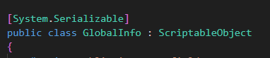

## ScriptableObject

ScriptableObject is a **serializable Unity class** that allows you to **store large quantities of shared data independent from script instances**. Using ScriptableObjects makes it easier to manage changes and debugging. You can build in a level of flexible communication between the different systems in your game, so that it’s more manageable to change and adapt them throughout production, as well as reuse components.

A ScriptableObject is a data container that you can use to save large amounts of data, independent of class instances. One of the main use cases for ScriptableObjects is to reduce your Project’s memory usage by avoiding copies of values. This is useful if your Project has a Prefab
 that stores unchanging data in attached MonoBehaviour scripts
.

Every time you instantiate that Prefab, it will get its own copy of that data. Instead of using the method, and storing duplicated data, you can use a ScriptableObject to store the data and then access it by reference from all of the Prefabs. This means that there is one copy of the data in memory.

Just like MonoBehaviours, ScriptableObjects derive from the base Unity object but, unlike MonoBehaviours, you can not attach a ScriptableObject to a GameObject
. Instead, you need to save them as Assets in your Project.

When you use the Editor, you can save data to ScriptableObjects while editing and at run time because ScriptableObjects use the Editor namespace and Editor scripting. In a deployed build, however, you can’t use ScriptableObjects to save data, but you can use the saved data from the ScriptableObject Assets that you set up during development.

Data that you save from Editor Tools to ScriptableObjects as an asset is written to disk and is therefore persistent between sessions.




### Using a ScriptableObject

The main use cases for ScriptableObjects are:

-   **Saving and storing data during an Editor session**
-   **Saving data as an Asset** in your Project to use at **run time**

```cs
using UnityEngine;

[CreateAssetMenu(fileName = "Data", menuName = "ScriptableObjects/SpawnManagerScriptableObject", order = 1)]
public class SpawnManagerScriptableObject : ScriptableObject
{
    public string prefabName;

    public int numberOfPrefabsToCreate;
    public Vector3[] spawnPoints;
}
```
With the above script in your **Assets** folder, you can create an instance of your ScriptableObject by navigating to **Assets > Create > ScriptableObjects > SpawnManagerScriptableObject**. Give your new ScriptableObject instance a meaningful name and alter the values. To use these values, you need to create a new script that references your ScriptableObject, in this case, a `SpawnManagerScriptableObject`. For example:

```cs
using UnityEngine;

public class Spawner : MonoBehaviour
{
    // The GameObject to instantiate.
    public GameObject entityToSpawn;

    // An instance of the ScriptableObject defined above.
    public SpawnManagerScriptableObject spawnManagerValues;

    // This will be appended to the name of the created entities and increment when each is created.
    int instanceNumber = 1;

    void Start()
    {
        SpawnEntities();
    }

    void SpawnEntities()
    {
        int currentSpawnPointIndex = 0;

        for (int i = 0; i < spawnManagerValues.numberOfPrefabsToCreate; i++)
        {
            // Creates an instance of the prefab at the current spawn point.
            GameObject currentEntity = Instantiate(entityToSpawn, spawnManagerValues.spawnPoints[currentSpawnPointIndex], Quaternion.identity);

            // Sets the name of the instantiated entity to be the string defined in the ScriptableObject and then appends it with a unique number. 
            currentEntity.name = spawnManagerValues.prefabName + instanceNumber;

            // Moves to the next spawn point index. If it goes out of range, it wraps back to the start.
            currentSpawnPointIndex = (currentSpawnPointIndex + 1) % spawnManagerValues.spawnPoints.Length;

            instanceNumber++;
        }
    }
}
```
> **Note**: The script file must have the same name as the class.

Attach the above script to a GameObject in your  Scene. Then, in the Inspector, set the **Spawn Manager Values** field to the new **`SpawnManagerScriptableObject`** that you set up.

Set the ****Entity To Spawn**** field to any Prefab in your Assets folder, then click **Play** in the Editor. The Prefab you referenced in the **`Spawner`** instantiates using the values you set in the **`SpawnManagerScriptableObject`** instance.

If you’re working with ScriptableObject references in the Inspector, you can double click the reference field to open the Inspector for your ScriptableObject. You can also create a custom Editor to define the look of the Inspector for your type to help manage the data that it represents.


> **Note**: 保存資料 在Editor中的RunTime更改ScriptableObjectk的數據，即使離開Runtime也會保留(所以調用的時候要特別注意) 但Build後就不會保留，關閉後會自動恢復到Build時的資料


### ref 
https://docs.unity3d.com/Manual/class-ScriptableObject.html

https://unity.com/how-to/architect-game-code-scriptable-objects

https://www.youtube.com/watch?v=raQ3iHhE_Kk

https://home.gamer.com.tw/creationDetail.php?sn=4786801

https://xjoshua.github.io/2018/07/04/Intro-to-ScriptableObject/

https://www.youtube.com/watch?v=VPlOVUc16Ek

https://www.youtube.com/watch?v=0nW5PhQTWbQ

https://www.youtube.com/watch?v=cy49zMBZvhg
