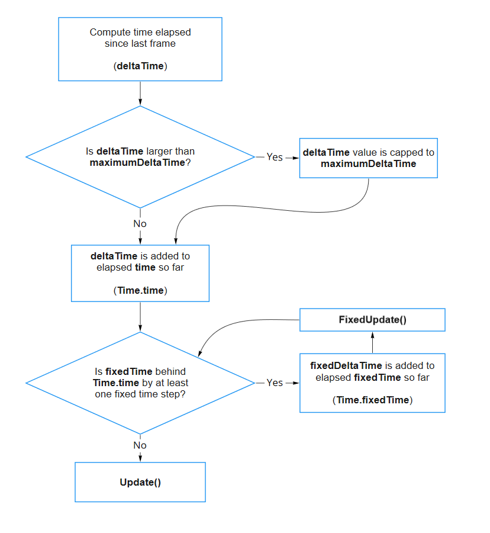

## Time

provide you with numeric values that allow you to measure time elapsing while your game or app is running.

- **`Time.time`** returns the amount of time in seconds since your project started playing.
- **`Time.deltaTime`** returns the amount of time in seconds that elapsed since the last frame completed. This value varies depending on the frames per second
 (FPS) rate at which your game or app is running.
- **`Time.timeScale`** controls the rate at which time elapses. You can read this value, or set it to control how fast time passes, allowing you to create slow-motion effects.
- **`Time.fixedDeltaTime`** controls the interval of Unity’s fixed timestep
 loop (used for physics, and if you want to write deterministic time-based code).
- **`Time.maximumDeltaTime`** sets an upper limit on the amount of time the engine will report as having passed by the “delta time” properties above.

