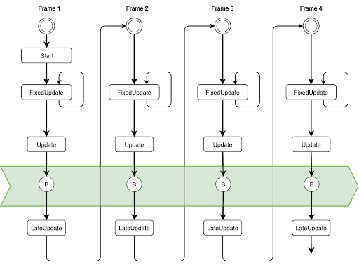
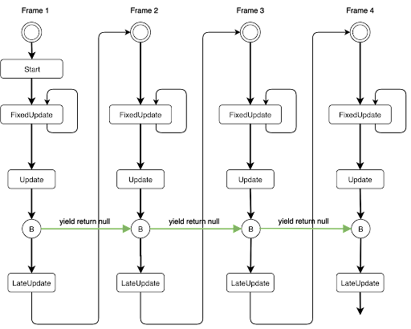
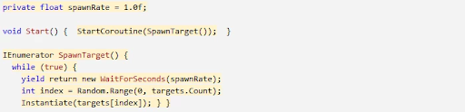

## Coroutine

A **coroutin**e allows you to **spread tasks across several frames**. It is like **a function that has the ability** **to pause execution** and **return control to Unity but then to continue** where it left off on the following frame.

In most situations, when you call a method, it runs to completion and then returns control to the calling method, plus any optional return values. This means that any action that takes place within a method must happen within a single frame update.


In situations where you would like to use a method call to contain a procedural animation or a sequence of events over time, you can use a coroutine.

> It’s best to use coroutines if you need to **deal with long asynchronous operations**, such as **waiting for HTTP transfers**, **asset loads**, or **file I/O to complete**.




**example:**




However, it’s important to remember that coroutines aren’t threads. Synchronous operations that run within a coroutine still execute on the main thread. If you want to reduce the amount of CPU time spent on the main thread, it’s just as important to avoid blocking operations in coroutines as in any other script code. If you want to use multi-threaded code within Unity, consider the **C# Job System**.


You can stop a Coroutine with `StopCoroutine` and `StopAllCoroutines`. 
> A **coroutine**s also **stops** when the GameObject it is attached to is **disabled with `SetActive(false)`**.

A **coroutine** is a function that can **suspend its execution** (**`yield`**) until the given **YieldInstruction finishes**. **`IEnumerator`** function 中 **`yield return`**, **`yield`** execution of the function，return a value to **`IEnumerator`**, and the execution of code will resume at this point. 必須有condition(eg: if/while) 讓 **`IEnumerator`** function loop. 大部分的 Coroutine 會在 Update() 結束後的 B 時間點執行，那要如何切割 Coroutine 呢？在 Coroutine 函式的每一個區段間，可以用 `yield return null` 中斷執行。Coroutine 用 `yield return null` 中斷執行後要等到下一幀同樣的 B 時間點才會接續執行


### **Yieldinstruction:**

- **`yield return null` (**-The coroutine will continue after all Update functions have been called on the next frame.**)**
- **`yield return new WaitForSeconds()` (**-Continue after a specified time delay, after all Update functions have been called for the frame.**)**
- **`yield return new WaitForFixedUpdate()` (**-Continue after all FixedUpdate has been called on all scripts.**)**
- **`yield return new WaitForEndOfFrame()` (**-Continue after the end of frame. **)**
- **`yield return StartCoroutine()`** Chains the coroutine, and will wait for the chained coroutine to complete first.

**StartCoroutine**
```cs
    public Coroutine StartCoroutine(IEnumerator routine);
```
```cs

```

https://docs.unity3d.com/ScriptReference/MonoBehaviour.StartCoroutine.html

**StopCoroutine**

https://docs.unity3d.com/ScriptReference/MonoBehaviour.StopCoroutine.html

**WaitForSeconds**

https://docs.unity3d.com/ScriptReference/WaitForSeconds.html


### Start coroutine once

**`StartCoroutine`** in `Update` but **once**
```cs
bool isCoroutineStarted = false;

void Update()
{
    if(!isCoroutineStarted){
        StartCoroutine("MyCoroutine");
    }
}
 
IEnumerator MyCoroutine(){
    isCoroutineStarted = true;
}
```


### ref 
**[https://docs.unity3d.com/Manual/BestPracticeUnderstandingPerformanceInUnity3.html](https://docs.unity3d.com/Manual/BestPracticeUnderstandingPerformanceInUnity3.html)**

**[https://docs.unity3d.com/Manual/Coroutines.html](https://docs.unity3d.com/Manual/Coroutines.html)**

**[https://docs.unity3d.com/ScriptReference/Coroutine.html](https://docs.unity3d.com/ScriptReference/Coroutine.html)**

**https://learn.unity.com/tutorial/coroutines#**

**[https://www.tutorialspoint.com/unity/unity_coroutines.htm](https://www.tutorialspoint.com/unity/unity_coroutines.htm).**

**[https://www.youtube.com/watch?v=5L9ksCs6MbE](https://www.youtube.com/watch?v=5L9ksCs6MbE)**

**[https://medium.com/feis-studio/%E6%B7%BA%E8%AB%87-unity-coroutine-%E7%9A%84%E9%81%8B%E8%A1%8C%E6%96%B9%E5%BC%8F-c3d5b52e1a0d](https://medium.com/feis-studio/%E6%B7%BA%E8%AB%87-unity-coroutine-%E7%9A%84%E9%81%8B%E8%A1%8C%E6%96%B9%E5%BC%8F-c3d5b52e1a0d)**

**[https://medium.com/feis-studio/unity-coroutine-yieldinstruction-8e08fa8b3c9f](https://medium.com/feis-studio/unity-coroutine-yieldinstruction-8e08fa8b3c9f)**
