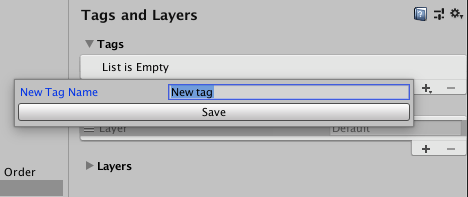
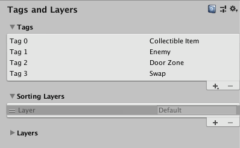
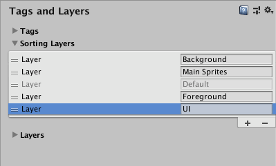

## Tags & Layers

**Layers can help to organize the GameObjectsin your scene.**

Layers are a tool that allows you to separate GameObjects in your scenes. 

### Use of layers
Use Layers primarily to restrict operations such as raycasting or rendering, so that they are only applied to the relevant groups of objects.

Common uses of layers include: 
- **Layer-based rendering**. 
- **Layer-based collision**.

> Layers marked as **Builtin** Layer are default layers used by Unity, which you cannot edit. You can customise layers marked as **User Layer**.

### Buid-in Layer
- 0: Default
- 1: TransparentFX
- 2: Ignore Raycast
- 3: Water
- 4: UI

### Camera culling mask with layers
You can render only the objects in a particular layer, or selection of layers, if you use the **Camera’s culling mask**.
To change the culling mask, select the camera you want to use, and select the Culling Mask dropdown in the Inspector window. If you clear the checkbox of a layer, it doesn’t render in the scene.

> Note: UI elements and screen space canvas children are exceptions to this and render regardless.

### Ray cast with layers
Use layers to specify which GameObjects that a ray cast can intersect with.

To make a **ray cast ignore a GameObject**:
- you can **assign it to the Ignore Raycast layer**, or
- pass a **LayerMask** for another layer which does not contain the gameobject you want to ignore the ray to the **ray cast API** call.

If you **don’t pass a LayerMask to the ray cast API call**, Unity uses **`Physics.DefaultRaycastLayers`** which **matches every layer except Ignore Raycast layer**.

The **`Physics.Raycast` function** uses a **bitmask**, and **each bit determines if a layer is ignored by rays or not**. If all bits in the layerMask are on, the ray collides against all colliders. If the layerMask = 0, there are no collisions. All colliders ignore the ray.

### Collision with layers
Use **Layer collision matrix** to control physics collision detection.

> 📌 Set the two game objects into **different layers** → **project setting** → **physics** → **Layer collision matrix** untick two layer for collision.

**Setting up layer-based collision detection**

- To select a Layer for your GameObjects to belong to, select the GameObject, navigate to the Inspector window, select the Layer dropdown at the top, and either choose a Layer or add a new Layer. Repeat for each GameObject until you have finished assigning your GameObjects to Layers.
- In the Unity menu bar, go to **Edit > Project Settings**, then select the Physics category to open the Physics window.
- Select which layers on the **Collision Matrix** will interact with the other layers by checking them.

### Create a layer
There are two ways you can create a new layer:

- Select the **Tags and Layers** window (main menu: **Edit > Project Settings > Tags and Layers > Layers**).
- Select a GameObject, select the Layer dropdown in the Inspector window, and select Add Layer from the menu.

> Warning: Layer 31 is used internally by the Editor’s Preview window mechanics. To prevent clashes, do not use this layer.

### Add GameObjects to a layer
To assign a GameObject to a layer, select the GameObject, go to the Inspector window and select the dropdown next to Layer. This menu shows the layers that have names so you can select which one works best for your GameObject.
> You can only assign each GameObject to one layer, but you can add multiple GameObjects to one layer.

### Tags
A tag is **a reference word** which you can assign to one or more GameObjects.
For example, you might define "Player" tags for player-controlled characters and an "Enem" tag for non-player-controlled characters. You might define items the player can collect in a Scene with a “Collectable” tag.

Tags help you identify GameObjects for scripting purposes. 

Tags are **useful for triggers in Collider control** scripts that need to determine if the player interacts with an enemy, a prop, or a collectable, for example.

You can use the `GameObject.FindWithTag()` function to look for any GameObject that contains a tag you specify. 

### Create or assign a tag to game object
The Inspector displays the Tag and Layer dropdown menus below the name of a GameObject.
To create a new tag, select Add Tag…. This opens the Tag and Layer Manager in the Inspector

- A GameObject can only have one tag assigned to it.
- Unity includes some built-in tags which don’t appear in the Tag Manager:
  - Untagged
  - Respawn
  - Finish
  - EditorOnly
  - MainCamera
  - Player
  - GameController

### Tags and Layers settings

The **Tags and Layers** settings (main menu: **Edit > Project Settings**, then select the **Tags and Layers** category) allows you to set up **Tags**, **Sorting Layers** and **Layers**.

#### Tag
**Tags** are marker values that you can use to identify objects in your Project. To add a new Tag, click the plus button (+) at the bottom-right of the list, and name your new Tag.

Note that once you have named a Tag, you cannot rename it. To remove a Tag, click on it and then click the minus (-) button at the bottom-right of the list.

#### Sorting Layers
Sorting Layers are used in **conjunction with Sprite graphics in the 2D system**. Sorting refers to **the overlay order of different Sprites**. Use to control the sprites overlay order. 

####Layers
Use Layers throughout the Unity Editor as a way to create groups of objects that share particular characteristics (see documentation on Layers for further details). Use Layers primarily to restrict operations such as raycasting or rendering, so that they are only applied to the relevant groups of objects. Layers marked as Builtin Layer are default layers used by Unity, which you cannot edit. You can customise layers marked as User Layer.

### ref
https://docs.unity3d.com/Manual/Layers.html

https://learn.unity.com/tutorial/essential-unity-concepts#5c7f8528edbc2a002053b6c8

https://docs.unity3d.com/Manual/class-TagManager.html

https://docs.unity3d.com/Manual/Tags.html
