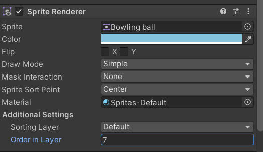

## Sprites
Sprites are a type of 2D asset you can use in your Unity project.

If you’re used to working in 3D, sprites are similar to **standard textures** but there are special techniques to combine and manage sprite textures for efficiency during development.

### Sprite Renderer

 
| **_Property_** | **_Function_** |
| --- | --- |
| **Sprite** | Define which Sprite texture the component should render. Click the small dot to the right to open the object picker window, and select from the list of available Sprite Assets. |
| **Color** | Define the vertex color of the Sprite, which tints or recolors the Sprite’s image. Use the color picker to set the vertex color of the rendered Sprite texture. |
| **Flip** | Flips the Sprite texture along the checked axis. This does not flip the Transform position of the **GameObject**. |
| **Material** | Define the Material used to render the Sprite texture. |
| **Draw Mode** | Define how the Sprite scales when its dimensions change. Select one of the following options from the drop-down box. |
|    Simple | The entire image scales when its dimensions change. This is the default option. |
|    Sliced | Select this mode if the Sprite is 9-sliced. |
|        Size          _(‘Sliced’ or ‘Tiled’)_ | Enter the Sprite’s new Width and Height to scale the 9-sliced Sprite correctly. You can also use the Rect Transform Tool to scale the Sprite while applying 9-slicing properties. |
|    Tiled | By default, this mode causes the middle of the 9-Sliced Sprite to tile instead of scale when its dimensions change. Use **Tile Mode** to control the tiling behavior of the Sprite. |
|        Continuous | This is the default **Tile Mode**. In Continuous mode, the midsection tiles evenly when the Sprite dimensions change. |
|        Adaptive | In Adaptive mode, the Sprite texture stretches when its dimensions change, similar to Simple mode. When the scale of the changed dimensions meets the Stretch Value, the midsection begins to tile. |
|         Stretch Value | Use the slider to set the value between 0 and 1. The maximum value is 1, which represents double the original Sprite’s scale. |
| **Sorting Layer** | Set the Sorting Layer of the Sprite, which controls its priority during rendering. Select an existing Sorting Layer from the drop-down box, or create a new Sorting Layer. |
| **Order In Layer** | Set the render priority of the Sprite within its Sorting Layer. Lower numbered Sprites are rendered first, with higher numbered Sprites overlapping those below. |
| **Mask Interaction** | Set how the Sprite Renderer behaves when interacting with a Sprite Mask. See examples of the different options in the Mask Interaction section below. |
|    None | The Sprite Renderer does not interact with any Sprite Masks in the Scene. This is the default option. |
|    Visible Inside Mask | The Sprite is visible where the Sprite Mask overlays it, but not outside of it. |
|    Visible Outside Mask | The Sprite is visible outside of the Sprite Mask, but not inside it. The Sprite Mask hides the sections of the Sprite it overlays. |
| **Sprite Sort Point** | Choose between the Sprite’s Center or its Pivot Point when calculating the distance between the Sprite and the **camera**. See the section on Sprite Sort Point for further details. |

### ref 
https://docs.unity3d.com/Manual/Sprites.html
