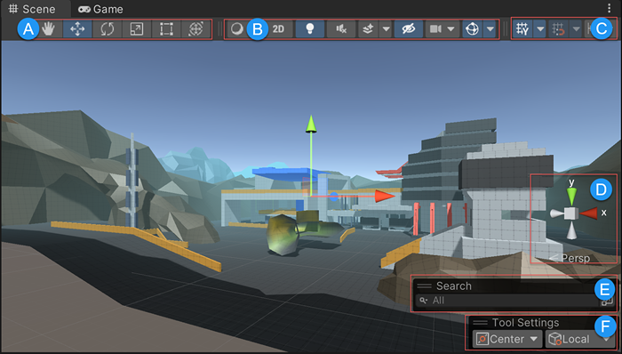

## Overlays

Unity authoring tools are available as Overlay panels in the Scene view
 window to make them more accessible and improve your workflow. You can customize which Overlays are shown, their placement in the Scene
 view window, and save your customized Overlay configurations as presets to reuse and share.

You can also create custom Overlays.

- **Tools**: https://docs.unity3d.com/Manual/PositioningGameObjects.html
- **View Options**: https://docs.unity3d.com/Manual/ViewModes.html
- **Grid and Snap Toolbar**: https://docs.unity3d.com/Manual/GridSnapping.html
- **Orientation**: https://docs.unity3d.com/Manual/SceneViewNavigation.html
- **Search**: https://docs.unity3d.com/Manual/Searching.html
- **Tool Settings**: https://docs.unity3d.com/Manual/PositioningGameObjects.html#GizmoHandlePositions
  
https://docs.unity3d.com/Manual/overlays.html

