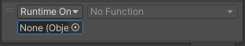
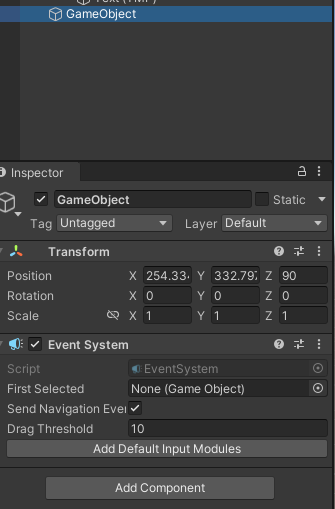
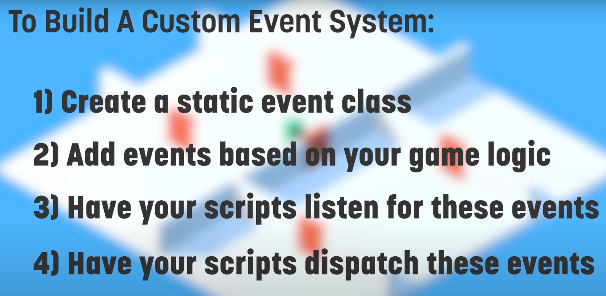

## Event system
The **Event System** is a way of **sending events** to objects in the application based on **input, be it keyboard, mouse, touch, or custom input**. The **Event System** consists of a few components that work together to send events.

When you add an **Event System component** to a GameObject you will notice that it does not have much functionality exposed, this is because the Event System itself is designed as a manager and facilitator of communication between **Event System** modules.

The primary roles of the Event System are as follows:

-   Manage which GameObject is considered selected
-   Manage which Input Module is in use
-   Manage Raycasting (if required)
-   Updating all Input Modules as required


Unity’s EventSystem allows your UI to respond to events.

> An **EventSystem component** is automatically created alongside your UI and contains several Input Modules. These modules are responsible for deciding how GameObjects in your UI respond to input — if a corresponding GameObject within your UI contains the same Input Module as the one in your EventSystem, it can be interacted with.


### Input Modules

An Input Module is where the main logic of how you want the Event System to behave lives, they are used for:

-   Handling Input
-   Managing event state
-   Sending events to scene objects.

Only one Input Module can be active in the Event System at a time, and they must be components on the same GameObject as the Event System component.

If you want to write a custom Input Module, send events supported by existing UI components in Unity.


### Raycasters

Raycasters are used for figuring out what the pointer is over. It is common for Input Modules to use the Raycasters configured in the Scene to calculate what the pointing device is over.

There are 3 provided Raycasters that exist by default:

- **Graphic Raycaster** - Used for UI elements
- **Physics 2D Raycaster** - Used for 2D physics elements
- **Physics Raycaster** - Used for 3D physics elements


### UnityEvent
UnityEvents are a way of allowing **user driven callback to be persisted from edit time to run time** without the need for additional programming and script configuration.

UnityEvents are useful for a number of things:

-   Content driven callbacks
    
-   Decoupling systems
    
-   Persistent callbacks
    
-   Preconfigured call events


**`UnityEvents`** can be added to any **`MonoBehaviour`** and are executed from code like a standard .net delegate. When a **`UnityEvent`** is added to a **`MonoBehaviour`** it appears in the **Inspector** and **persistent callbacks can be added**.

**`UnityEvents`** have similar limitations to standard delegates. That is, they hold references to the element that is the target and this stops the target being garbage collected. If you have a **`UnityEngine.Object`** as the target and the native representation disappears the callback will not be invoked.

#### Using UnityEvents

To configure a callback in the editor there are a few steps to take:

1.  Make sure your script imports/uses **`UnityEngine.Events`**.
    
2.  Select the **"+"** icon to add a slot for a **callback**
    
3.  Select the **`UnityEngine.Object`** you wish to receive the callback (You can use the **object selector** for this)
    
4.  Select the **function** you wish to be called
    
5.  You can add more than one callback for the event



When configuring a **`UnityEvent`** in the Inspector there are two types of function calls that are supported:

-   **Static**: \
    Static calls are preconfigured calls, with preconfigured values that are set in the **UI**(User Interface) Allows a user to interact with your application. Unity currently supports three UI systems. This means that when the callback is invoked, the target function is invoked with the argument that has been entered into the UI.
-   **Dynamic**: \
    Dynamic calls are invoked using an argument that is sent from code, and this is bound to the type of UnityEvent that is being invoked. The UI filters the callbacks and only shows the dynamic calls that are valid for the UnityEvent.


#### Generic UnityEvents
**Create your custom UnityEvents**:


By default a `UnityEvent` in a `Monobehaviour` binds dynamically to a void function. This does not have to be the case as dynamic invocation of **`UnityEvents`** supports binding to functions with up to **4 arguments**. To do this you need to define a **custom** **`UnityEvent`** class that supports multiple arguments. This is quite easy to do:

```cs
[Serializable]
public class StringEvent : UnityEvent <string> {}
```

```cs
public class MyIntEvent : UnityEvent<T0>
{
}
```
```cs
public class MyIntEvent : UnityEvent<T0,T1>
{
}
```
```cs
public class MyIntEvent : UnityEvent<T0,T1,T2>
{
}
```
```cs
public class MyIntEvent : UnityEvent<T0,T1,T2,T3>
{
}
```

Eg:
```cs
using UnityEngine;
using UnityEngine.Events;


[System.Serializable]
public class MyIntEvent : UnityEvent<int, int, int, int>
{
}

public class ExampleClass : MonoBehaviour
{
    public MyIntEvent m_MyEvent;

    void Start()
    {
        if (m_MyEvent == null)
            m_MyEvent = new MyIntEvent();

        m_MyEvent.AddListener(Ping);
    }

    void Update()
    {
        if (Input.anyKeyDown && m_MyEvent != null)
        {
            m_MyEvent.Invoke(5, 6, 7, 8);
        }
    }

    void Ping(int i, int j, int k, int l)
    {
        Debug.Log("Ping" + i + j + k + l);
    }
}
```

By adding an instance of this to your class instead of the base **`UnityEvent`** it will allow the callback to bind dynamically to  functions.

This can then be invoked by calling the **`Invoke()`** function with a `string` as argument.

UnityEvents can be defined with up to **4 arguments** in their generic definition.


### Event System Component
This subsystem is responsible for controlling all the other elements that make up eventing. It coordinates which Input Module is currently active, which GameObject is currently considered 'selected', and a host of other high level Event System concepts.

Each 'Update' the Event System receives the call, looks through its Input Modules and figures out which is the Input Module that should be used for this tick. It then delegates the processing to the modules.

Add **Event System** component to an UI gameobject.



#### Properties

| **_Property:_** | **_Function:_** |
| --- | --- |
| **First Selected** | The GameObject that was selected first. |
| **Send Navigation Events** | Should the EventSystem allow navigation events (move / submit / cancel). |
| **Drag Threshold** | The soft area for dragging in pixels. |


### Build your customed Event in Unity(Using C# delefate event)


https://medium.com/xrpractices/lets-build-a-custom-event-system-in-unity3d-d39f38b223d1

https://vionixstudio.com/2022/06/20/unity-events-and-delegates/


Example of using **delegate** in **event**: 
```cs
using System.Collections;
using System.Collections.Generic;
using UnityEngine;

public class Events : MonoBehaviour
{
    public delegate void ActionClick();

    public static event ActionClick OnClick;
    
    public void Button_Click()
    {
        OnClick?.Invoke();
    }
}
```
```cs
using System;
using System.Collections;
using System.Collections.Generic;
using UnityEngine;

public class Cube : MonoBehaviour
{
    void Start()
    {
        Events.OnClick += TurnRed;
    }

    private void TurnRed()
    {
        GetComponent<MeshRenderer>().material.color = Color.red;
    }

    private void OnDisable()
    {
        Events.OnClick -= TurnRed;
    }
}

```
https://github.com/tunchasan/Unity-Delegates-and-Events-Cheatseet/tree/main/Assets/_Main/Scripts/Event%20Example%202


> 1. Declare a Delegate
  ```cs
    public delegate void OnGameStart();
  ```
> 2.Create an Event
  ```cs
    public static event OnGameStart onGameStart;
  ```
> 3. Point to method
  ```cs
    onGameStart += Move;
  ```
> 4. Invoke an Event
  ```cs
    onGameStart ();
  ```

#### Action and Func Delegates in Unity
https://medium.com/nerd-for-tech/action-and-func-delegates-d60fe913e26c


### C# Delegate Events VS UnityEvent
he only advantage and reason to use UnityEvent is that it allows you to use events in the Editor. That's for drag and drop people or those making Editor plugins.

Another advantage of UnityEvent is that it prevents the problem of Unity Object not being freed due to the misuse of delegates or using anonymous delegates with Unity Objects. Although they get freed when the main script that's holding them is destroyed. The reason for this is because UnityEvent is implemented with weak references therefore removing/minimizing this problem. These two things are still not worth it to use UnityEvent over native C# events.

UnityEvent generates less garbage than C# events.

You should always use native event and delegate over UnityEvent if you are not making an Editor plugin because of its fast performance and small memory usage. See this and this post post for more information.

https://www.youtube.com/watch?v=oc3sQamIh-Q

https://forum.unity.com/threads/why-choose-unityevents-over-native-c-events.479311/


### ref
https://docs.unity3d.com/Packages/com.unity.ugui@1.0/manual/EventSystem.html

**learn event system** \
https://learn.unity.com/tutorial/working-with-the-event-system#

**Event** \
https://learn.unity.com/tutorial/events-uh#5c894782edbc2a1410355442

https://www.youtube.com/watch?v=gx0Lt4tCDE0

https://www.youtube.com/watch?v=70PcP_uPuUc

https://www.youtube.com/watch?v=EvqdcyTgZNg

**C# event** \
https://learn.microsoft.com/en-us/dotnet/csharp/language-reference/keywords/event

**UnityEngine.Event** \
https://docs.unity3d.com/ScriptReference/Event.html

**UnityEvents** \
https://docs.unity3d.com/Manual/UnityEvents.html

https://docs.unity3d.com/ScriptReference/Events.UnityEvent.html

**`UnityEngine.EventSystems`** \
https://docs.unity3d.com/Packages/com.unity.ugui@1.0/api/UnityEngine.EventSystems.html

**`UnityEditor.EventSystems`** \
https://docs.unity3d.com/Packages/com.unity.ugui@1.0/api/UnityEditor.EventSystems.html

https://docs.unity3d.com/Packages/com.unity.ugui@1.0/manual/SupportedEvents.html

https://docs.unity3d.com/Packages/com.unity.ugui@1.0/manual/Raycasters.html

**Event System Reference** \
https://docs.unity3d.com/Packages/com.unity.ugui@1.0/manual/script-EventSystem.html

**Creating a Simple Messaging System** \
https://learn.unity.com/tutorial/create-a-simple-messaging-system-with-events#5cf5960fedbc2a281acd21fa
