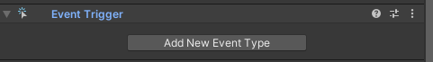
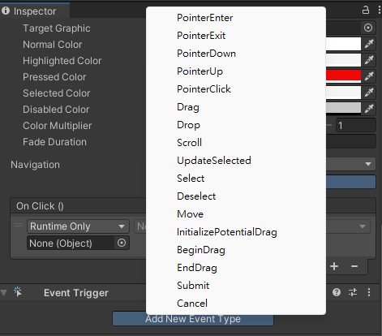

## Event system
The **Event System** is a way of **sending events to objects** in the application based on **input, be it keyboard, mouse, touch, or custom input**. 

**Objects receive these events based on on user input**.

To make objects interact with sending events based on input, use Event System.

The **Event System** consists of a **few components** that work together to send events.

When you add an **Event System component** to a GameObject you will notice that it does not have much functionality exposed, this is because the Event System itself is designed as a manager and facilitator of communication between **Event System** modules.

The primary roles of the **Event System** are as follows:

-   Manage which GameObject is **considered selected**
-   Manage which **Input Module** is in use
-   Manage **Raycasting** (if required)
-   **Updating all Input Modules** as required


> **Unity’s Event System allows your UI to respond to events**.

> An **Event System component** is **automatically created alongside your UI** and **contains several Input Modules**. These modules are responsible for deciding how GameObjects in your UI respond to input — if a corresponding GameObject within your UI contains the same Input Module as the one in your EventSystem, it can be interacted with.

### Input Modules

An Input Module is where the main logic of how you want the Event System to behave lives, they are used for:

- **Handling Input**
- **Managing event state**
- **Sending events** to **scene objects**.

Only one Input Module can be active in the Event System at a time, and they must be components on the same GameObject as the Event System component.

If you want to write a **custom Input Module**, send events supported by existing UI components in Unity.

An Input Module is where the main logic of an event system can be configured and customized. Out of the box there are two provided Input Modules, one designed for Standalone, and one designed for Touch input. Each module receives and dispatches events as you would expect on the given configuration.

Input modules are where the 'business logic' of the Event System take place. When the Event System is enabled it looks at what Input Modules are attached and passes update handling to the specific module.

Input modules are designed to be extended or modified based on the input systems that you wish to support. Their purpose is to map hardware specific input (such as touch, joystick, mouse, motion controller) into events that are sent via the messaging system.

The built in Input Modules are designed to support common game configurations such as touch input, controller input, keyboard input, and mouse input. They send a variety of events to controls in the application, if you implement the specific interfaces on your MonoBehaviours. All of the UI components implement the interfaces that make sense for the given component.

#### Standalone Input Module

The module is designed to work as you would expect a **controller / mouse input to work**. Events for button presses, dragging, and similar are sent in response to input.

The module sends pointer events to components as a mouse / input device is moved around, and uses the Graphics Raycaster and Physics Raycaster to calculate which element is currently pointed at by a given pointer device. You can configure these raycasters to detect or ignore parts of your Scene, to suit your requirements.

The module sends move events and submit / cancel events in response to Input tracked via the Input window. This works for both keyboard and controller input. The tracked axis and keys can be configured in the module's inspector.


| **_Property:_** | **_Function:_** |
| --- | --- |
| **Horizontal Axis** | Type the desired manager name for the horizontal axis button. |
| **Vertical Axis** | Type the desired manager name for the vertical axis. |
| **Submit Button** | Type the desired manager name for the Submit button. |
| **Cancel Button** | Type the desired manager name for the Cancel button. |
| **Input Actions Per Second** | Number of keyboard/controller inputs allowed per second. |
| **Repeat Delay** | Delay in seconds before the input actions per second repeat rate takes effect. |
| **Force Module Active** | Enable this property to force this **Standalone Input Module** to be active. |


### Raycasters

**Raycasters** are used for figuring out **what the pointer is over**. It is common for Input Modules to **use the Raycasters configured in the Scene to calculate what the pointing device is over**.

The **Event System** needs a method for **detecting where current input events need to be sent to**, and this is provided by the **Raycasters**. Given a screen space position they will collect all potential targets, figure out if they are under the given position, and then **return the object that is closest to the screen**. 

There are 3 provided Raycasters that exist by default:

- **Graphic Raycaster** - Used for **UI elements**.
- **Physics 2D Raycaster** - Used for **2D physics elements**.
- **Physics Raycaster** - Used for **3D physics elements**.

When a **Raycaster** is present and enabled in the scene it will be used by the **Event System** whenever a query is issued from an Input Module.

If multiple Raycasters are used then they will all have casting happen against them and the results will be sorted based on distance to the elements.

#### Graphic Raycaster
The Graphic Raycaster is used to **raycast against a Canvas**. The Raycaster looks at all Graphics on the canvas and determines if any of them have been hit.

The Graphic Raycaster can be configured to ignore backfacing Graphics as well as be blocked by 2D or 3D objects that exist in front of it. A manual priority can also be applied if you want processing of this element to be forced to the front or back of the Raycasting.

> When a UI is created, a Graphic Raycaster is **automatically included within the Canvas**.

| **_Property:_** | **_Function:_** |
| --- | --- |
| **Ignore Reversed Graphics** | Should graphics facing away from the raycaster be considered? |
| **Blocked Objects** | Type of objects that will block graphic raycasts. |
| **Blocking Mask** | Type of objects that will block graphic raycasts. |

#### Physics Raycaster

The Raycaster raycasts against 3D objects in the scene. This allows messages to be sent to 3D physics objects that implement event interfaces.

| **_Property:_** | **_Function:_** |
| --- | --- |
| **Depth** | Get the depth of the configured camera. |
| **Event Camera** | Get the camera that is used for this module. |
| **Event Mask** | Logical and of Camera mask and eventMask. |
| **Final Event Mask** | Logical and of Camera mask and eventMask. |

#### Physics 2D Raycaster
The 2D Raycaster raycasts against 2D objects in the scene. This allows messages to be sent to 2D physics objects that implement event interfaces. The **Camera GameObject needs to be used** and will be added to the GameObject if the **Physics 3D Raycaster is not added to the Camera GameObject**.

| **_Property:_** | **_Function:_** |
| --- | --- |
| **Event Camera** | The camera that will generate rays for this raycaster. |
| **Priority** | Priority of the caster relative to other casters. |
| **Sort Order Priority** | Priority of the raycaster based upon sort order. |
| **Render Order Priority** | Priority of the raycaster based upon render order. |


### Event System Component
An **EventSystem component** is automatically created **alongside your UI** and **contains several Input Modules**. 

This subsystem is responsible for controlling all the other elements that make up eventing. It coordinates which Input Module is currently active, which GameObject is currently considered 'selected', and a host of other high level Event System concepts.

Each 'Update' the Event System receives the call, looks through its Input Modules and figures out which is the Input Module that should be used for this tick. It then delegates the processing to the modules.

Add **Event System** component to an UI gameobject.


#### Properties

| **_Property:_** | **_Function:_** |
| --- | --- |
| **First Selected** | The GameObject that was selected first. |
| **Send Navigation Events** | Should the EventSystem allow navigation events (move / submit / cancel). |
| **Drag Threshold** | The soft area for dragging in pixels. |


### Events

#### Messaging System
The new UI system uses a messaging system designed to replace SendMessage. The system is pure C# and aims to address some of the issues present with SendMessage.

**Defining A Custom Message**

If you wish to define a custom message it is relatively simple. In the UnityEngine.EventSystems namespace there is a base interface called 'IEventSystemHandler'. Anything that extends from this can be considered as a target for receiving events via the messaging system.

```cs
public interface ICustomMessageTarget : IEventSystemHandler
{
    // functions that can be called via the messaging system
    void Message1();
    void Message2();
}
```

Once this interface is defined then it can be implemented by a MonoBehaviour. When implemented it defines the functions that will be executed if the given message is issued against this MonoBehaviours GameObject.

```cs
public class CustomMessageTarget : MonoBehaviour, ICustomMessageTarget
{
    public void Message1()
    {
        Debug.Log ("Message 1 received");
    }

    public void Message2()
    {
        Debug.Log ("Message 2 received");
    }
}
```

Now that a script exists that can receive the message we need to issue the message. Normally this would be in response to some loosely coupled event that occurs. For example, in the UI system we issue events for such things as PointerEnter and PointerExit, as well as a variety of other things that can happen in response to user input into the application.

To send a message a static helper class exists to do this. As arguments it requires a target object for the message, some user specific data, and a functor that maps to the specific function in the message interface you wish to target.

```cs
ExecuteEvents.Execute<ICustomMessageTarget>(target, null, (x,y)=>x.Message1());
```

This code will execute the function Message1 on any components on the GameObject target that implement the ICustomMessageTarget interface. The scripting documentation for the ExecuteEvents class covers other forms of the Execute functions, such as Executing in children or in parents.


#### Event Trigger

The **Event Trigger** **receives events** from the **Event System** and **calls registered functions** for each event.

The **Event Trigger** can be used to **specify functions you wish to be called** for each **Event System event**. You can **assign multiple functions to a single event** and whenever the **Event Trigger** receives that event it will call those functions.





> **Note**: attaching an **Event Trigger component** to a GameObject will make that **object intercept all events**, and no event bubbling will occur from this object!


#### Supported Events

The Event System supports a number of events, and they can be customized further in user custom user written Input Modules.

The events that are supported by the Standalone Input Module and Touch Input Module are provided by interface and can be implemented on a MonoBehaviour by implementing the interface. If you have a valid Event System configured the events will be called at the correct time.


-   `IPointerEnterHandler` - `OnPointerEnter` - Called when a pointer enters the object
-   `IPointerExitHandler` - `OnPointerExit` - Called when a pointer exits the object
-   `IPointerDownHandler` - `OnPointerDown` - Called when a pointer is pressed on the object
-   `IPointerUpHandler`- `OnPointerUp` - Called when a pointer is released (called on the GameObject that the pointer is clicking)
-   `IPointerClickHandler` - `OnPointerClick` - Called when a pointer is pressed and released on the same object
-  `IInitializePotentialDragHandle` - `OnInitializePotentialDrag` - Called when a drag target is found, can be used to initialize values
-   `IBeginDragHandler` - `OnBeginDrag` - Called on the drag object when dragging is about to begin
-   `IDragHandler` - `OnDrag` - Called on the drag object when a drag is happening
-   `IEndDragHandler` - `OnEndDrag` - Called on the drag object when a drag finishes
-   `IDropHandler` - `OnDrop` - Called on the object where a drag finishes
-   `IScrollHandler` - `OnScroll` - Called when a mouse wheel scrolls
-   `IUpdateSelectedHandler` - `OnUpdateSelected` - Called on the selected object each tick
-   `ISelectHandler` - `OnSelect` - Called when the object becomes the selected object
-   `IDeselectHandler` - `OnDeselect` - Called on the selected object becomes deselected
-   `IMoveHandler` - `OnMove` - Called when a move event occurs (left, right, up, down)
-   `ISubmitHandler` - `OnSubmit` - Called when the submit button is pressed
-   `ICancelHandler` - `OnCancel` - Called when the cancel button is pressed


### ref
https://docs.unity3d.com/Packages/com.unity.ugui@2.0/manual/EventSystem.html

**learn event system** \
https://learn.unity.com/tutorial/working-with-the-event-system#

**Messaging System** \
https://docs.unity3d.com/Packages/com.unity.ugui@2.0/manual/MessagingSystem.html

**Input Modules** \
https://docs.unity3d.com/Packages/com.unity.ugui@2.0/manual/InputModules.html

**Standalone Input Module** \
https://docs.unity3d.com/Packages/com.unity.ugui@2.0/manual/script-StandaloneInputModule.html

**Touch Input Module** \
https://docs.unity3d.com/Packages/com.unity.ugui@2.0/manual/script-TouchInputModule.html

**Supported Events** \
https://docs.unity3d.com/Packages/com.unity.ugui@2.0/manual/SupportedEvents.html

**Raycasters** \
https://docs.unity3d.com/Packages/com.unity.ugui@2.0/manual/Raycasters.html

**Graphic Raycaster** \
https://docs.unity3d.com/Packages/com.unity.ugui@2.0/manual/script-GraphicRaycaster.html \
https://docs.unity3d.com/Packages/com.unity.ugui@2.0/api/UnityEngine.UI.GraphicRaycaster.html

**Physics Raycaster** \
https://docs.unity3d.com/Packages/com.unity.ugui@2.0/manual/script-PhysicsRaycaster.html \


**Physics 2D Raycaster** \
https://docs.unity3d.com/Packages/com.unity.ugui@2.0/manual/script-Physics2DRaycaster.html

**Event Trigger** \
https://docs.unity3d.com/Packages/com.unity.ugui@2.0/manual/script-EventTrigger.html

**`UnityEngine.EventSystems`** \
https://docs.unity3d.com/Packages/com.unity.ugui@1.0/api/UnityEngine.EventSystems.html

**`UnityEditor.EventSystems`** \
https://docs.unity3d.com/Packages/com.unity.ugui@1.0/api/UnityEditor.EventSystems.html

https://docs.unity3d.com/Packages/com.unity.ugui@1.0/manual/SupportedEvents.html

https://docs.unity3d.com/Packages/com.unity.ugui@1.0/manual/Raycasters.html

**UI Reference** \
https://docs.unity3d.com/Packages/com.unity.ugui@2.0/manual/UIReference.html

**Event System Reference** \
https://docs.unity3d.com/Packages/com.unity.ugui@2.0/manual/EventSystemReference.html

**ULTIMATE Event System for Unity Beginners** \
https://www.youtube.com/watch?v=7_dyDmF0Ktw&t=1s
