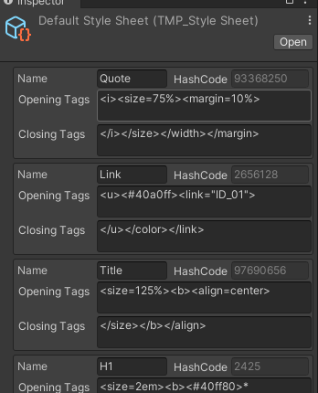
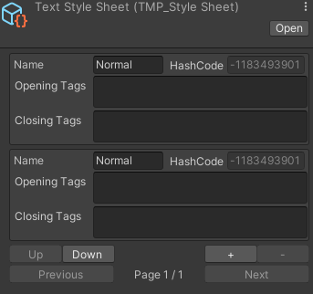

## Style Sheets
The default style sheet is the style sheet that every TextMesh Pro object in your

TextMesh Pro ships with a default style sheet stored in the **TextMesh Pro > Resources > Style Sheets** folder, but you can set any style sheet to be the default.

A custom style can include opening and closing rich text tags, as well as leading and trailing text.

### The default style sheet

The default style sheet is the style sheet that every TextMesh Pro object in your

TextMesh Pro ships with a default style sheet stored in the **TextMesh Pro > Resources > Style Sheets** folder, but you can set any style sheet to be the default.

To change the default style sheet, set the **Default Style Sheet > Default Style Sheet** option in the TextMesh Pro settings

### Creating custom style sheets

To create a new style sheet, choose **Assets > Create > TextMesh Pro > Style Sheet** from the menu.

This adds a new TextMesh Pro style sheet to the Project. Open it in the Inspector to add custom styles.

### ref 
https://docs.unity3d.com/Packages/com.unity.textmeshpro@4.0/manual/StyleSheets.html
