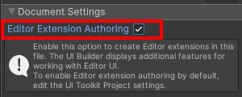
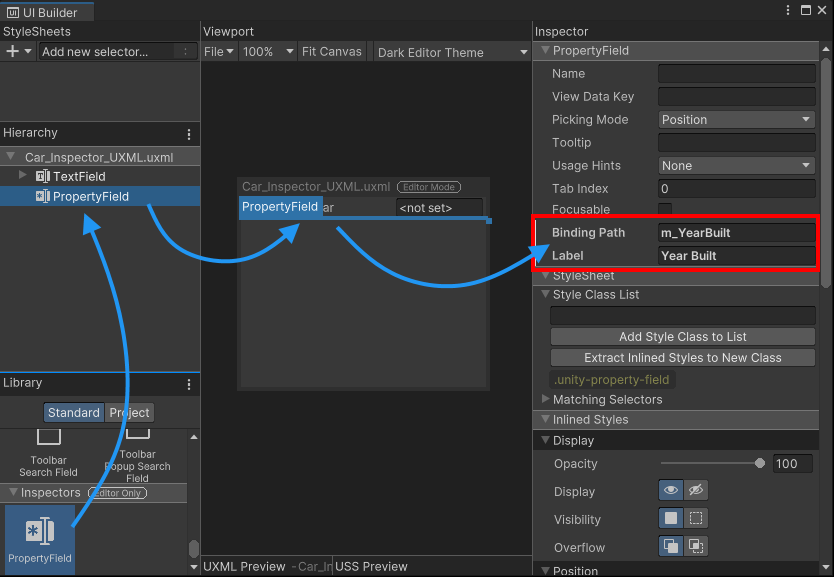
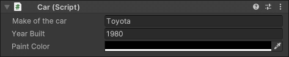
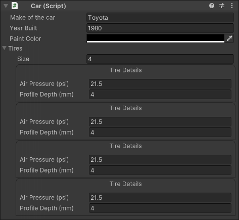

## Create a Custom Inspector

Reason to write a custom inspector:

- Create a more user-friendly representation of script properties.
- Organize and group properties together.
- Display or hide sections of the UI depending on the user’s choices.
- Provide additional information about the meaning of individual settings and properties.

Creating custom inspectors using UI Toolkit is similar to using Immediate Mode GUI (IMGUI), but UI Toolkit has several advantages, such as automatic data binding and automatic undo support. Where IMGUI creates the UI for the inspector entirely through script, UI Toolkit allows you to build the UI via script, visually in UI Builder, or a combination of both.

### Create a custom inspector script
To create a custom inspector for any serialized object, you need to create a class deriving from the **Editor** base class, and add the **`CustomEditor`** attribute to it. This attribute **lets Unity know which class this custom inspector represents**.

EG: \
Create a file `Car_Inspector.cs` inside **Assets/Scripts/Editor** and copy the following code into it.

```cs

using UnityEditor;
using UnityEditor.UIElements;
using UnityEngine.UIElements;


[CustomEditor(typeof(Car))]  // This attribute lets Unity know which class this custom inspector represents
public class Car_Inspector : Editor
{
   ...
}

```
> **Note**: The custom inspector file must be inside the **Editor folder**, or inside an **Editor-only assembly definition**. Attempting to create standalone builds will fail, as the **UnityEditor** namespace isn’t available.

If you **select your GameObject with the Car component** at this point, Unity will still display the default inspector. You need to **override `CreateInspectorGUI()`** inside your **`Car_Inspector`** class to **replace the default inspector**.

The **`CreateInspectorGUI()`** function builds the visual tree for the inspector. The function needs to return a VisualElement containing the UI. The implementation of **`CreateInspectorGUI()`** below creates a blank new VisualElement and adds a label to it.

Override the **`CreateInspectorGUI()`** function inside your `Car_Inspector` script 

Eg:

```cs
public override VisualElement CreateInspectorGUI()
{
  // Create a new VisualElement to be the root of our inspector UI
  VisualElement myInspector = new VisualElement();

  // Example: Add a simple label
  myInspector.Add(new Label("This is a custom inspector"));

  // Return the finished inspector UI
  return myInspector;
}

```

### Use UXML inside a custom inspector
UI Toolkit allows you to add UI controls in two ways:

-   Implementing a script
-   Loading a UXML file containing a pre-made UI tree.


Using the UI Builder to create a UXML file containing the UI, and use code to load and instantiate the UI from the UXML file.

Open the UI Builder via the menu **Window > UI Toolkit > UI Builder** and create a new Visual Tree Asset using the **File > New** menu entry inside the UI Builder.


UI Toolkit offers additional controls types when you’re using it to create Editor windows and custom inspectors. By default, these Editor-only controls aren’t visible in UI Builder. To make them available, you need to enable the checkbox **Editor Extension Authoring**.

Select the `<unsaved file>*.uxml` in the **Hierarchy** view in the UI Builder and enable the **Editor Extension Authoring** checkbox.




> **Note**: If you use UI Toolkit to create Editor windows and custom inspectors, you can enable this setting by default in **Project Settings > UI Builder**.

To use the **UXML** file inside your custom inspector, you need to **clone** it inside the **`CreateInspectorGUI()`** function and add it to the **visual tree**. To do this, you use the **`CloneTree`** method. You can pass any **VisualElement as a parameter** to act as **a parent** for the created elements.


Example: 

After creating **`Car_Inspector_UXML.uxml`** in UI Builder, save it. To use it in your custom inspector UI. 

Create a public variable for a `VisualTreeAsset` in your script, and assign the `Car_Inspector_UXML.uxml` file as a default reference in the Editor.


```cs
public VisualTreeAsset m_InspectorXML;

public override VisualElement CreateInspectorGUI()
{
  // Create a new VisualElement to be the root of our inspector UI
  VisualElement myInspector = new VisualElement();

  // Load from default reference
  m_InspectorXML.CloneTree(myInspector);

  // Return the finished inspector UI
  return myInspector;
}
```


> Default references only work in the Editor. They do not work with runtime components in standalone builds using the `AddComponent()` method.


### Property fields
To display properties of the `Car` class, you must add a control for each field. The control must match the property type so that it can be bound. For example, an `int` should be bound to an Integer field or an Integer Slider.

Instead of adding a specific control based on the property type, you can also make use of the generic **`PropertyField`** control. This control **works for most types of serialized properties**, and generates the default inspector UI for this property type.

Eg:

Add a `PropertyField` control for the `m_YearBuilt` and the `m_Color` properties of the `Car` class. Assign the binding path for each and fill in the `Label` text.




The advantage of a `PropertyField` is the inspector UI will automatically adjust when you change the variable type inside your script. However, you can’t get a preview of the control inside the UI Builder, since the control type needed is unknown until the visual tree is bound to a serialized object, and UI Toolkit can determine the property type.





#### Car.cs
```cs
using UnityEngine;

public class Car : MonoBehaviour
{
  public string m_Make = "Toyota";
  public int m_YearBuilt = 1980;
  public Color m_Color = Color.black;

  // This car has four tires
  public Tire[] m_Tires = new Tire[4];
}
```

#### Car_Inspector.cs
```cs
using UnityEditor;
using UnityEditor.UIElements;
using UnityEngine.UIElements;

[CustomEditor(typeof(Car))]
public class Car_Inspector : Editor
{
  public VisualTreeAsset m_InspectorXML;

  public override VisualElement CreateInspectorGUI()
  {
    // Create a new VisualElement to be the root of our inspector UI
    VisualElement myInspector = new VisualElement();

    // Load from default reference
    m_InspectorXML.CloneTree(myInspector);

    // Return the finished inspector UI
    return myInspector;
  }
}

```




#### Car_Inspector_UXML.uxml
```xml
<ui:UXML xmlns:ui="UnityEngine.UIElements" xmlns:uie="UnityEditor.UIElements" editor-extension-mode="True">
    <ui:TextField label="Make of the car" text="&lt;not set&gt;" binding-path="m_Make" />
    <uie:PropertyField label="Year Built" binding-path="m_YearBuilt" />
    <uie:PropertyField binding-path="m_Color" label="Paint Color" />
    <uie:PropertyField binding-path="m_Tires" label="Tires" />
    <ui:Foldout text="Default Inspector" name="Default_Inspector" />
</ui:UXML>
```

#### Tire.cs
```cs
[System.Serializable]
public class Tire
{
  public float m_AirPressure = 21.5f;
  public int m_ProfileDepth = 4;
}
```

### ref 
https://docs.unity3d.com/Manual/UIE-HowTo-CreateCustomInspector.html

https://docs.unity3d.com/ScriptReference/UIElements.PropertyField.html


