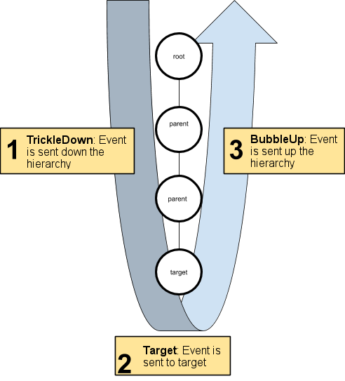

## Control behavior with events

**UI Toolkit** provides events that communicate **user actions or notifications to visual elements**. 
The **UI Toolkit event** system shares the **same terminology** and event naming as **HTML events**.
 
 
The UI Toolkit event system listens to events, coming from the operating system or scripts
, and dispatches these events to visual elements using the **EventDispatcher**. 

The **event dispatcher** determines an **appropriate dispatching strategy** for each event it sends. Once determined, the dispatcher **executes the strategy**.
 

**Visual elements** implement default behaviors for several events. 
This can involve the creation and execution of additional events. 
For example, a **MouseMoveEvent** could generate an additional **MouseEnterEvent** and a **MouseLeaveEvent**. These events enter a queue and process after the current event. 
For example, the **MouseMoveEvent** finishes processing before the **MouseEnterEvent** and **MouseLeaveEvent** events.


### Event System
The Event System is a way of sending events to objects in the application based on input, be it keyboard, mouse, touch, or custom input. The Event System consists of a few components that work together to send events.

When you add an Event System component to a GameObject you will notice that it does not have much functionality exposed, this is because the Event System itself is designed as a manager and facilitator of communication between Event System modules.

The primary roles of the Event System are as follows:

-   Manage which GameObject is considered selected
-   Manage which Input Module is in use
-   Manage Raycasting (if required)
-   Updating all Input Modules as required

#### Input Modules
An Input Module is where the main logic of how you want the Event System to behave lives, they are used for:

Handling Input
Managing event state
Sending events to scene objects.
Only one Input Module can be active in the Event System at a time, and they must be components on the same GameObject as the Event System component.

If you want to write a custom Input Module, send events supported by existing UI components in Unity. To extend and write your own events, see the Messaging System documentation.

### Event propagation
After the event dispatcher selects the event target, it computes the propagation path of the event. The propagation path is an ordered list of visual elements that receive the event. The propagation path occurs in the following order:

1.  The path starts at the root of the visual element tree and descends towards the target. This is the **trickle-down phase**.
2.  The event target receives the event.
3.  The event then ascends the tree towards the root. This is the **bubble-up phase**.




### Dispatch behavior of event types

Each event type has its own dispatch behavior. The behavior of each event type breaks down into three stages:

-   **Trickles down**: Events sent to elements during the trickle down phase.
-   **Bubbles up**: Events sent to elements during the bubble-up phase.
-   **Cancellable**: Events that can have their default action execution cancelled, stopped, or prevented.


### Handle events
Events in **UI Toolkit** are similar to **HTML events**. When an event occurs, it’s sent to the target visual element
and to all elements within the propagation path in the **visual element tree**.
 
The event handling sequence is as follows:

1.  Execute event callbacks on elements from the root element down to the parent of the event target. This is the **trickle-down phase** of the dispatch process.
2.  Execute event callbacks on the event target. This is the **target phase** of the dispatch process.
3.  Call `ExecuteDefaultActionAtTarget()` on the event target.
4.  Execute event callbacks on elements from the event target parent up to the root. This is the **bubble-up phase** of the dispatch process.
5.  Call `ExecuteDefaultAction()` on the event target.

As an event moves along the propagation path, the `Event.currentTarget` property updates to the element currently handling the event. Within an event callback function:

-   `Event.currentTarget` is the visual element that the callback registers on.
-   `Event.target` is the visual element where the original event occurs.


### Register an event callback

You can register an event callback to customize the behavior of an individual instance of an existing class, such as reacting to a mouse click on a text label.

Each element along the propagation path (except the target) can receive an event twice:

-   Once during the trickle-down phase.
-   Once during the bubble-up phase.

By default, a registered callback executes during the target phase and the bubble-up phase. This default behavior ensures that a parent element reacts after its child element.

> On the other hand, if you want a parent element to react before its child, register your callback with the `TrickleDown.TrickleDown` option:

```csharp
using UnityEngine;
using UnityEngine.UIElements;

...
VisualElement myElement = new VisualElement();

// Register a callback for the trickle-down phase.
myElement.RegisterCallback<MouseDownEvent>(MyCallback, TrickleDown.TrickleDown);
...
```

This informs the dispatcher to execute the callback at the target phase and the trickle-down phase.

To add a custom behavior to a specific visual element, register an event callback on that element.


### ref
https://docs.unity3d.com/Manual/UIE-Events.html

https://docs.unity3d.com/Manual/UIE-Events-Handling.html


