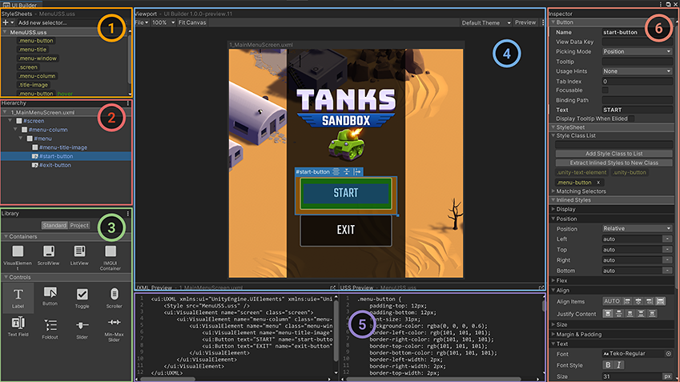
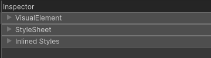

## UI builder 

**UI Builder** lets you visually create and edit **UI assets**, such as **UI Documents** (`.uxml`), and **StyleSheets** (`.uss`), that you use with **UI Toolkit**.

You can also install the following optional packages that offer additional functionality in UI Builder:

- The `com.unity.vectorgraphics` package allows you to assign a **VectorImage** as a background style on an element.
- The `com.unity.2d.sprite` package allows you to assign a 2D **Sprite** asset (or sub-asset) as a background style on an element. With the 2D Sprite package installed, you can also open the 2D Sprite Editor directly from the **Inspector** pane.

To open the **UI Builder** window:

Select **Window > UI Toolkit > UI Builder**. This opens a **UXML** document that has been previously loaded with **UIBuilder**. From the Project window, double-click a **UXML** file.

https://docs.unity3d.com/Manual/UIB-interface-overview.html

### Open and save UI Documents (UXML)

To open a UI Document in UI Builder:

- Use the File menu inside the UI Builder Viewport pane toolbar and select Open….
- In the Project tab of the Library pane, right-click on the document and select Open in UI Builder.

To open a UI Document (UXML) in your default text editor or IDE:

- Use the inlineStyle file icon.
  1. Go to the Project window > Assets.
  2. Click the arrow in the middle of the UXML file icon.
  3. Double-click the inlineStyle file icon.
- Use the Open with IDE button.
  1. In UI Builder, go to Library > Project tab.
  2. Open the Assets folder.
  3. Right-click on the UI Document (UXML) and select Open with IDE.
- Use the **UXML** Preview pane.
  1. In UI Builder, make sure your UI Document (UXML) is currently loaded.
  2. Go to the UXML Preview pane.
  3. Select the top-right icon.

### StyleSheets
**StyleSheets** and the **USS Selectors** in UI Toolkit are used to share and apply styles across many elements and **UI Documents (UXML)**.

The StyleSheets pane **1** is where you can:

- Add, reorder, or remove StyleSheets (USS) in the current UI Document (UXML).
- Create, reorder, copy, or remove USS Selectors within StyleSheets to share styles across different elements.

### Hierarchy

The Hierarchy pane **2** contains the tree view representing the element hierarchy of the current document. It’s a superset of the hierarchy you see in the UXML text representation of the UI Document (UXML). Besides the elements created directly from UXML, the Hierarchy pane also contains elements created dynamically that only exist in the runtime of the UI. For example, the Hierarchy pane includes elements that are part of a Template instance (a different document instanced inside the current document), whereas the UXML would just have a single **`<Instance>`** tag.

  
You can use the Hierarchy pane to:

- Select elements for inspecting or editing.
- Cut, copy, delete, or reorder elements.
- Open instanced template documents as sub-documents for in-place (in context) editing.
- Check at once many elements’ style class lists, name attributes, and locally attached StyleSheets. 
  
Click the **⋮** icon in the top right corner of the Hierarchy pane header to access a menu of display options.

- Select Type to force the Hierarchy to display each element’s C# type, regardless of whether it has a name.
- Select Class List to display each element’s style class list next to its Hierarchy entry.
- Select Attached StyleSheets to display any locally attached StyleSheets next to their element.  
  

### Library
The Library pane **3** is similar to the Project window in the Unity Editor. It lists available **UI elements**.

### Viewport
The Viewport pane **4** displays the output of a **UI Document (UXML)** on a floating resizable edit-time Canvas. 

The toolbar contains menus of UI Builder-specific commands, Viewport settings, **Theme** selector, and the **Preview** button. You can find additional UI Builder settings in the top-right corner of the **Viewport** under the **⋮** menu, including a shortcut to the UI Builder’s Settings in Unity’s **Project Settings**.

#### Navigate in the Viewport

**Pan** and **zoom** to navigate in the Viewport. The UI Builder saves each UI Document (UXML)’s current pan and zoom state, and restores them after the UI Builder window reloads, a domain reloads, or when you close and re-open the same UI Document (UXML).

When you create and open a new document, the UI Builder resets the pan and zoom states.

To **pan**, do one of the following:

- Middle-click and drag in the Viewport.
- Hold down **Ctrl/Cmd** + **Alt**/Option and click and drag in the Viewport.

To **zoom** in and out, position the mouse pointer in the Viewport and do one of the following:

- Position the mouse pointer in the Viewport, and rotate the mouse wheel.
- Hold down **Alt/Option** and right-mouse drag. Drag right to zoom in, and left to zoom out.

### Inspector

### Code Previews
As you build your UI, UI Builder automatically generates the underlying **UXML** and **USS** text, and displays them in the **UXML** Preview and **USS** Preview panes **5**.

### To create UI in the UI Builder
1. Create a new UI Document (UXML).
2. Add elements to create your UI hierarchy.
3. Set up attributes and style properties in the Inspector.
4. When more than one element starts to need the same style properties, create **USS style sheets and selectors**.
5. Test your UI and if you are satisfied with the results, extract inline style properties to USS classes.
6. Save the **UI Document (UXML)**.
 

### Extract inline styles
In UI Builder, you can create elements and use inline styles only to experiment while the number of elements is still small. As you build a more complex UI, it’s easier to manage styles using style sheets. You can extract inline styles to a style sheet in UI Builder.

1. Select the root visual element.
2. In the Inspector window, in the **Style Class** List field, enter **`.background`** as the class name.
3. Select **Extract Inlined Styles to New Class**. This creates a **`.background`** class selector with the inline styles you set for the root element and updates the UI Document (**UXML**) for the root visual element to use the class selector instead of the inline styles.
4. In the Viewport window, select **File > Save**.

### Add elements

You need to add elements to the hierarchy to create UI. To add an element to the hierarchy in UI Builder, drag it from the Library tab into the Hierarchy window. You can also double-click on an element in the Library to append it to the Hierarchy. By default, elements aren’t named, so they appear in the Hierarchy as their type name.

To name an element, double-click on the item in the Hierarchy, or update the Name attribute in the element’s Inspector window.
 
 Unique naming in UI Toolkit isn’t enforced, so they’re only for identification within the UI. UI Builder doesn’t use element names for any internal identification or functionality.

To build a hierarchy, you can drag one or more elements in the Hierarchy to reorder them or move them between parents.

### Read-only elements
When you drag an element from the Library tab to the Hierarchy tab, you might notice additional child elements appearing in a dimmed state. These are read-only elements. This happens with some **built-in UI controls**, and some **custom elements that create their internal hierarchy upon creation**.

### Use UXML instances as templates
You can instantiate existing **UXML Documents** as Templates inside your **UXML** Documents as **Template Instances**, similar to how **Prefabs** work in Unity.

https://docs.unity3d.com/Manual/UIB-structuring-ui-templates.html

### ref 

https://docs.unity3d.com/Manual/UIBuilder.html

https://docs.unity3d.com/Manual/UIB-interface-overview.html

https://www.youtube.com/watch?v=NQYHIH0BJbs&t=36s

